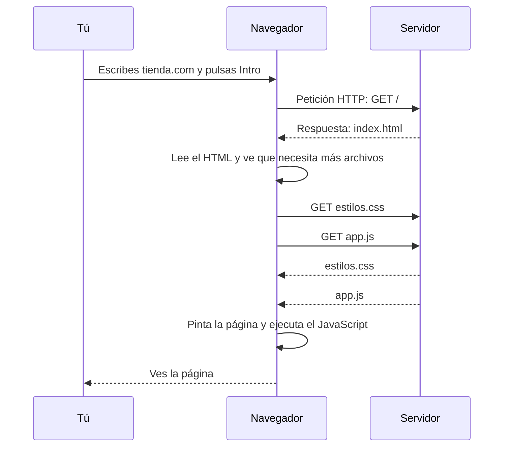

Abres el navegador, escribes `tienda.com` y, en menos de un segundo, aparece una página con fotos, botones y precios. Parece magia, pero detrás hay una conversación muy ordenada entre dos ordenadores. Antes de aprender Angular necesitas conocer esa conversación, porque **todo lo que hace Angular ocurre dentro de ella**.

## Dos protagonistas: el navegador y el servidor

- El **navegador** (Chrome, Firefox, Safari, Edge…) es el programa que usas para ver páginas web. Vive en tu ordenador o en tu móvil.
- El **servidor** es otro ordenador, normalmente lejos, encendido día y noche, que guarda los archivos de la web y los entrega a quien los pida.

Al navegador también se le llama **cliente**: es quien pide. El servidor es quien sirve.

> [!analogia]
> Piensa en un restaurante. Tú (el navegador) te sientas y pides un plato a la cocina (el servidor). El camarero lleva tu pedido y vuelve con el plato. Tú no entras en la cocina: solo pides y recibes. La **URL** es lo que pides en la carta; la **respuesta** es el plato.

## La URL: la dirección de lo que quieres

Una **URL** es la dirección de una página. Tiene partes con significado:

```text
https://tienda.com/productos/zapatillas
└─┬─┘   └───┬────┘└─────────┬─────────┘
protocolo  dominio         ruta
```

- `https` es el **protocolo**, el idioma de la conversación (la `s` final significa que va cifrada).
- `tienda.com` es el **dominio**, el nombre del servidor.
- `/productos/zapatillas` es la **ruta**: qué página concreta quieres de ese servidor.

Recuerda la palabra *ruta*: en el módulo 11 verás que Angular tiene un **router** que decide qué enseñar según la ruta.

## La conversación, paso a paso

Cuando pulsas Intro, ocurre esto:



1. El navegador envía una **petición** (en inglés *request*) usando **HTTP**, el protocolo de la web. `GET` significa «dame».
2. El servidor responde con una **respuesta** (*response*): primero, un archivo **HTML**.
3. El navegador lee ese HTML y descubre que la página necesita más archivos: estilos (**CSS**), código (**JavaScript**), imágenes… y los pide uno a uno.
4. Con todo en la mano, **pinta** la página en la pantalla y ejecuta el JavaScript.

> [!idea]
> La web es pedir y recibir archivos. El navegador pide, el servidor responde, y el navegador construye lo que ves con esos archivos.

## Los tres archivos de toda página

Casi todo lo que llega al navegador es de uno de estos tres tipos. Verás cada uno en las próximas lecciones:

| Archivo | Para qué sirve | Analogía |
| --- | --- | --- |
| HTML | El contenido y su estructura: títulos, párrafos, botones | El esqueleto |
| CSS | El aspecto: colores, tamaños, posiciones | La ropa |
| JavaScript | El comportamiento: qué pasa al hacer clic | Los músculos |

Una aplicación Angular, cuando ya está terminada, **también es eso**: un `index.html`, unos archivos `.css` y unos archivos `.js`. Angular es una forma muy organizada de producir esos archivos.

## Lo que verás en este curso: localhost

Mientras programas, el servidor no está lejos: está en tu propio ordenador. Su nombre es `localhost` («este mismo ordenador»), y Angular lo arranca en el **puerto** 4200 (un puerto es como el número de puerta por el que entra la conversación). Por eso verás esta dirección a menudo:

```pantalla
@url localhost:4200/
<h1>¡Hola desde tu ordenador!</h1>
<p>Esta página la sirve un servidor que vive en tu propia máquina.</p>
```

> [!prueba]
> Abre cualquier web en tu navegador, pulsa **F12** (o clic derecho → **Inspeccionar**) y ve a la pestaña **Red** (*Network*). Recarga la página: verás la lista de todas las peticiones que hace el navegador, una por archivo. Esa lista es la conversación de este diagrama.

> [!cuidado]
> Al principio es fácil pensar que la página «está» en tu navegador. No: el navegador la **descarga** cada vez (o la recuerda un rato en su caché). Si el servidor se apaga, una página nueva no puede llegar. Lo comprobarás cuando cierres `ng serve` y recargues: el navegador dirá que no puede conectar.

> [!resumen]
> - El navegador (cliente) pide archivos y el servidor los entrega, usando el protocolo HTTP.
> - Una URL tiene protocolo, dominio y ruta; la ruta dice qué página quieres.
> - Toda página se construye con HTML (estructura), CSS (aspecto) y JavaScript (comportamiento).
> - Mientras desarrolles con Angular, el servidor será `localhost:4200`, en tu propio ordenador.
