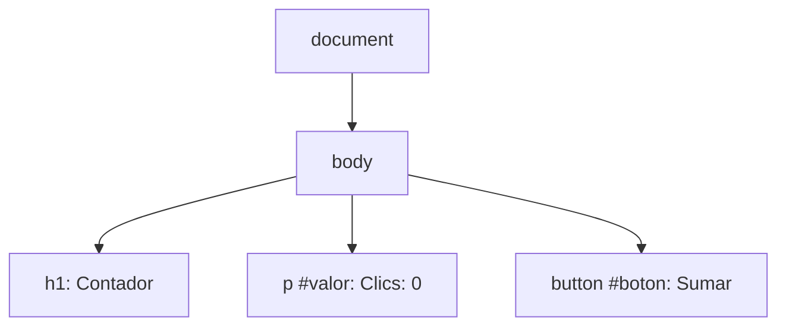
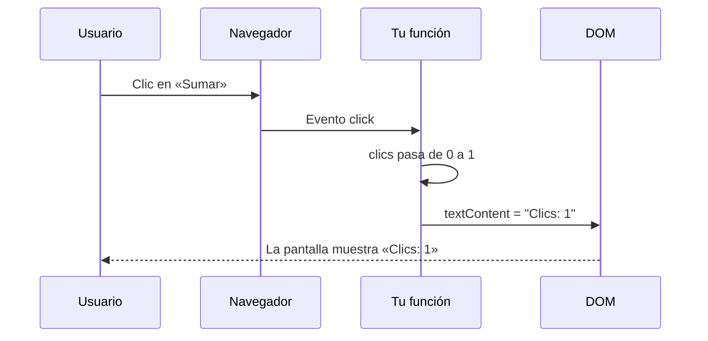

Una página con solo HTML y CSS es como un cartel: bonito, pero quieto. Pulsas el botón **Comprar** y no pasa nada. Para que la página **reaccione** (sume un producto al carrito, muestre un mensaje, cambie un número) hace falta un lenguaje de programación que viva dentro del navegador: **JavaScript**.

## JavaScript: el único lenguaje que entiende el navegador

**JavaScript** (JS) es un lenguaje de programación: una forma de dar instrucciones que se ejecutan en orden. Todos los navegadores traen dentro un **motor** que lo ejecuta. Angular, como verás, se escribe en TypeScript, pero al final **todo se convierte en JavaScript**, porque es lo único que el navegador sabe ejecutar.

## El DOM: la página convertida en un árbol de objetos

Cuando el navegador lee el HTML, no lo guarda como texto. Construye en memoria un **árbol** con un nodo por cada elemento. A ese árbol se le llama **DOM** (*Document Object Model*, modelo de objetos del documento). Para este HTML:

```html
<body>
  <h1>Contador</h1>
  <p id="valor">Clics: 0</p>
  <button id="boton">Sumar</button>
</body>
```

el DOM es este árbol:



> [!analogia]
> El HTML es el plano de una casa; el DOM es la casa ya construida. JavaScript es el obrero que entra en la casa, mueve muebles y pinta paredes. **Lo que ves en pantalla es siempre el DOM**, no el archivo HTML: si JavaScript cambia el DOM, la pantalla cambia al momento.

## Eventos: reaccionar a lo que hace el usuario

Un **evento** es algo que ocurre: un clic, una tecla, el ratón que pasa por encima. JavaScript puede **escuchar** un evento y ejecutar una **función** (un bloque de instrucciones con nombre) cuando ocurre.

```javascript
// app.js
let clics = 0;

const boton = document.querySelector('#boton');
const valor = document.querySelector('#valor');

boton.addEventListener('click', () => {
  clics = clics + 1;
  valor.textContent = 'Clics: ' + clics;
});
```

Línea a línea:

- `let clics = 0;` crea una **variable**: una caja con nombre que guarda un valor (aquí, el número de clics). `let` permite cambiarlo después.
- `document` es el DOM entero. `querySelector('#boton')` busca en el árbol el elemento con `id="boton"` y lo guarda en la constante `boton` (`const`: una caja que no cambiará de contenido).
- `addEventListener('click', ...)` dice: «cuando hagan **clic** en este botón, ejecuta esta función». La función es lo que va entre `() => {` y `}`.
- Dentro, sumamos 1 y cambiamos el **texto** del párrafo con `textContent`.

Para que el navegador cargue este código, el HTML lo enlaza al final del `<body>`: `<script src="app.js"></script>`.

## Qué pasa al hacer clic



Antes del clic:

```pantalla
<h1>Contador</h1>
<p>Clics: 0</p>
<button>Sumar</button>
```

Después de tres clics:

```pantalla
<h1>Contador</h1>
<p>Clics: 3</p>
<button>Sumar</button>
```

> [!idea]
> Una página interactiva es un ciclo: el usuario provoca un **evento**, JavaScript cambia los **datos** (la variable) y después actualiza el **DOM** para que la pantalla muestre los datos nuevos.

## El problema que se esconde aquí

Fíjate en que hay **dos** cosas que mantener: la variable `clics` y el texto del párrafo. Si cambias una y te olvidas de la otra, la pantalla miente. En una página con cien datos y cien párrafos, ese trabajo manual se vuelve un infierno. **Este es justo el problema que resuelve Angular**: tú cambias los datos y él actualiza la pantalla por ti. Lo verás con calma en el módulo 7 (signals).

> [!prueba]
> En cualquier web, abre las herramientas del navegador (**F12**), ve a la pestaña **Consola**, escribe `document.querySelector('h1').textContent = 'Lo he cambiado yo'` y pulsa Intro. Si la página tiene un `<h1>`, verás el cambio al instante. Acabas de modificar el DOM (solo en tu pantalla: al recargar, vuelve a ser como era).

> [!cuidado]
> Si el `<script>` se carga **antes** de que exista el botón (por ejemplo, en el `<head>` sin más), `querySelector('#boton')` no lo encuentra y devuelve `null`. Al llamar a `addEventListener` sobre `null` aparece en la consola un error como `Cannot read properties of null`. Por eso el script va al final del `<body>`.

> [!resumen]
> - JavaScript es el lenguaje que ejecuta el navegador; todo Angular acaba convertido en JavaScript.
> - El DOM es el árbol de objetos que el navegador construye a partir del HTML; la pantalla muestra el DOM.
> - Con `addEventListener` reaccionas a eventos como `click`.
> - Mantener a mano los datos y la pantalla sincronizados es tedioso y fácil de romper: Angular lo hace por ti.
