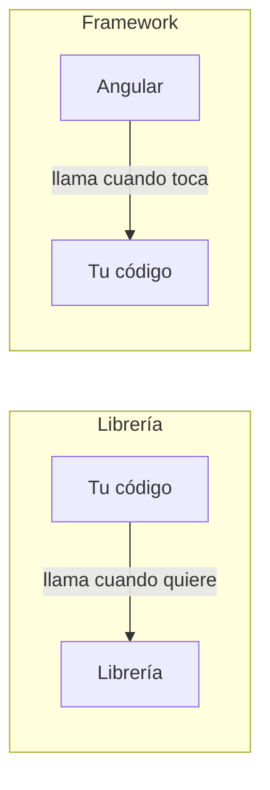

Ya sabes hacer un contador con HTML, CSS y JavaScript a mano. Ahora imagina una tienda entera: cien productos, un carrito, filtros, un formulario de pago, diez pantallas. Escrito a mano, el código se convierte en una maraña de `querySelector` y `addEventListener` que nadie se atreve a tocar. Para no empezar siempre de cero, los programadores usan código que ya han escrito otros: **librerías** y **frameworks**.

## Librería: una caja de herramientas

Una **librería** (o biblioteca) es código ya escrito que resuelve un problema concreto y que tú **llamas** cuando lo necesitas. Por ejemplo, una librería de fechas te da una función para escribir «hace 3 días» sin tener que programarlo tú.

- Tú decides **cuándo** y **dónde** usarla.
- Puedes cambiarla por otra sin rehacer toda tu aplicación.

## Framework: el esqueleto de la casa

Un **framework** (marco de trabajo) es más grande: te da la **estructura** de toda la aplicación y unas reglas. Tú rellenas los huecos con tu código, y es **el framework quien llama a tu código** cuando toca.

> [!analogia]
> Una librería es una caja de herramientas: tú construyes la casa como quieras y sacas el martillo cuando lo necesitas. Un framework es una casa prefabricada con los cimientos, las tuberías y la electricidad ya puestos: tú decides cómo decorar cada habitación, pero la estructura viene dada. Se suele resumir con una frase: «a una librería la llamas tú; un framework te llama a ti».



## Angular: un framework completo

**Angular** es un framework creado y mantenido por Google para construir aplicaciones web de una sola página (SPA). Es **gratuito** y de **código abierto**. Su versión actual es la 22, y es la que aprenderás aquí.

Angular resuelve de una vez los problemas que viste en las lecciones anteriores:

| Problema al hacerlo a mano | Lo que pone Angular | Dónde lo verás |
| --- | --- | --- |
| Mantener datos y pantalla sincronizados | Plantillas y **signals**: cambias el dato y la pantalla se actualiza sola | Módulos 6 y 7 |
| Código enorme en un solo archivo | **Componentes**: piezas pequeñas con su HTML, CSS y lógica | Módulo 5 |
| Cambiar de pantalla sin recargar | El **router** | Módulo 11 |
| Formularios y validaciones | `@angular/forms` | Módulo 12 |
| Pedir datos al servidor | `HttpClient` | Módulo 13 |
| Compilar, probar y publicar | La **Angular CLI** | Módulos 3, 4 y 21 |

Otros nombres que oirás son **React** (una librería, centrada solo en pintar la pantalla) y **Vue** (un framework más ligero). Angular destaca por traer **todo incluido** y por sus reglas claras, por eso se usa mucho en empresas con equipos grandes.

## Un primer vistazo

No tienes que entenderlo aún, solo comparar. Este es el mismo contador de la lección anterior, escrito en Angular:

```typescript
// src/app/contador/contador.ts
import { Component, signal } from '@angular/core';

@Component({
  selector: 'app-contador',
  template: `
    <h1>Contador</h1>
    <p>Clics: {{ clics() }}</p>
    <button (click)="sumar()">Sumar</button>
  `,
})
export class Contador {
  protected readonly clics = signal(0);

  protected sumar() {
    this.clics.update((valor) => valor + 1);
  }
}
```

Fíjate en lo que **no** hay: ni `querySelector`, ni `addEventListener`, ni `textContent`. El HTML dice «aquí va el número de clics» (`{{ clics() }}`) y «al hacer clic, llama a `sumar`» (`(click)="sumar()"`). Cuando `sumar` cambia el dato, **Angular actualiza el DOM por ti**.

```pantalla
@url localhost:4200/
<h1>Contador</h1>
<p>Clics: 3</p>
<button>Sumar</button>
```

Ese archivo está escrito en **TypeScript**, el lenguaje de Angular. Es JavaScript con algunos añadidos, y es lo que aprenderás en el módulo 2. Después prepararás tu ordenador (módulo 3) y crearás tu primer proyecto (módulo 4).

> [!idea]
> Angular es un framework: te da la estructura completa de una SPA y se encarga del trabajo repetitivo (actualizar la pantalla, navegar, validar formularios…) para que tú escribas solo lo que es propio de tu aplicación.

> [!cuidado]
> Si buscas ayuda en internet verás «AngularJS». Es el **antiguo** framework (de 2010), ya sin soporte y muy distinto. El Angular actual se llama solo **Angular** (versión 2 en adelante). Si un tutorial habla de `$scope` o de `ng-app`, es AngularJS: no te sirve.

> [!prueba]
> Mira el contador de Angular y localiza tres cosas: dónde se guarda el dato (`clics`), dónde se muestra (`{{ clics() }}`) y dónde se reacciona al clic (`(click)="sumar()"`). Si quisieras que sumara de 5 en 5, ¿qué línea cambiarías? (Pista: está dentro de `sumar`.)

> [!resumen]
> - Una librería es código que llamas tú; un framework es una estructura que llama a tu código.
> - Angular es un framework de Google, gratuito, para construir SPA; la versión actual es la 22.
> - Resuelve la sincronización datos-pantalla, la organización en componentes, la navegación, los formularios y la comunicación con el servidor.
> - Se escribe en TypeScript, que verás en el próximo módulo.
