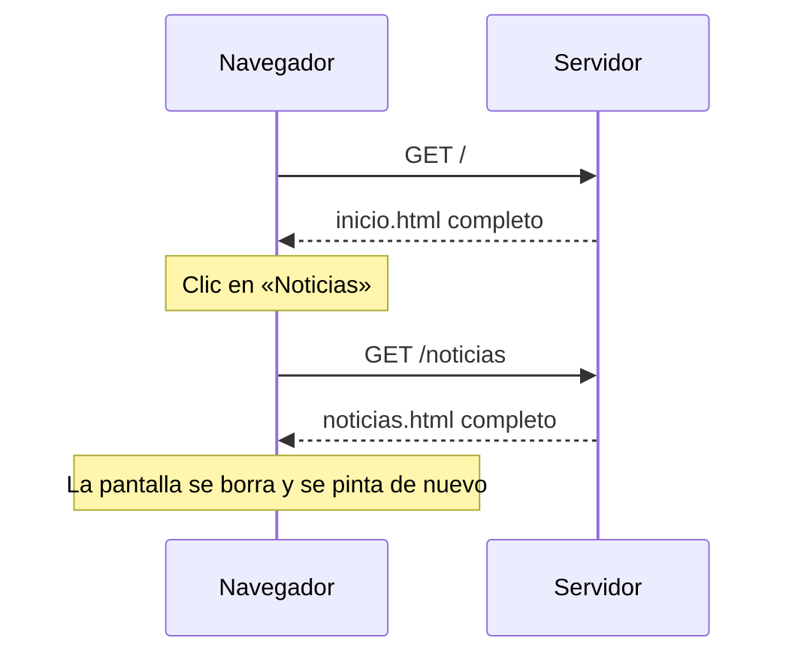
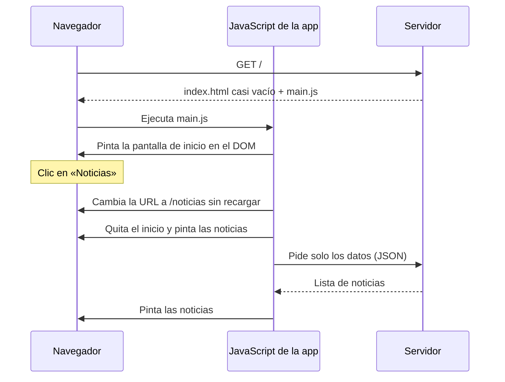

Piensa en dos apps que usas: un periódico digital y Gmail. En el periódico, cada vez que abres una noticia la pantalla se queda en blanco un instante y aparece una página nueva. En Gmail abres un correo, vuelves a la bandeja, escribes otro… y la página **nunca** se recarga entera. Son dos formas distintas de construir una web, y Angular pertenece a la segunda.

## Web de varias páginas (la forma clásica)

En una **web de varias páginas** (en inglés *MPA*, *Multi-Page Application*), cada dirección es un archivo HTML distinto que prepara el servidor.



Cada clic en un enlace provoca un viaje al servidor y una página **entera** nueva: HTML, CSS y JavaScript otra vez. Funciona muy bien para webs de lectura, pero se nota el parpadeo y se pierde lo que había en pantalla (un formulario a medio rellenar, por ejemplo).

## Aplicación de una sola página (SPA)

En una **SPA** (*Single-Page Application*, aplicación de una sola página), el servidor entrega **un único** `index.html` casi vacío y un paquete de JavaScript. A partir de ahí, **JavaScript construye todas las pantallas** dentro del navegador cambiando el DOM.



Fíjate en la diferencia: al navegar ya **no se pide una página**, solo los **datos** que faltan (en un formato de texto llamado **JSON**, que verás en el módulo 13). La pantalla cambia sin parpadeo.

> [!analogia]
> Una web de varias páginas es un libro: para ver otra cosa, pasas a otra página ya impresa. Una SPA es una pizarra: siempre es la misma pizarra, pero alguien (JavaScript) borra y dibuja lo que toca en cada momento.

Este es el `index.html` real que genera Angular. Mira qué poco tiene dentro del `<body>`:

```html
<!-- src/index.html -->
<!doctype html>
<html lang="en">
  <head>
    <meta charset="utf-8" />
    <title>MiApp</title>
    <base href="/" />
    <meta name="viewport" content="width=device-width, initial-scale=1" />
    <link rel="icon" type="image/x-icon" href="favicon.ico" />
  </head>
  <body>
    <app-root></app-root>
  </body>
</html>
```

`<app-root>` no es una etiqueta de HTML: es el hueco donde Angular pintará **toda** tu aplicación. Si el JavaScript no se ejecuta, la página se queda en blanco. Lo verás en detalle en el módulo 4.

## Ventajas e inconvenientes

| | Varias páginas | SPA |
| --- | --- | --- |
| Al navegar | Recarga la página entera | Cambia solo lo necesario |
| Sensación | Web clásica | App fluida, como una de móvil |
| Primera carga | Rápida | Algo más lenta (hay que descargar la app) |
| Buscadores (SEO) | Lo leen todo fácilmente | Necesitan ayuda extra |
| Ideal para | Blogs, periódicos | Paneles, correo, tiendas, redes sociales |

Los dos inconvenientes de la SPA tienen solución en Angular: la carga diferida (módulo 17) y el renderizado en el servidor, SSR (módulo 19).

> [!idea]
> Angular construye SPA: un solo `index.html`, y JavaScript que dibuja cada pantalla cambiando el DOM. La URL cambia, pero la página no se recarga.

> [!prueba]
> Abre una web que sea SPA (por ejemplo, tu correo web) con la pestaña **Red** de las herramientas del navegador abierta (F12). Navega entre secciones: verás que casi no aparecen documentos HTML nuevos, solo peticiones pequeñas de datos.

> [!cuidado]
> En una SPA, recargar con **F5** en `/noticias` hace que el navegador pida `/noticias` al servidor, y ese archivo no existe: solo existe `index.html`. Si el servidor no está configurado para devolver siempre `index.html`, verás un error 404. El servidor de desarrollo de Angular ya lo hace por ti; cuando publiques tu app tendrás que configurarlo (módulo 21).

> [!resumen]
> - Una web de varias páginas recibe un HTML completo del servidor en cada navegación.
> - Una SPA recibe un `index.html` casi vacío y JavaScript que pinta cada pantalla en el DOM.
> - Al navegar, una SPA solo pide datos, no páginas, y no parpadea.
> - Angular es un framework para construir SPA; `<app-root>` es el hueco donde pinta la app.
