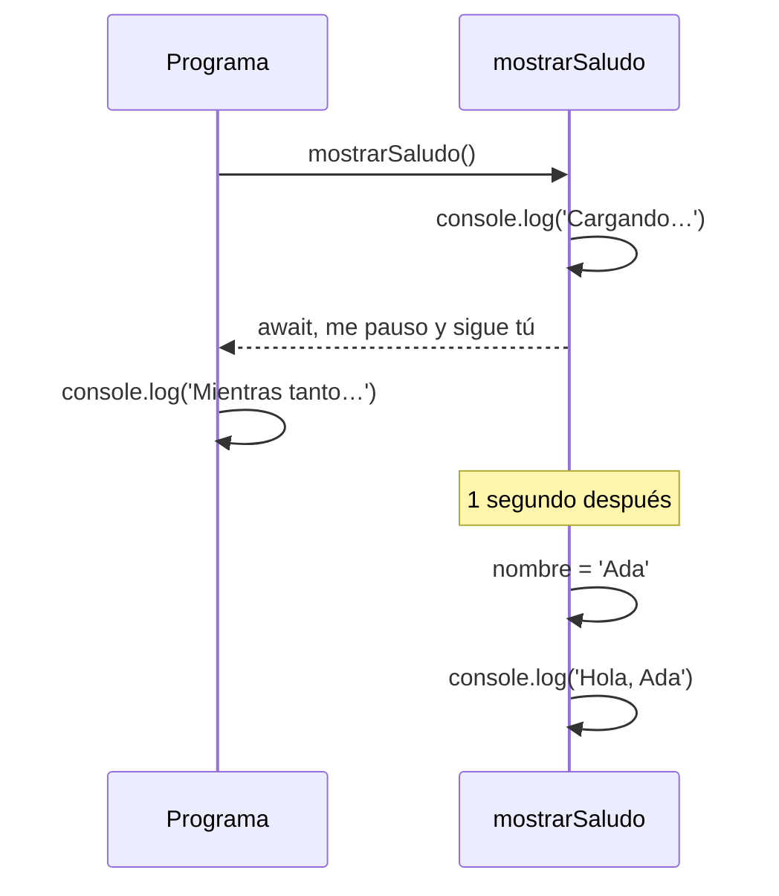

Pedir datos a un servidor tarda: quizá medio segundo, quizá tres. ¿Qué hace tu código mientras **espera** la respuesta? Si el navegador se quedara parado, la página se congelaría. Esta lección explica cómo evitarlo con promesas y `async`/`await`.

## Código asíncrono: no bloquear mientras esperas

Esas operaciones son **asíncronas**: se lanzan, el programa sigue, y la respuesta llega más tarde.

Una **promesa** (`Promise`) es un objeto que representa un valor que **llegará** (o un error). Con `async` y `await` puedes escribir código que espera promesas como si fuera código normal, de arriba abajo:

```typescript
function esperar(ms: number): Promise<void> {
  return new Promise((resolve) => setTimeout(resolve, ms));
}

async function cargarNombre(): Promise<string> {
  await esperar(1000);   // simula un servidor que tarda 1 segundo
  return 'Ada';
}

async function mostrarSaludo(): Promise<void> {
  console.log('Cargando…');
  const nombre = await cargarNombre();
  console.log(`Hola, ${nombre}`);
}

mostrarSaludo();
console.log('Mientras tanto, la página sigue viva');
```

```text
Cargando…
Mientras tanto, la página sigue viva
Hola, Ada
```

- `async function` marca una función asíncrona. **Siempre** devuelve una promesa: `Promise<string>` es «una promesa de un texto» (otra vez un genérico).
- `await` **pausa esa función** hasta que la promesa se cumple y te da su valor. Solo se puede usar dentro de una función `async`.
- Mientras `mostrarSaludo` está en pausa, el resto del programa **sigue**: por eso «Mientras tanto…» sale antes que «Hola, Ada».



> [!analogia]
> Una promesa es el tique de una pescadería: no tienes el pescado, pero tienes la promesa de que te lo darán. `await` es quedarte en esa cola; mientras tanto, la tienda sigue atendiendo a otros clientes.

Si la promesa **falla** (el servidor no responde), `await` lanza un error que puedes atrapar con `try`/`catch`:

```typescript
interface Producto {
  id: number;
  nombre: string;
}

async function cargarProductos(): Promise<Producto[]> {
  try {
    const respuesta = await fetch('/api/productos');
    const datos: Producto[] = await respuesta.json();
    return datos;
  } catch (error) {
    console.error('No se pudo cargar', error);
    return [];
  }
}
```

`fetch` es la función del navegador para pedir datos. En Angular normalmente usarás `HttpClient` (módulo 13), que trabaja con **observables**, un primo de las promesas que verás en el módulo 14.

> [!cuidado]
> Olvidar el `await` es un error muy común: `const nombre = cargarNombre();` no te da `'Ada'`, sino **la promesa**. Si después haces `` `Hola, ${nombre}` ``, verás `Hola, [object Promise]`. TypeScript te ayuda: el tipo de `nombre` será `Promise<string>` y no `string`.

> [!prueba]
> Copia el ejemplo de `mostrarSaludo` y cambia `esperar(1000)` por `esperar(3000)`. Ejecuta y fíjate en que «Mientras tanto…» sale igual de rápido, aunque el saludo tarde tres segundos.

> [!resumen]
> - Una `Promise` es un valor que llegará más tarde; `async`/`await` permiten esperarlo sin bloquear la página.
> - `await` solo se usa dentro de una función `async`, y una función `async` siempre devuelve una promesa.
> - Los errores de una promesa se capturan con `try`/`catch`.
