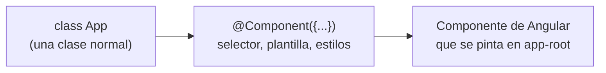

En una tienda hay muchos carritos, uno por cliente. Todos funcionan igual (añadir producto, quitar, calcular total), pero cada uno tiene **sus propios** productos. Necesitas una forma de definir el carrito una vez y fabricar todos los que quieras. Eso es una **clase**. Y es importante: **en Angular, cada componente y cada servicio es una clase**.

## Clase y objeto

Una **clase** es un molde que define qué datos tiene algo (**propiedades**) y qué sabe hacer (**métodos**: funciones que pertenecen a la clase). Con `new` fabricas **objetos** (también llamados **instancias**) a partir del molde.

```typescript
class Cuenta {
  readonly titular: string;
  private saldo = 0;

  constructor(titular: string) {
    this.titular = titular;
  }

  ingresar(cantidad: number): void {
    this.saldo = this.saldo + cantidad;
  }

  verSaldo(): number {
    return this.saldo;
  }
}

const cuenta = new Cuenta('Ada');
cuenta.ingresar(50);
cuenta.ingresar(20);
console.log(cuenta.titular);     // Ada
console.log(cuenta.verSaldo());  // 70

const otra = new Cuenta('Alan');
console.log(otra.verSaldo());    // 0
```

Línea a línea:

- `class Cuenta { ... }` define el molde. Por costumbre, los nombres de clase van en *PascalCase* (cada palabra empieza en mayúscula): `Cuenta`, `UserCard`.
- `readonly titular: string;` declara una propiedad que **solo se puede dar una vez** (en su declaración o en el constructor). Después, `cuenta.titular = 'Alan'` da error: `Cannot assign to 'titular' because it is a read-only property`.
- `private saldo = 0;` es una propiedad **privada**: solo el código de dentro de la clase puede tocarla.
- `constructor(titular: string)` es un método especial que se ejecuta **una vez**, al hacer `new`. Prepara el objeto recién creado.
- `this` significa «este objeto»: `this.saldo` es el saldo **de esta cuenta**, no el de otra.
- `ingresar` y `verSaldo` son métodos. Se llaman con un punto: `cuenta.ingresar(50)`.
- `new Cuenta('Ada')` fabrica un objeto y ejecuta el constructor con `'Ada'`. Cada objeto tiene sus propios datos: `otra` empieza con saldo 0.

> [!analogia]
> Una clase es un molde de galletas; cada objeto es una galleta. Todas tienen la misma forma, pero puedes decorar cada una a tu manera: la de Ada tiene 70 €, la de Alan, 0 €.

## public, private, protected y readonly

Las palabras delante de una propiedad o un método dicen **quién puede usarlo**:

| Palabra | Quién puede usarlo |
| --- | --- |
| `public` (o nada) | Cualquiera, desde fuera de la clase |
| `private` | Solo el código de la propia clase |
| `protected` | La clase y las clases que **heredan** de ella (`class Perro extends Animal`) |
| `readonly` | Se combina con las anteriores: se lee, pero no se reasigna |

¿Por qué esconder cosas? Para que nadie haga `cuenta.saldo = 1000000` saltándose las reglas. TypeScript lo impide: `Property 'saldo' is private and only accessible within class 'Cuenta'`. La única forma de cambiar el saldo es `ingresar`, y ahí pones tus reglas.

En Angular verás mucho `protected`: es la forma recomendada de marcar lo que usa la **plantilla** (el HTML del componente) pero no debe tocar nadie de fuera. Recuerda la clase que genera `ng new`:

```typescript
// src/app/app.ts (fragmento)
export class App {
  protected readonly title = signal('mi-app');
}
```

Es una clase con una propiedad `protected` (la usa su plantilla) y `readonly` (nadie la sustituye por otra).

> [!cuidado]
> En proyectos antiguos verás constructores así: `constructor(private http: HttpClient) {}`. Es un atajo de TypeScript que declara y rellena la propiedad a la vez. Funciona, pero en Angular moderno se prefiere `private http = inject(HttpClient);`, que verás en el módulo 10.

## Decoradores: etiquetas con instrucciones

Un **decorador** es una función que se escribe con `@` justo encima de una clase (o de una propiedad o un método) y le **añade información o comportamiento**. Este decorador de juguete solo anuncia la clase al definirse:

```typescript
function Anunciar(clase: Function) {
  console.log(`Se ha definido la clase ${clase.name}`);
}

@Anunciar
class Tienda {}
// En la consola: Se ha definido la clase Tienda
```

`@Anunciar` hace que TypeScript llame a la función `Anunciar` pasándole la clase. Nada más misterioso que eso.

Angular usa decoradores para saber **qué es cada clase**. Una clase normal no es nada para Angular; con `@Component` se convierte en un componente:

```typescript
// src/app/app.ts
import { Component, signal } from '@angular/core';
import { RouterOutlet } from '@angular/router';

@Component({
  imports: [RouterOutlet],
  selector: 'app-root',
  styleUrl: './app.css',
  templateUrl: './app.html',
})
export class App {
  protected readonly title = signal('mi-app');
}
```



`@Component({...})` recibe un objeto con instrucciones: qué etiqueta usar (`selector`), qué HTML pintar (`templateUrl`), qué estilos (`styleUrl`)… Verás cada campo en el módulo 5. Otros decoradores que encontrarás: `@Injectable` (servicios), `@Directive` y `@Pipe`.

> [!idea]
> Una clase es el molde con datos y métodos; un decorador es una etiqueta con `@` que le dice a Angular qué papel tiene esa clase.

> [!prueba]
> En tu proyecto (módulo 4), abre `src/app/app.ts` y busca las tres partes: los `import`, el decorador `@Component({...})` y la clase `App`. Ahora ya puedes leer cada una.

> [!resumen]
> - Una clase define propiedades y métodos; `new` crea objetos y ejecuta el `constructor`.
> - `this` es el objeto actual; `private`, `protected` y `readonly` limitan quién puede leer o cambiar cada cosa.
> - En Angular, lo que usa la plantilla suele marcarse `protected`.
> - Un decorador (`@Component`, `@Injectable`…) es una función que añade información a una clase.
