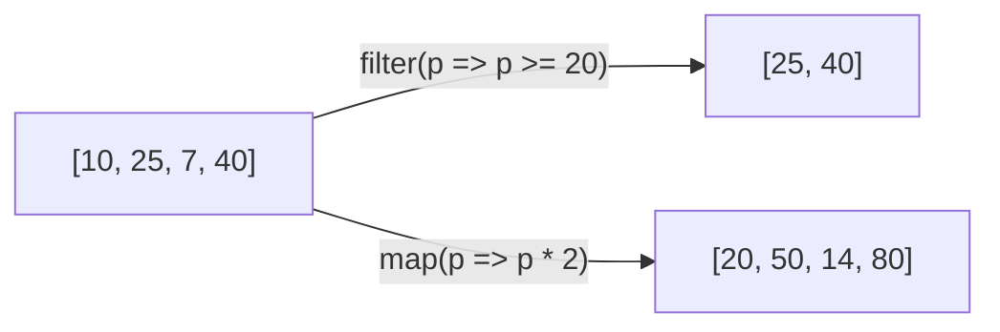

En la tienda calculas el precio final de un producto: precio menos descuento. Lo necesitas en el carrito, en la ficha del producto, en el resumen del pedido… Si copias la cuenta en tres sitios y un día cambia la fórmula, tendrás que acordarte de cambiarla en los tres. Una **función** te deja escribir la cuenta **una vez**, darle un nombre y usarla donde quieras.

## Funciones con tipos

Una **función** es un bloque de código con nombre que recibe datos (**parámetros**), hace algo y puede **devolver** un resultado.

```typescript
function precioFinal(precio: number, descuento: number): number {
  return precio - descuento;
}

console.log(precioFinal(60, 10));   // 50
```

- `function precioFinal` declara la función y le da nombre.
- `(precio: number, descuento: number)` son los parámetros, cada uno con su tipo.
- El `: number` después del paréntesis es el **tipo de retorno**: lo que devuelve.
- `return` entrega el resultado y termina la función.
- `precioFinal(60, 10)` **llama** a la función: ejecuta su código con `precio = 60` y `descuento = 10`.

> [!analogia]
> Una función es una receta: los parámetros son los ingredientes, el cuerpo son los pasos y lo que devuelve es el plato. Los tipos son la lista de la compra: «2 huevos», no «2 cosas».

Si una función no devuelve nada, su tipo de retorno es `void` («vacío»):

```typescript
function avisar(mensaje: string): void {
  console.log(`Aviso: ${mensaje}`);
}

avisar('Stock bajo');   // Aviso: Stock bajo
```

Fíjate en las comillas invertidas `` ` ``: crean una **plantilla de texto** (*template literal*). Dentro, `${...}` inserta el valor de una expresión. Es más cómodo que unir textos con `+`.

## Funciones flecha

Hay una forma más corta de escribir funciones, muy usada en Angular: la **función flecha** (*arrow function*), con `=>`:

```typescript
const doble = (n: number): number => n * 2;

const saludar = (nombre: string, signo = '!'): string => {
  return `Hola, ${nombre}${signo}`;
};

console.log(doble(21));             // 42
console.log(saludar('Ada'));        // Hola, Ada!
console.log(saludar('Alan', '?'));  // Hola, Alan?
```

- Si el cuerpo es una sola expresión, se puede escribir sin llaves ni `return`: `n => n * 2` devuelve `n * 2`.
- Con varias líneas, se usan llaves y `return`, como en una función normal.
- `signo = '!'` es un **valor por defecto**: si no pasas ese parámetro, vale `'!'`.

## Pasar funciones a otras funciones

Las funciones también son valores: puedes pasarlas a otra función, que las llamará cuando toque. A esa función que pasas se le llama **callback**. Ya lo hiciste con `addEventListener('click', () => {...})`. Los arrays tienen varios métodos que funcionan así:

```typescript
const precios = [10, 25, 7, 40];

const caros = precios.filter((p) => p >= 20);   // [25, 40]
const dobles = precios.map((p) => p * 2);       // [20, 50, 14, 80]

console.log(caros.join(', '));    // 25, 40
console.log(dobles.join(', '));   // 20, 50, 14, 80
```

- `filter` llama a tu función con cada elemento y **se queda** con los que devuelven `true`.
- `map` llama a tu función con cada elemento y crea un array **nuevo** con lo que devuelve.
- Ninguno de los dos cambia `precios`: crean arrays nuevos.



## Genéricos: funciones que sirven para cualquier tipo

¿Y si quieres una función que devuelva el primer elemento de **cualquier** lista, sea de números o de textos, sin perder el tipo? Para eso están los **genéricos**: un tipo que se decide al usar la función. Se escriben entre `< >`, y por costumbre se llaman `T`:

```typescript
function primero<T>(lista: T[]): T | undefined {
  return lista[0];
}

const n = primero([3, 4, 5]);        // n es number | undefined
const s = primero(['Ada', 'Alan']);  // s es string | undefined
```

`T` es un hueco: con `[3, 4, 5]`, TypeScript rellena `T = number`; con textos, `T = string`. El `| undefined` avisa de que una lista vacía no tiene primer elemento.

> [!analogia]
> Un genérico es una caja con una etiqueta en blanco. Al usarla escribes en la etiqueta qué guarda («números», «productos»), y desde ese momento solo admite eso.

En Angular verás genéricos todo el rato: `signal<number>(0)`, `Array<string>`, `input<string>()`… El `<...>` dice de qué tipo es lo que hay dentro.

> [!cuidado]
> Si escribes una flecha con llaves, **necesitas** `return`. `(n: number) => { n * 2 }` no devuelve nada (devuelve `undefined`), y si la usas en un `map` obtendrás una lista llena de `undefined`. O quitas las llaves (`n => n * 2`) o añades `return`.

> [!resumen]
> - Una función recibe parámetros con tipo y devuelve un valor del tipo de retorno (`void` si no devuelve nada).
> - Las funciones flecha (`(x) => ...`) son la forma corta; sin llaves devuelven la expresión.
> - Un callback es una función que pasas a otra; `filter` y `map` crean arrays nuevos con él.
> - Los genéricos (`<T>`) hacen código que sirve para cualquier tipo sin perder la comprobación.
