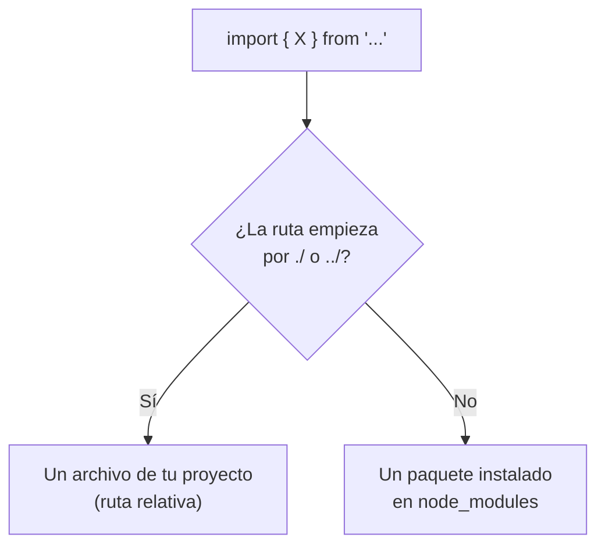
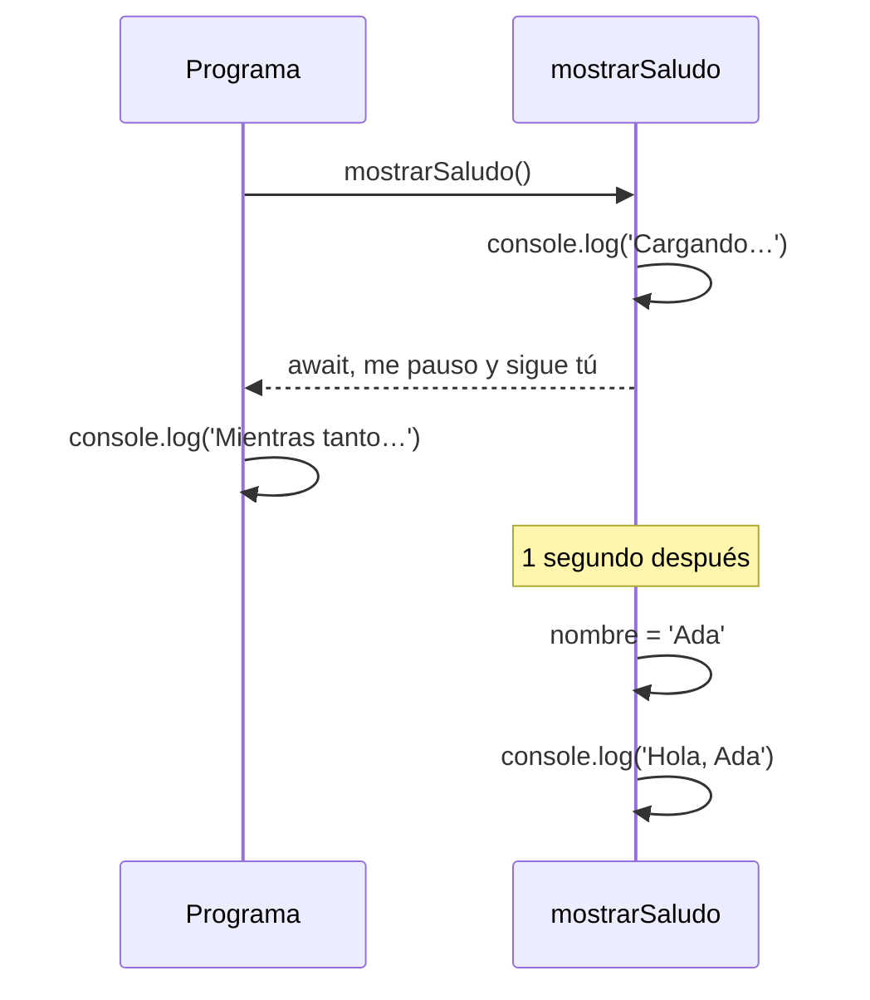

Un proyecto de Angular tiene decenas de archivos, y cada uno usa cosas de otros: el componente usa una interfaz, la interfaz vive en otro archivo, y casi todos usan piezas de Angular. ¿Cómo se pasan las cosas de un archivo a otro? Con `import` y `export`. Y hay una segunda pregunta que aparece en cuanto pides datos a un servidor: ¿qué hace tu código mientras **espera** la respuesta? Para eso están las promesas y `async`/`await`. Esta lección cubre las dos, porque las dos responden a lo mismo: **usar algo que no está aquí** (en otro archivo) **o todavía no** (llegará más tarde).

## Módulos: cada archivo es una caja cerrada

En TypeScript moderno, cada archivo es un **módulo**: lo que declaras dentro es **privado** del archivo, salvo que lo **exportes**.

```typescript
// src/app/precios.ts
export const IVA = 0.21;

export function conIva(precio: number): number {
  return precio + precio * IVA;
}

const secreto = 'nadie lo ve fuera';
```

```typescript
// src/app/carrito.ts
import { conIva, IVA } from './precios';

console.log(`El IVA es ${IVA * 100} %`);   // El IVA es 21 %
console.log(conIva(100));                  // 121
```

- `export` delante de algo lo hace visible para otros archivos. `secreto` no lleva `export`, así que nadie puede importarlo.
- `import { conIva, IVA } from './precios'` trae esas dos cosas. Las llaves listan **qué** quieres, por su nombre exacto (*named imports*).
- `'./precios'` es la ruta del archivo, **sin** la extensión `.ts`. `./` significa «en esta misma carpeta»; `../` sería «en la carpeta de arriba».

> [!analogia]
> Cada archivo es una casa con la puerta cerrada. `export` es poner algo en el escaparate; `import` es ir a esa casa y coger lo que hay en el escaparate. Lo que no está expuesto se queda dentro.

## De dónde salen los imports

Mira de nuevo el principio de `app.ts`:

```typescript
import { Component, signal } from '@angular/core';
import { RouterOutlet } from '@angular/router';
```

Aquí la ruta **no** empieza por `./`. Cuando no empieza por `.` ni por `/`, es el nombre de un **paquete**: una librería instalada en la carpeta `node_modules` de tu proyecto. `@angular/core` es el corazón de Angular (componentes, signals…) y `@angular/router` es la librería de navegación.

```arbol
mi-app/                        # Tu proyecto
  node_modules/                # Librerías instaladas (módulo 3); de aquí salen los imports sin ./
    @angular/                  # Todas las librerías oficiales de Angular
      core/                    # import { Component, signal } from '@angular/core'
      router/                  # import { RouterOutlet } from '@angular/router'
    rxjs/                      # import { Observable } from 'rxjs'
  src/
    app/
      app.ts                   # import { App } from './app/app' lo trae desde main.ts
      precios.ts               # import { conIva } from './precios' desde otro archivo de app/
    main.ts                    # Primer archivo que se ejecuta; importa App y la configuración
```



En el módulo 3 verás cómo llegan los paquetes a `node_modules`, y en el módulo 4, para qué sirve cada librería de Angular.

## Código asíncrono: no bloquear mientras esperas

Pedir datos a un servidor tarda: quizá medio segundo, quizá tres. Si el navegador se quedara **parado** esperando, la página se congelaría. Por eso esas operaciones son **asíncronas**: se lanzan, el programa sigue, y la respuesta llega más tarde.

Una **promesa** (`Promise`) es un objeto que representa un valor que **llegará** (o un error). Con `async` y `await` puedes escribir código que espera promesas como si fuera código normal, de arriba abajo:

```typescript
function esperar(ms: number): Promise<void> {
  return new Promise((resolve) => setTimeout(resolve, ms));
}

async function cargarNombre(): Promise<string> {
  await esperar(1000);   // simula un servidor que tarda 1 segundo
  return 'Ada';
}

async function mostrarSaludo(): Promise<void> {
  console.log('Cargando…');
  const nombre = await cargarNombre();
  console.log(`Hola, ${nombre}`);
}

mostrarSaludo();
console.log('Mientras tanto, la página sigue viva');
```

```text
Cargando…
Mientras tanto, la página sigue viva
Hola, Ada
```

- `async function` marca una función asíncrona. **Siempre** devuelve una promesa: `Promise<string>` es «una promesa de un texto» (otra vez un genérico).
- `await` **pausa esa función** hasta que la promesa se cumple y te da su valor. Solo se puede usar dentro de una función `async`.
- Mientras `mostrarSaludo` está en pausa, el resto del programa **sigue**: por eso «Mientras tanto…» sale antes que «Hola, Ada».



> [!analogia]
> Una promesa es el tique de una pescadería: no tienes el pescado, pero tienes la promesa de que te lo darán. `await` es quedarte en esa cola; mientras tanto, la tienda sigue atendiendo a otros clientes.

Si la promesa **falla** (el servidor no responde), `await` lanza un error que puedes atrapar con `try`/`catch`:

```typescript
interface Producto {
  id: number;
  nombre: string;
}

async function cargarProductos(): Promise<Producto[]> {
  try {
    const respuesta = await fetch('/api/productos');
    const datos: Producto[] = await respuesta.json();
    return datos;
  } catch (error) {
    console.error('No se pudo cargar', error);
    return [];
  }
}
```

`fetch` es la función del navegador para pedir datos. En Angular normalmente usarás `HttpClient` (módulo 13), que trabaja con **observables**, un primo de las promesas que verás en el módulo 14.

> [!cuidado]
> Olvidar el `await` es un error muy común: `const nombre = cargarNombre();` no te da `'Ada'`, sino **la promesa**. Si después haces `` `Hola, ${nombre}` ``, verás `Hola, [object Promise]`. TypeScript te ayuda: el tipo de `nombre` será `Promise<string>` y no `string`.

> [!resumen]
> - Cada archivo es un módulo: `export` hace visible algo y `import { ... } from '...'` lo trae.
> - Rutas con `./` o `../` son archivos tuyos; sin punto, son paquetes de `node_modules` (como `@angular/core`).
> - Una `Promise` es un valor que llegará más tarde; `async`/`await` permiten esperarlo sin bloquear la página.
> - Los errores de una promesa se capturan con `try`/`catch`.
