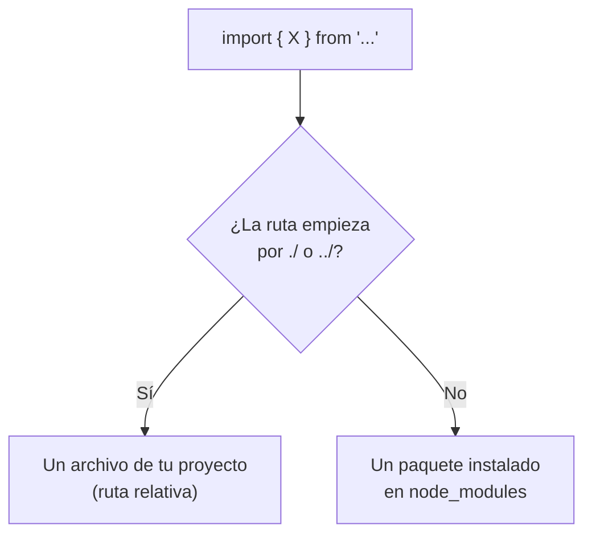

Un proyecto de Angular tiene decenas de archivos, y cada uno usa cosas de otros: el componente usa una interfaz, la interfaz vive en otro archivo, y casi todos usan piezas de Angular. ¿Cómo se pasan las cosas de un archivo a otro? Con `import` y `export`.

## Módulos: cada archivo es una caja cerrada

En TypeScript moderno, cada archivo es un **módulo**: lo que declaras dentro es **privado** del archivo, salvo que lo **exportes**.

```typescript
// src/app/precios.ts
export const IVA = 0.21;

export function conIva(precio: number): number {
  return precio + precio * IVA;
}

const secreto = 'nadie lo ve fuera';
```

```typescript
// src/app/carrito.ts
import { conIva, IVA } from './precios';

console.log(`El IVA es ${IVA * 100} %`);   // El IVA es 21 %
console.log(conIva(100));                  // 121
```

- `export` delante de algo lo hace visible para otros archivos. `secreto` no lleva `export`, así que nadie puede importarlo.
- `import { conIva, IVA } from './precios'` trae esas dos cosas. Las llaves listan **qué** quieres, por su nombre exacto (*named imports*).
- `'./precios'` es la ruta del archivo, **sin** la extensión `.ts`. `./` significa «en esta misma carpeta»; `../` sería «en la carpeta de arriba».

> [!analogia]
> Cada archivo es una casa con la puerta cerrada. `export` es poner algo en el escaparate; `import` es ir a esa casa y coger lo que hay en el escaparate. Lo que no está expuesto se queda dentro.

## De dónde salen los imports

Mira de nuevo el principio de `app.ts`:

```typescript
import { Component, signal } from '@angular/core';
import { RouterOutlet } from '@angular/router';
```

Aquí la ruta **no** empieza por `./`. Cuando no empieza por `.` ni por `/`, es el nombre de un **paquete**: una librería instalada en la carpeta `node_modules` de tu proyecto. `@angular/core` es el corazón de Angular (componentes, signals…) y `@angular/router` es la librería de navegación.

```arbol
mi-app/                        # Tu proyecto
  node_modules/                # Librerías instaladas (módulo 3); de aquí salen los imports sin ./
    @angular/                  # Todas las librerías oficiales de Angular
      core/                    # import { Component, signal } from '@angular/core'
      router/                  # import { RouterOutlet } from '@angular/router'
    rxjs/                      # import { Observable } from 'rxjs'
  src/
    app/
      app.ts                   # import { App } from './app/app' lo trae desde main.ts
      precios.ts               # import { conIva } from './precios' desde otro archivo de app/
    main.ts                    # Primer archivo que se ejecuta; importa App y la configuración
```



En el módulo 3 verás cómo llegan los paquetes a `node_modules`, y en el módulo 4, para qué sirve cada librería de Angular.

> [!cuidado]
> Si importas algo que no se ha exportado, TypeScript lo marca en rojo: `Module './precios' has no exported member 'secreto'`. La solución es añadir `export` en el archivo de origen, no copiar el código.

> [!prueba]
> Imagina que `precios.ts` tiene `export const IVA = 0.21;`. En `carrito.ts`, cambia `IVA` por `IVAA` en el `import`. ¿Qué mensaje esperas del editor? Después vuelve a escribirlo bien.

> [!resumen]
> - Cada archivo es un módulo: `export` hace visible algo y `import { ... } from '...'` lo trae.
> - Rutas con `./` o `../` son archivos tuyos; sin punto, son paquetes de `node_modules` (como `@angular/core`).
> - Las llaves del `import` llevan el nombre exacto de lo exportado.
