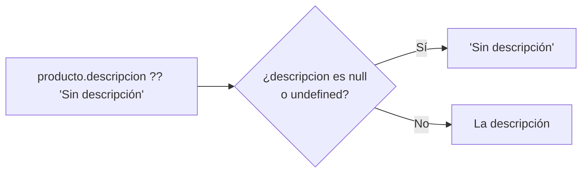

Una tienda no tiene un producto: tiene cientos. Y cada producto no es un dato suelto, sino varios a la vez: nombre, precio, descripción, tallas… Necesitas dos herramientas: una para guardar **listas** de cosas (los arrays) y otra para agrupar **varios datos de una misma cosa** (los objetos). Y, como estás en TypeScript, una forma de describir su forma: las **interfaces**.

## Arrays: listas ordenadas

Un **array** es una lista de valores en orden. Se escribe entre corchetes y su tipo es `tipo[]`:

```typescript
const precios: number[] = [10, 25, 7];
const nombres: string[] = ['Ada', 'Alan'];

precios.push(12);              // añade al final
console.log(precios.length);   // 4
console.log(nombres[0]);       // Ada
```

- `number[]` se lee «array de números»: solo admite números.
- `push` añade un elemento al final; `length` dice cuántos hay.
- Los elementos se numeran desde **0**: `nombres[0]` es el primero.
- `console.log(...)` escribe un valor en la **consola** del navegador (la pestaña **Consola** de F12). Es la forma más sencilla de ver qué está pasando.

> [!analogia]
> Un array es una fila de taquillas numeradas empezando por la 0. Un `number[]` es una fila de taquillas en la que solo caben números.

## Objetos: varios datos con nombre

Un **objeto** agrupa datos relacionados. Cada dato es una **propiedad** con un nombre y un valor:

```typescript
const zapatillas = {
  id: 1,
  nombre: 'Zapatillas Nube',
  precio: 59,
};

console.log(zapatillas.nombre);      // Zapatillas Nube
console.log(zapatillas.precio * 2);  // 118
```

Se accede a cada propiedad con un punto: `zapatillas.nombre`.

## Interfaces: el plano de un objeto

Si vas a tener cien productos, quieres que **todos** tengan la misma forma. Una **interfaz** describe esa forma: qué propiedades hay y de qué tipo es cada una.

```typescript
interface Producto {
  id: number;
  nombre: string;
  precio: number;
  descripcion?: string;
}

const gorra: Producto = {
  id: 2,
  nombre: 'Gorra',
  precio: 15,
  descripcion: 'De algodón',
};

const catalogo: Producto[] = [gorra];
```

- `interface Producto { ... }` crea un tipo nuevo llamado `Producto`. No crea ningún objeto: solo describe cómo deben ser.
- El `?` de `descripcion?` la hace **opcional**: un producto puede tenerla o no.
- `const gorra: Producto` obliga a que `gorra` cumpla el plano. Si te falta una propiedad obligatoria, TypeScript avisa: `Property 'precio' is missing in type...`.
- `Producto[]` es un array de productos: el catálogo.

> [!analogia]
> Una interfaz es como un formulario en papel con casillas: «nombre», «precio», «descripción (opcional)». Cada producto es un formulario relleno. Si dejas en blanco una casilla obligatoria, te lo devuelven.

En Angular usarás interfaces constantemente para describir los datos que llegan del servidor.

## type y las uniones

Con `type` puedes dar nombre a cualquier tipo. Su uso más típico son las **uniones**, con `|`, que significa «o»:

```typescript
type Talla = 'S' | 'M' | 'L';
type Id = number | string;

let talla: Talla = 'M';     // solo puede ser 'S', 'M' o 'L'
let pedido: Id = 42;
pedido = 'A-42';            // también vale: es number o string
```

`talla = 'XL'` daría error: `'XL'` no está en la lista. Así los errores tipográficos no llegan nunca a la pantalla.

`interface` y `type` se parecen mucho para describir objetos. Una regla sencilla: **`interface` para la forma de los objetos, `type` para uniones y alias**.

## Cuando un dato puede faltar: `?.` y `??`

En TypeScript, «no hay valor» se escribe `undefined` (no se ha puesto nada) o `null` (se ha dejado vacío a propósito). Una propiedad opcional puede valer `undefined`, y TypeScript te obliga a tenerlo en cuenta. Para eso hay dos operadores:

```typescript
const zapatillas: Producto = { id: 1, nombre: 'Zapatillas Nube', precio: 59 };

console.log(zapatillas.descripcion ?? 'Sin descripción');  // Sin descripción
console.log(zapatillas.descripcion?.length);               // undefined
```

- `a ?? b` (*nullish coalescing*) significa «usa `a`, pero si es `null` o `undefined`, usa `b`». Perfecto para valores por defecto.
- `a?.b` (*optional chaining*) significa «si `a` existe, dame `b`; si no, devuelve `undefined` sin romper nada».



> [!cuidado]
> Quizá veas `||` en lugar de `??`. Se parecen, pero `||` también sustituye el `0`, el texto vacío `''` y el `false`. Si el stock de un producto es `0`, `stock || 5` da `5` (¡mentira!) mientras que `stock ?? 5` da `0`. Para valores por defecto, usa `??`.

> [!prueba]
> En el ejemplo de `gorra`, borra la línea de `precio` y mira qué dice el editor. Después vuelve a escribirla con un texto, `precio: 'quince'`, y lee el nuevo mensaje.

> [!resumen]
> - Un array (`tipo[]`) es una lista ordenada; se cuenta desde 0.
> - Un objeto agrupa propiedades; una `interface` describe su forma, y `?` marca lo opcional.
> - `type` con `|` crea uniones: un valor que puede ser una cosa u otra.
> - `??` da un valor por defecto si falta el dato y `?.` accede sin romper si algo no existe.
