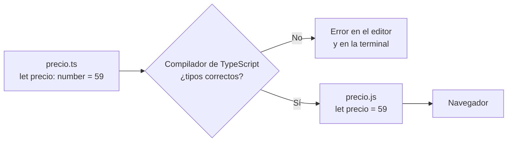

Imagina una tienda online que cobra 2 + 3 euros de envío… y al cliente le aparece un total de **23 €**. No es una broma: pasa en JavaScript cuando uno de los números llega como texto (`"2"`) y el `+` los **pega** en vez de sumarlos. El programa no se queja, simplemente hace algo absurdo, y te enteras cuando un cliente se enfada. **TypeScript** existe para que ese error salte **mientras escribes**, no cuando ya está en manos de los usuarios.

## JavaScript con tipos

**TypeScript** (TS) es JavaScript con un añadido: los **tipos**. Un **tipo** dice qué clase de valor puede guardar algo: un número, un texto, un sí/no… TypeScript lo creó Microsoft, es gratuito, y **Angular está escrito en TypeScript**: todo tu código de Angular será TypeScript.

> [!analogia]
> Los tipos son como las formas de un juguete de encajar piezas: el agujero del triángulo solo acepta triángulos. Si intentas meter un círculo, no entra, y te das cuenta en el momento, no días después.

## Variables con tipo

Una **variable** es una caja con nombre que guarda un valor. En TypeScript puedes decir qué tipo de valor admite la caja, poniendo `: tipo` después del nombre:

```typescript
let producto: string = 'Zapatillas Nube';
let precio: number = 59;
let enOferta: boolean = true;

const iva = 0.21;
let unidades = 3;
```

- `let` crea una variable que **puede cambiar** después. `const` crea una **constante**: su valor ya no se puede reasignar. Usa `const` siempre que puedas; `let` solo si de verdad va a cambiar.
- `string` es texto. Va entre comillas: `'así'` o `"así"` (en Angular se usan comillas simples).
- `number` es cualquier número, entero o con decimales: `59`, `0.21`, `-3`.
- `boolean` solo puede ser `true` (verdadero) o `false` (falso).
- En `const iva = 0.21` no hemos escrito el tipo, y aun así TypeScript sabe que es `number`, porque lo deduce del valor. A esto se le llama **inferencia**. Cuando el valor inicial deja claro el tipo, no hace falta escribirlo.

## El error que TypeScript te ahorra

Ahora intenta guardar un texto en la caja de los números:

```typescript
let precio: number = 59;
precio = 'gratis';
// ✗ Type 'string' is not assignable to type 'number'.
```

El mensaje dice: «el tipo `string` no se puede asignar al tipo `number`». Lo verás **subrayado en rojo en tu editor** antes de ejecutar nada. Lo mismo pasa con las funciones (las verás en la lección 3):

```typescript
function sumar(a: number, b: number): number {
  return a + b;
}

sumar(2, 3);   // 5
sumar('2', 3);
// ✗ Argument of type 'string' is not assignable to parameter of type 'number'.
```

El error de los 23 € ya no puede llegar a producción: TypeScript no te deja ni compilar.

## Del TypeScript al navegador

El navegador **no entiende TypeScript**, solo JavaScript. Por eso hay un paso intermedio: el **compilador** de TypeScript (`tsc`) revisa los tipos y después los **borra**, dejando JavaScript normal.



Fíjate: en el JavaScript final **ya no hay tipos**. Los tipos solo existen mientras programas, para protegerte. En Angular no tendrás que llamar a `tsc` a mano: la Angular CLI lo hace por ti cada vez que guardas (módulo 4).

> [!idea]
> TypeScript = JavaScript + tipos. Los tipos se comprueban al compilar y desaparecen en el JavaScript que llega al navegador.

## Modo estricto

Los proyectos de Angular 22 usan TypeScript 6, que trae activado por defecto el **modo estricto** (*strict*): la versión más exigente de las comprobaciones. Por ejemplo, no te deja escribir un dato sin tipo cuando no puede deducirlo, ni usar algo que podría estar vacío sin comprobarlo antes. Al principio parece pesado; con el tiempo es tu mejor compañero.

> [!prueba]
> Cuando tengas tu proyecto (módulo 4), abre `src/app/app.ts` en VS Code y escribe al final `let edad: number = 'veinte';`. Verás el subrayado rojo al instante. Pasa el ratón por encima para leer el mensaje y después borra la línea.

> [!cuidado]
> Que TypeScript infiera los tipos no significa que puedas cambiar el tipo después. `let unidades = 3;` queda como `number` para siempre, y `unidades = 'tres';` da el mismo error que si hubieras escrito `: number` a mano.

> [!resumen]
> - TypeScript es JavaScript con tipos; Angular se escribe en TypeScript.
> - Tipos básicos: `string` (texto), `number` (números), `boolean` (`true`/`false`).
> - `const` para valores que no cambian, `let` para los que sí; TypeScript infiere el tipo del valor inicial.
> - El compilador avisa de los errores de tipo antes de ejecutar y genera JavaScript sin tipos para el navegador.
