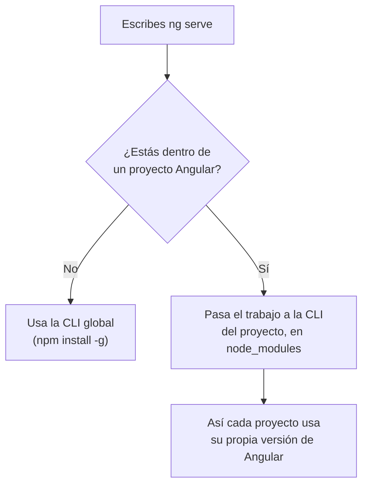

Podrías montar un proyecto Angular a mano: crear cada archivo, configurar el compilador, el servidor, las pruebas… Te llevaría días, y un error en cualquier pieza lo rompería todo. En su lugar, Angular te da un asistente que lo hace en segundos y que te acompañará siempre: la **Angular CLI**.

## Qué es la Angular CLI

**CLI** significa *Command Line Interface*, interfaz de línea de órdenes: un programa que se usa escribiendo en la terminal. La de Angular se llama `ng` y es un paquete de npm (`@angular/cli`) que se ejecuta con Node. Con ella:

- **creas** proyectos (`ng new`),
- **arrancas** el servidor de desarrollo (`ng serve`),
- **generas** componentes, servicios y más (`ng generate`),
- **compilas** para publicar (`ng build`),
- **pruebas** (`ng test`) y **actualizas** Angular (`ng update`).

> [!analogia]
> La CLI es el jefe de obra. Tú le dices «quiero una casa» (`ng new`) o «añade una habitación» (`ng generate component`), y él sabe qué materiales usar, dónde ponerlos y cómo dejarlo todo conectado según las normas de Angular.

## Instalarla

Con Node instalado, abre una terminal y escribe:

```bash
npm install -g @angular/cli
```

- `npm install` instala un paquete, como en la lección anterior.
- `-g` significa **global**: en lugar de instalarlo en la carpeta de un proyecto, lo instala para **todo el ordenador**, de modo que la orden `ng` funcione desde cualquier carpeta.
- `@angular/cli` es el nombre del paquete. El `@angular/` del principio es el **ámbito** (*scope*): indica que es un paquete oficial del equipo de Angular.

## Comprobar que funciona: ng version

```bash
ng version
```

Fuera de un proyecto, responde con algo así:

```text
Angular CLI       : 22.2.1
Node.js           : 24.21.0
Package Manager   : npm 11.19.0
Operating System  : linux x64
```

Dentro de un proyecto, además, muestra una tabla con la versión de cada paquete de Angular: la **pedida** en `package.json` y la **instalada** de verdad. Es lo primero que te pedirán si buscas ayuda en un foro.

La primera vez que uses `ng`, puede preguntarte si quieres compartir datos de uso anónimos con el equipo de Angular. Responde lo que prefieras (`y` o `N`); no cambia nada de cómo funciona.

## Las órdenes de ng

`ng help` (o `ng --help`) lista todas las órdenes. Las que más usarás:

| Orden | Atajo | Qué hace | Dónde la verás |
| --- | --- | --- | --- |
| `ng new mi-app` | `ng n` | Crea un proyecto nuevo en la carpeta `mi-app` | Módulo 4 |
| `ng serve` | `ng s` | Compila y arranca el servidor en `localhost:4200`, recargando al guardar | Módulo 4 |
| `ng generate component nombre` | `ng g c nombre` | Crea los archivos de un componente | Módulo 5 |
| `ng build` | `ng b` | Compila la app para publicarla en `dist/` | Módulos 4 y 21 |
| `ng test` | `ng t` | Ejecuta las pruebas | Módulo 18 |
| `ng add paquete` | | Instala y configura una librería (Material, SSR…) | Módulos 16 y 19 |
| `ng update` | | Actualiza Angular a una versión nueva | Módulo 21 |

## La CLI global y la del proyecto

En el `package.json` del proyecto viste `@angular/cli` dentro de `devDependencies`. Entonces, ¿hay dos CLI? Sí, y es a propósito:



La global sirve sobre todo para `ng new`, cuando aún no hay proyecto. Dentro de uno, `ng` delega en la versión instalada en ese proyecto. Así puedes tener un proyecto en Angular 20 y otro en Angular 22 en el mismo ordenador sin conflictos.

Si no quieres instalar nada global, también puedes usar **npx**, que viene con npm y ejecuta un paquete sin instalarlo de forma permanente:

```bash
npx @angular/cli@latest new mi-app
```

> [!cuidado]
> En Windows, PowerShell a veces bloquea las órdenes instaladas con npm y muestra un error como `ng.ps1 cannot be loaded because running scripts is disabled on this system`. Se arregla una sola vez ejecutando en PowerShell `Set-ExecutionPolicy -Scope CurrentUser -ExecutionPolicy RemoteSigned` y respondiendo que sí. En Mac o Linux, si `npm install -g` falla con `EACCES` (permiso denegado), no uses `sudo`: instala Node con un gestor de versiones como `nvm`.

> [!prueba]
> Instala la CLI y ejecuta `ng version`. Después escribe `ng help` y busca en la lista la orden `ng serve`: fíjate en que tiene el alias `s`, así que `ng s` hace lo mismo.

> [!resumen]
> - La Angular CLI (`ng`) crea, sirve, genera, compila, prueba y actualiza proyectos.
> - Se instala con `npm install -g @angular/cli`; `-g` la deja disponible en todo el ordenador.
> - `ng version` muestra las versiones de la CLI, Node, npm y, dentro de un proyecto, de cada paquete.
> - Dentro de un proyecto, `ng` usa la versión de la CLI instalada en ese proyecto.
