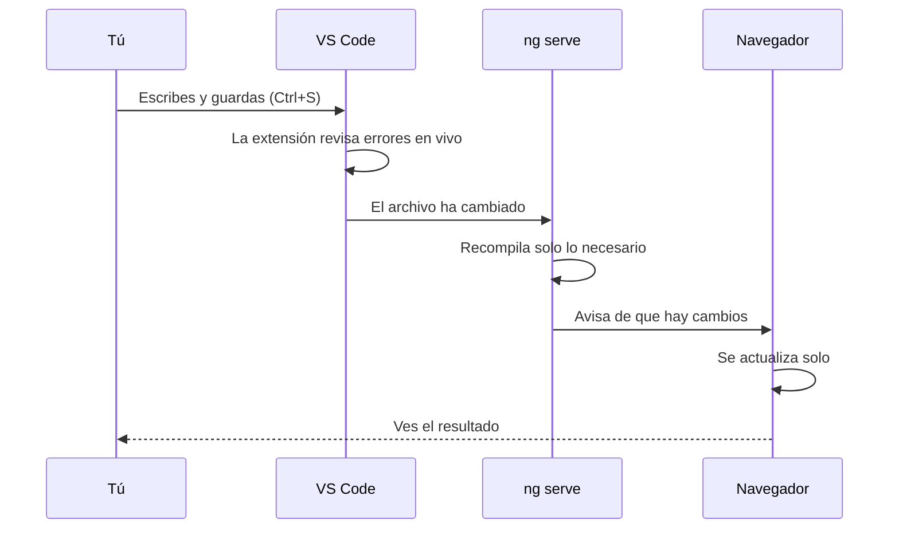

Puedes escribir código en el Bloc de notas, igual que puedes escribir un libro con una máquina de escribir. Pero un buen editor de código es como un procesador de textos con corrector: subraya los errores mientras escribes, te sugiere lo que viene después, te deja saltar de un archivo a otro con un clic y te enseña el tipo de cada cosa al pasar el ratón. Con Angular, esto marca una diferencia enorme.

## Visual Studio Code

**Visual Studio Code** (VS Code) es el editor más usado para Angular. Es gratuito, funciona en Windows, Mac y Linux, y entiende TypeScript de serie (lo hacen en Microsoft, como TypeScript). Descárgalo de `code.visualstudio.com` e instálalo.

Sus zonas principales:

```text
┌──────────────┬──────────────────────────────────┐
│ EXPLORADOR   │ app.ts                           │
│ ▾ src        │ export class App {               │
│   ▾ app      │   protected readonly title = …   │
│     app.ts   │ }                                │
│     app.html ├──────────────────────────────────┤
│   main.ts    │ TERMINAL                         │
│ package.json │ > npm start                      │
└──────────────┴──────────────────────────────────┘
```

- **Explorador** (izquierda): el árbol de carpetas y archivos del proyecto.
- **Editor** (centro): donde escribes. Puedes abrir varios archivos en pestañas.
- **Terminal integrada** (abajo): una terminal dentro del editor, ya situada en la carpeta del proyecto. Se abre con **Ver → Terminal** (o `` Ctrl+` ``; en teclados españoles, `Ctrl+ñ`).

Para trabajar con un proyecto, abre **la carpeta entera** (**Archivo → Abrir carpeta…**), no un archivo suelto: así el editor entiende el proyecto completo.

## La extensión Angular Language Service

VS Code entiende TypeScript, pero no las plantillas de Angular (`{{ clics() }}`, `(click)="sumar()"`…). Para eso está la extensión oficial **Angular Language Service** (identificador `angular.ng-template`). Una **extensión** es un complemento que añade funciones al editor.

Con ella, en tus plantillas HTML tendrás:

- **autocompletado** de las propiedades y métodos de tu componente,
- **errores en rojo** si usas algo que no existe (`{{ clix() }}` en lugar de `{{ clics() }}`),
- **ir a la definición**: `Ctrl+clic` sobre un nombre te lleva a donde se declara,
- información al pasar el ratón por encima.

Para instalarla, abre el panel de **Extensiones** (el icono de los cuatro cuadrados, o `Ctrl+Shift+X`), busca `Angular Language Service` e instala la del autor **Angular**.

> [!analogia]
> VS Code sin la extensión es un corrector ortográfico que sabe español pero no conoce las palabras de tu oficio. La extensión le enseña el vocabulario de Angular, y entonces también te corrige la parte HTML.

## La carpeta .vscode que crea Angular

Cuando hagas `ng new` (módulo 4), el proyecto traerá una carpeta para VS Code ya preparada:

```arbol
mi-app/
  .vscode/                # Configuración de VS Code para este proyecto
    extensions.json       # Recomienda instalar la extensión angular.ng-template al abrir el proyecto
    launch.json           # Botones para depurar la app en Chrome con el depurador del editor
    tasks.json            # Tareas que lanzan npm start y npm test desde el editor
  .editorconfig           # Reglas de formato para cualquier editor: 2 espacios, UTF-8, comillas simples en .ts
  .prettierrc             # Configuración de Prettier, el formateador automático de código
```

Gracias a `extensions.json`, al abrir el proyecto VS Code te mostrará un aviso para instalar la extensión recomendada. Este es su contenido real:

```json
{
  // For more information, visit: https://go.microsoft.com/fwlink/?linkid=827846
  "recommendations": ["angular.ng-template"]
}
```

## Prettier: el código siempre bien colocado

**Prettier** es una herramienta que **formatea** el código automáticamente: sangrías, espacios, comillas, saltos de línea. Ya viene en las `devDependencies` del proyecto y su configuración (`.prettierrc`) dice, por ejemplo, que se usen comillas simples y líneas de hasta 100 caracteres. Si instalas también la extensión **Prettier** en VS Code y activas **Format On Save** en los ajustes, tu código se ordenará solo cada vez que guardes.

## El ciclo de trabajo

Así será tu día a día a partir del módulo 4:



> [!prueba]
> Instala VS Code y la extensión Angular Language Service. Cuando tengas tu proyecto, abre `src/app/app.html`, escribe `{{ titulo() }}` y pasa el ratón por encima: la extensión te dirá que `titulo` no existe en el componente. Cámbialo por `{{ title() }}` y el error desaparece.

> [!cuidado]
> Si los errores rojos no aparecen o el autocompletado no funciona en las plantillas, revisa dos cosas: que has abierto la **carpeta del proyecto** (la que contiene `package.json` y `angular.json`), no una carpeta superior; y que has ejecutado `npm install`, porque la extensión necesita los paquetes de Angular en `node_modules`.

> [!resumen]
> - VS Code es el editor recomendado: abre siempre la carpeta completa del proyecto.
> - La extensión Angular Language Service (`angular.ng-template`) entiende las plantillas: autocompleta y marca errores.
> - El proyecto trae `.vscode/` con la extensión recomendada y tareas para `npm start` y `npm test`.
> - Prettier formatea el código; con Format On Save, al guardar.
