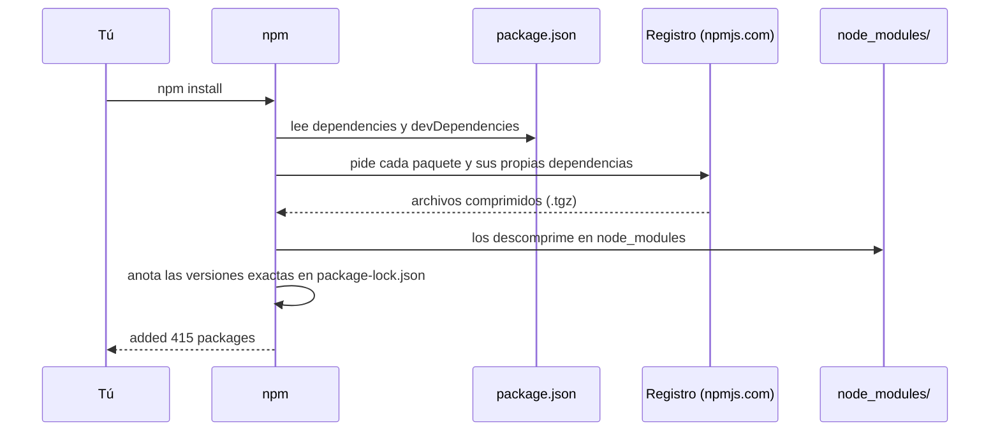

El `package.json` es la lista de la compra. Pero alguien tiene que ir a la tienda, traer los productos y colocarlos en la despensa. Eso hace `npm install`: lee la lista, descarga cada paquete y lo guarda en una carpeta llamada **`node_modules`**. Y como las librerías cambian de versión cada pocas semanas, necesitas reglas claras sobre **qué versión** se instala. Esta lección trata de las dos cosas.

## npm install: de la lista a la despensa

En la carpeta de un proyecto, ejecuta:

```bash
npm install
```

npm hace esto:



Fíjate en un detalle: el `package.json` de Angular pide **15** paquetes, pero en un proyecto recién creado npm instala **más de 400**. ¿Por qué? Porque cada paquete tiene **sus propias** dependencias, y estas, otras. Por ejemplo, `@angular/core` necesita `tslib`. A esas dependencias de tus dependencias se les llama **dependencias transitivas**.

```arbol
mi-app/
  package.json            # La lista de lo que pides (lo escribes tú o la CLI)
  package-lock.json       # Las versiones exactas que se instalaron (lo escribe npm)
  node_modules/           # Todos los paquetes descargados: unos 300 MB; nunca se edita a mano
    @angular/             # Los paquetes oficiales de Angular
      core/               # El corazón de Angular: lo importas con '@angular/core'
      router/             # La navegación entre pantallas
    rxjs/                 # Librería de flujos de datos que usa Angular
    typescript/           # El compilador de TypeScript
    tslib/                # Funciones de ayuda que usa el código compilado
    .bin/                 # Las órdenes de los paquetes (ng, tsc, vitest…) que usan los scripts
```

> [!analogia]
> `node_modules` es la despensa: llena, pesada y siempre reconstruible a partir de la lista de la compra. Por eso no se guarda ni se comparte: si la tiras, `npm install` la vuelve a llenar.

> [!cuidado]
> **Nunca** edites archivos dentro de `node_modules` ni la subas a tu repositorio de código. El `.gitignore` que crea Angular ya la excluye (línea `/node_modules`). Si algo raro pasa con las librerías, la solución clásica es borrar la carpeta `node_modules` y volver a ejecutar `npm install`.

## Versiones semánticas: MAYOR.MENOR.PARCHE

Casi todos los paquetes numeran sus versiones con tres números, siguiendo el **versionado semántico** (*semver*):

```text
22 . 2 . 1
│    │   └─ PARCHE: arregla errores; no cambia nada de lo que usas
│    └───── MENOR: añade cosas nuevas sin romper las que había
└────────── MAYOR: cambios que pueden romper tu código
```

Angular publica una versión **mayor** cada seis meses aproximadamente (la 21, la 22…), versiones **menores** con novedades y **parches** casi cada semana.

## El ^ y el ~ del package.json

Delante de cada versión del `package.json` hay un símbolo que dice **qué actualizaciones aceptas**:

| Escrito | Significa | Ejemplo: acepta… | …pero no |
| --- | --- | --- | --- |
| `^22.2.0` | Misma **mayor**: menores y parches más nuevos | `22.2.1`, `22.3.5` | `23.0.0` |
| `~7.8.0` | Misma **mayor y menor**: solo parches | `7.8.2` | `7.9.0` |
| `22.2.0` | Exactamente esa | `22.2.0` | Cualquier otra |

`^` (circunflejo) es el más común: «dame mejoras, pero nada que rompa». `~` (virgulilla) es más prudente: «solo arreglos». Angular usa `~` para `rxjs` y `typescript`, porque hasta sus versiones menores pueden traer cambios delicados.

Lo comprobé en un proyecto real: el `package.json` pedía `"@angular/cli": "^22.2.1"` y npm instaló la **22.2.2**, que había salido después. En cambio `"typescript": "~6.0.2"` instaló la **6.0.3**, y nunca instalaría una 6.1.

> [!idea]
> `^` acepta versiones nuevas de la misma **mayor**; `~` acepta solo parches de la misma **menor**. Ninguno de los dos salta a una versión mayor por su cuenta.

## package-lock.json: la foto exacta

Si el `package.json` dice `^22.2.0`, hoy se instala la 22.2.1 y dentro de un mes quizá la 22.4.0. Para que todo el equipo tenga **exactamente** lo mismo, npm escribe `package-lock.json` con la versión exacta de los más de 400 paquetes, de dónde se descargó cada uno y una huella para comprobar que no ha sido modificado:

```json
"node_modules/@angular/core": {
  "version": "22.2.1",
  "resolved": "https://registry.npmjs.org/@angular/core/-/core-22.2.1.tgz",
  "license": "MIT"
}
```

- `package-lock.json` **sí** se guarda en el repositorio, junto con `package.json`.
- `npm install` respeta el lock si existe, y lo actualiza si añades o cambias paquetes.
- `npm ci` instala **exactamente** lo que dice el lock, borrando antes `node_modules`. Es lo que se usa en servidores de integración continua (módulo 21).

Para añadir una librería nueva no editas el `package.json` a mano: lo hace npm por ti.

```bash
npm install date-fns
npm install --save-dev @types/node
```

La primera la añade a `dependencies`; con `--save-dev` (o `-D`) va a `devDependencies`.

> [!prueba]
> Cuando tengas tu proyecto, abre `node_modules/@angular/core/package.json` y busca la línea `"version"`. Compárala con lo que pide tu `package.json` (`^22.2.0` o similar): verás qué versión concreta eligió npm dentro de lo permitido.

> [!resumen]
> - `npm install` descarga los paquetes (y sus dependencias transitivas) en `node_modules`.
> - `node_modules` no se edita ni se comparte: se reconstruye con `npm install`.
> - Versiones MAYOR.MENOR.PARCHE: `^` acepta menores y parches; `~` solo parches.
> - `package-lock.json` fija las versiones exactas y sí se guarda; `npm ci` instala justo eso.
