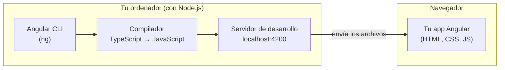
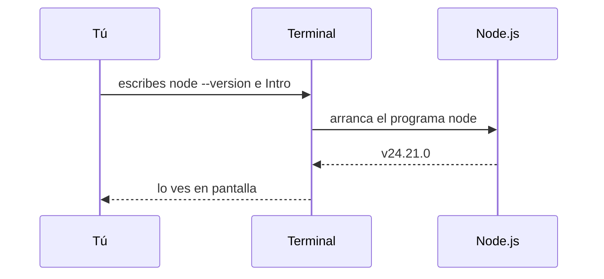

Para cocinar no basta con la receta: necesitas una cocina con fogones, cazuelas y una despensa. Con Angular pasa lo mismo. Ya sabes que tu app acabará siendo HTML, CSS y JavaScript en el navegador, pero para **fabricarla** necesitas herramientas en tu ordenador: un compilador de TypeScript, un servidor de desarrollo, un programa para hacer pruebas… Todas esas herramientas están escritas en JavaScript y necesitan algo que las ejecute **fuera** del navegador. Ese algo es **Node.js**.

## Node.js: JavaScript fuera del navegador

**Node.js** (o simplemente Node) es un programa que ejecuta JavaScript en tu ordenador, sin navegador. Lleva dentro el mismo tipo de motor de JavaScript que Chrome, pero en vez de pintar páginas, puede leer y escribir archivos, abrir servidores y ejecutar programas desde la **terminal** (la ventana donde escribes órdenes de texto).

Aquí está la clave que confunde a mucha gente:

> [!idea]
> Node **no** ejecuta tu aplicación Angular. Node ejecuta las **herramientas** que construyen tu aplicación. La aplicación terminada se ejecuta en el **navegador** del usuario, que no sabe ni que Node existe.



> [!analogia]
> Node es el taller; tu app es el coche. Para fabricar el coche necesitas el taller con sus máquinas. Pero cuando el coche sale a la calle, circula solo: el conductor (el navegador) no necesita el taller para conducirlo.

## npm: la tienda de librerías

Con Node se instala automáticamente **npm** (*Node Package Manager*, gestor de paquetes de Node). Un **paquete** es una librería o herramienta empaquetada para que otros la usen. npm hace dos cosas:

1. Es un **almacén público** en internet, el **registro** de npm (`npmjs.com`), con millones de paquetes. Ahí están `@angular/core`, `rxjs`, `typescript`…
2. Es un **programa** de terminal (`npm`) que descarga esos paquetes a tu proyecto y los mantiene ordenados.

Cuando en el módulo 2 viste `import { Component } from '@angular/core'`, ese `@angular/core` es un paquete que npm descargó del registro.

## Instalar Node

1. Entra en `nodejs.org` y descarga la versión **LTS** (*Long Term Support*, soporte a largo plazo): la estable, la recomendada.
2. Instálala como cualquier programa (siguiente, siguiente…). npm viene incluido.
3. Abre una terminal nueva (en Windows, **PowerShell**; en Mac, **Terminal**) y comprueba las versiones:

```bash
node --version
v24.21.0
npm --version
11.19.0
```

Cada orden se escribe y se confirma con **Intro**. La línea de debajo es lo que responde el ordenador (tus números pueden ser algo distintos).

Angular 22 exige una versión de Node concreta: **22.22.3 o superior dentro de la 22, 24.15.0 o superior dentro de la 24, o la 26 en adelante**. Si tu Node es más antiguo, la CLI se niega a arrancar con un mensaje como este:

```text
Node.js version v22.22.0 detected.
The Angular CLI requires a minimum Node.js version of v22.22.3 or v24.15.0 or v26.0.0.

Please update your Node.js version or visit https://nodejs.org/ for additional instructions.
```

La solución es instalar la LTS más reciente desde `nodejs.org`.

## Lo que pasa al ejecutar una orden



> [!prueba]
> Crea un archivo `hola.js` con una sola línea, `console.log('Hola desde Node');`, abre la terminal en esa carpeta y escribe `node hola.js`. Verás el mensaje en la terminal, sin navegador de por medio. Acabas de usar JavaScript fuera de la web.

> [!cuidado]
> Si al escribir `node --version` la terminal responde algo como `node: command not found` o «no se reconoce como un comando», casi siempre es porque la terminal estaba abierta **antes** de instalar Node. Ciérrala y abre una nueva: así carga la lista actualizada de programas.

> [!resumen]
> - Node.js ejecuta JavaScript en tu ordenador; Angular lo necesita para sus herramientas (CLI, compilador, servidor, pruebas).
> - Tu app terminada se ejecuta en el navegador, no en Node.
> - npm es el registro público de paquetes y el programa que los descarga.
> - Instala la versión LTS de Node; Angular 22 pide Node 22.22.3+, 24.15.0+ o 26+.
