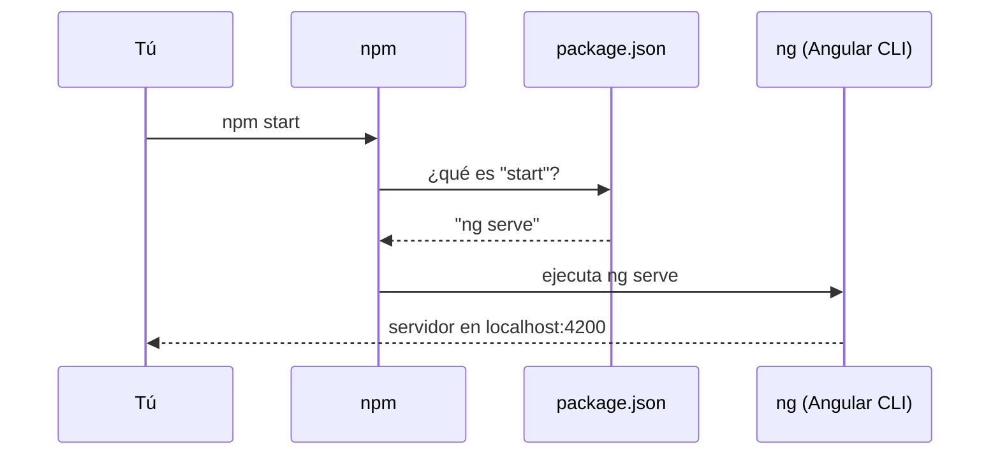

Cuando compartes una receta, no mandas la cocina entera: mandas la **lista de ingredientes** y los **pasos**. Con un proyecto pasa igual. Nadie envía las librerías descargadas (pesan cientos de megas); se envía una lista que dice qué librerías hacen falta y qué órdenes se pueden ejecutar. Esa lista es el archivo **`package.json`**, y todo proyecto de Angular tiene uno en su carpeta principal.

## El package.json real de un proyecto Angular 22

Este es el que genera `ng new mi-app` (lo verás nacer en el módulo 4):

```json
{
  "name": "mi-app",
  "version": "0.0.0",
  "scripts": {
    "ng": "ng",
    "start": "ng serve",
    "build": "ng build",
    "watch": "ng build --watch --configuration development",
    "test": "ng test"
  },
  "private": true,
  "packageManager": "npm@11.19.0",
  "dependencies": {
    "@angular/common": "^22.2.0",
    "@angular/compiler": "^22.2.0",
    "@angular/core": "^22.2.0",
    "@angular/forms": "^22.2.0",
    "@angular/platform-browser": "^22.2.0",
    "@angular/router": "^22.2.0",
    "rxjs": "~7.8.0",
    "tslib": "^2.3.0"
  },
  "devDependencies": {
    "@angular/build": "^22.2.1",
    "@angular/cli": "^22.2.1",
    "@angular/compiler-cli": "^22.2.0",
    "jsdom": "^30.0.0",
    "prettier": "^3.8.1",
    "typescript": "~6.0.2",
    "vitest": "^5.0.0"
  }
}
```

Está escrito en **JSON** (*JavaScript Object Notation*): el mismo formato que los objetos de TypeScript, pero más estricto. Los nombres van siempre entre comillas dobles y no se permiten comentarios ni comas al final.

Parte a parte:

- `"name"` y `"version"`: el nombre del proyecto y su versión. `0.0.0` significa «aún no publicado».
- `"private": true`: evita que lo publiques por error en el registro de npm. Es una app, no una librería para otros.
- `"packageManager"`: qué gestor de paquetes (y qué versión) usa el proyecto.
- `"scripts"`: atajos de órdenes (ahora los vemos).
- `"dependencies"` y `"devDependencies"`: las librerías que necesita el proyecto, cada una con su **versión** (el `^` y el `~` los verás en la próxima lección).

## dependencies y devDependencies

Las dos son listas de paquetes, pero con un propósito distinto:

| | `dependencies` | `devDependencies` |
| --- | --- | --- |
| Qué son | Código que **acaba dentro de tu app** | **Herramientas** para fabricarla y probarla |
| ¿Llegan al navegador? | Sí (la parte que uses) | No, se quedan en tu ordenador |
| Ejemplos | `@angular/core`, `@angular/router`, `rxjs` | `@angular/cli`, `typescript`, `vitest` |

> [!analogia]
> Haces una tarta. Las `dependencies` son los **ingredientes**: harina, huevos, azúcar; van dentro de la tarta que se come el invitado. Las `devDependencies` son los **utensilios**: horno, batidora, molde; los necesitas para hacerla, pero no se sirven en el plato.

Así, `typescript` es `devDependency` porque solo sirve para compilar (el navegador recibe JavaScript), y `vitest` porque solo sirve para hacer pruebas. En cambio, `@angular/core` va dentro de tu app: sin él, nada funciona. En el módulo 4 verás para qué sirve cada una de estas quince librerías.

## scripts: órdenes con nombre

La sección `"scripts"` da nombres cortos a órdenes más largas. Se ejecutan con `npm run <nombre>`:

```bash
npm run build
npm run watch
```

Algunos nombres especiales, como `start` y `test`, se pueden lanzar sin `run`:

```bash
npm start
npm test
```



¿Por qué no escribir directamente `ng serve`? Porque `npm run` usa la versión de `ng` **instalada en el proyecto**, aunque no la tengas instalada en todo el ordenador. Además, los scripts documentan cómo se trabaja con el proyecto: cualquiera que lo abra sabe que se arranca con `npm start`.

> [!prueba]
> Cuando tengas tu proyecto (módulo 4), añade a `"scripts"` la línea `"saluda": "echo Hola desde npm",` y ejecuta `npm run saluda`. Verás en la terminal la orden que se ejecuta y, debajo, `Hola desde npm`.

> [!cuidado]
> JSON no perdona: una coma de más al final de una lista o una comilla simple en lugar de doble rompen el archivo entero, y npm responde con un error como `JSON.parse Unexpected token`. Si npm se queja nada más empezar, revisa la última línea que tocaste en `package.json`.

> [!resumen]
> - `package.json` es la lista de ingredientes y órdenes del proyecto, en formato JSON.
> - `dependencies` acaban dentro de la app; `devDependencies` son herramientas para fabricarla y probarla.
> - `scripts` da nombres a órdenes: `npm start` ejecuta `ng serve`; los demás, con `npm run <nombre>`.
> - Un error de sintaxis en el JSON rompe todas las órdenes de npm.
