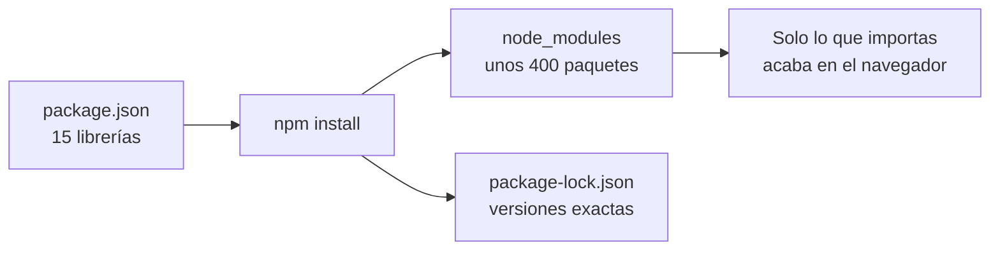

En la lección anterior viste las librerías que **viajan con tu app** hasta el navegador. Ahora vemos las que se quedan en tu ordenador: las que compilan, prueban y formatean. Y por qué, con solo quince librerías en `package.json`, tu carpeta `node_modules` acaba con cientos.

> [!analogia]
> Recuerda la película: las `dependencies` son los actores, que salen en pantalla. Las `devDependencies` son el **equipo técnico** (cámaras, focos, montadores): imprescindible para rodar, pero no sale en la película.

## Las devDependencies: el equipo técnico

| Librería | Para qué sirve |
| --- | --- |
| `@angular/cli` | El comando `ng`: `ng serve`, `ng build`, `ng generate`, `ng test`, `ng add`, `ng update`. Lee `angular.json` y delega el trabajo en los *builders*. |
| `@angular/build` | Los *builders*, las piezas que hacen el trabajo pesado: `application` (compila con **esbuild**, un empaquetador muy rápido), `dev-server` (sirve la app con **Vite**, un servidor de desarrollo con recarga instantánea) y `unit-test` (lanza Vitest). También compila Sass (y Less, si instalas el paquete `less`). |
| `@angular/compiler-cli` | El compilador de Angular para la línea de comandos (`ngc`). Envuelve a TypeScript, compila las plantillas y comprueba sus tipos: si escribes `{{ titel() }}` por error, el fallo aparece al compilar, no al usuario. |
| `typescript` | El compilador de TypeScript (versión 6.0): comprueba los tipos y traduce a JavaScript. |
| `vitest` | El ejecutor de pruebas: encuentra los `*.spec.ts`, ejecuta `describe`/`it`/`expect` y te dice qué pasa y qué falla. Módulo 18. |
| `jsdom` | Un navegador falso hecho en JavaScript: imita `document` y el DOM dentro de Node.js para que las pruebas puedan "pintar" componentes sin abrir Chrome. |
| `prettier` | El formateador de código. Lo usas tú (o tu editor) y también la CLI, que formatea con él los archivos que genera. |

## Qué descarga de verdad npm install

Ocho dependencias más siete de desarrollo son quince librerías… pero `node_modules` acaba con **unos 400 paquetes y unos 300 MB**. Cada librería trae las suyas: `@angular/build` necesita `esbuild`, `vite`, `sass`, `postcss`, `browserslist`…; `vitest` y `jsdom` traen decenas más. npm resuelve ese árbol entero, descarga cada paquete una vez y anota la versión exacta de todos en `package-lock.json`.

Lo importante es la última caja: el navegador **no** recibe 300 MB. En el build solo entra el código que tu aplicación importa de verdad, y el resto se descarta (a eso se le llama *tree shaking*, "sacudir el árbol" para que caigan las hojas que no usas). La app de bienvenida ocupa unos 216 kB, unos 59 kB comprimidos.

> [!cuidado]
> No muevas una librería de `dependencies` a `devDependencies` "para que pese menos": el tamaño final no depende de esa lista, sino de lo que importas. Y no instales paquetes de Angular con versiones mezcladas (`@angular/core` 22 con `@angular/router` 21): deben ir siempre juntos. Para actualizar, usa `ng update` (módulo 21).

> [!prueba]
> Ejecuta `npm ls --depth=0` en tu proyecto: lista solo las quince librerías de primer nivel. Después prueba `npm ls esbuild` y verás que `esbuild` llega dentro de `@angular/build`, sin que tú lo pidieras.

> [!resumen]
> - `devDependencies` solo construyen y prueban: cli, build, compiler-cli, typescript, vitest, jsdom y prettier.
> - npm descarga unos 400 paquetes porque cada librería trae las suyas; las versiones exactas quedan en `package-lock.json`.
> - Al navegador solo llega lo que importas (*tree shaking*).
