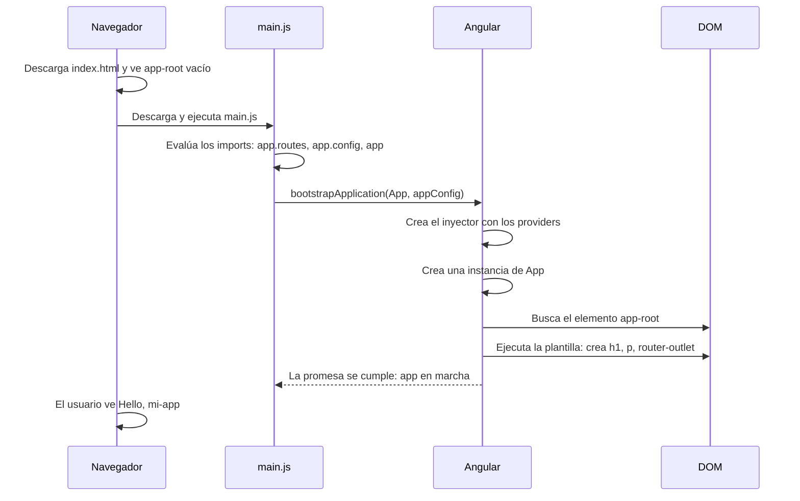

Abres `localhost:4200` y en menos de un segundo aparece «Hello, mi-app». Pero si miras el HTML que envía el servidor, dentro del `<body>` solo hay una etiqueta vacía: `<app-root></app-root>`. ¿Quién escribe el título? ¿Cuándo? ¿En qué orden? En esta lección seguimos el arranque **paso a paso**, archivo por archivo, línea por línea.

> [!analogia]
> Arrancar una app Angular es como abrir un teatro. `index.html` es el **escenario vacío** con una marca en el suelo (`<app-root>`). `main.ts` es el **regidor** que da la orden de empezar. `app.config.ts` es la **lista del equipo técnico** que tiene que estar en su puesto antes de subir el telón. Y `App` es la **obra**, que se representa justo encima de la marca.

## 1. index.html: el escenario vacío

```html
<!-- src/index.html -->
<!doctype html>
<html lang="en">
  <head>
    <meta charset="utf-8" />
    <title>MiApp</title>
    <base href="/" />
    <meta name="viewport" content="width=device-width, initial-scale=1" />
    <link rel="icon" type="image/x-icon" href="favicon.ico" />
  </head>
  <body>
    <app-root></app-root>
  </body>
</html>
```

- `<!doctype html>` y `<meta charset="utf-8" />`: página HTML moderna con tildes y eñes bien escritas.
- `<title>MiApp</title>`: el texto de la pestaña (el nombre del proyecto en *PascalCase*).
- `<base href="/" />`: la dirección base para las rutas relativas. El router la usa para saber dónde empieza tu app; si la publicas en `ejemplo.com/tienda/`, cambiará a `/tienda/`.
- `<meta name="viewport">`: hace que en el móvil la página use el ancho real de la pantalla en vez de verse diminuta.
- `<link rel="icon">`: el `favicon.ico` de `public/`.
- `<app-root></app-root>`: una etiqueta inventada. El navegador no sabe qué es y la deja vacía. Es la marca donde Angular pintará la app.

¿Y el `<script>`? No está porque **lo añade el build**. Al servir la página, la CLI inyecta `<link rel="stylesheet" href="styles.css">` y `<script src="main.js" type="module"></script>`.

## 2. main.ts: la orden de empezar

```typescript
// src/main.ts
import { bootstrapApplication } from '@angular/platform-browser';
import { appConfig } from './app/app.config';
import { App } from './app/app';

bootstrapApplication(App, appConfig).catch((err) => console.error(err));
```

- Línea 1: importa `bootstrapApplication` de `@angular/platform-browser`, la librería que conecta Angular con el navegador. *Bootstrap* significa "arrancar por uno mismo", como tirar de las cintas de tus botas.
- Línea 2: importa la configuración. `./` significa "un archivo nuestro, relativo a esta carpeta"; sin `./` sería una librería de `node_modules`. No se escribe `.ts`.
- Línea 3: importa la clase del componente raíz.
- Línea 5: «arranca la aplicación usando `App` como raíz y `appConfig` como configuración». Devuelve una **promesa** (módulo 2): el arranque termina un poco después. Si algo falla al arrancar, `.catch` escribe el error en la consola del navegador en vez de perderlo.

## 3. app.config.ts y app.routes.ts: el equipo técnico

```typescript
// src/app/app.config.ts
import { ApplicationConfig, provideBrowserGlobalErrorListeners } from '@angular/core';
import { provideRouter } from '@angular/router';
import { routes } from './app.routes';

export const appConfig: ApplicationConfig = {
  providers: [provideBrowserGlobalErrorListeners(), provideRouter(routes)],
};
```

- `ApplicationConfig` (de `@angular/core`) es el **tipo** del objeto: TypeScript comprueba que solo tenga campos válidos.
- `providers` es la lista de **proveedores**: piezas que la app tendrá disponibles en cualquier sitio gracias a la inyección de dependencias (módulo 10). Cada función `provide...()` devuelve un paquete de proveedores ya preparado.
- `provideBrowserGlobalErrorListeners()`: escucha los errores que nadie captura (los eventos `error` y `unhandledrejection` de `window`) y se los pasa al gestor de errores de Angular, para que ninguno pase desapercibido.
- `provideRouter(routes)` (de `@angular/router`): activa el router con la lista de rutas.

```typescript
// src/app/app.routes.ts
import { Routes } from '@angular/router';

export const routes: Routes = [];
```

Una lista vacía de rutas con su tipo, `Routes`. La rellenarás en el módulo 11.

## 4. app.ts y app.html: la obra

```typescript
// src/app/app.ts
import { Component, signal } from '@angular/core';
import { RouterOutlet } from '@angular/router';

@Component({
  imports: [RouterOutlet],
  selector: 'app-root',
  styleUrl: './app.css',
  templateUrl: './app.html',
})
export class App {
  protected readonly title = signal('mi-app');
}
```

- `@Component({...})` es un **decorador**: una etiqueta que convierte la clase en componente y le da sus datos.
- `selector: 'app-root'`: "píntame donde haya un `<app-root>`". Así se conecta con `index.html`.
- `templateUrl` y `styleUrl`: su HTML y su CSS, en archivos aparte.
- `imports: [RouterOutlet]`: los componentes y directivas que usa su plantilla. Usa `<router-outlet />`, así que lo importa.
- `export class App`: la clase. `export` permite que `main.ts` la importe.
- `title = signal('mi-app')`: un *signal*, un valor que avisa a Angular cuando cambia (módulo 7). `protected` hace que lo use la plantilla pero no otras clases; `readonly`, que nadie lo sustituya por otro signal.

Dentro de los 20 kB de `app.html`, lo esencial es esto:

```html
<!-- src/app/app.html (resumido) -->
<h1>Hello, {{ title() }}</h1>
<p>Congratulations! Your app is running. 🎉</p>

<router-outlet />
```

`{{ title() }}` lee el signal y escribe su valor. `<router-outlet />` es el hueco donde el router pintará la página de la ruta actual (de momento, nada).

## El arranque completo



Fíjate en el tercer paso: antes de ejecutar la línea de `bootstrapApplication`, el navegador **evalúa todos los archivos importados**, en el orden de los `import`. Solo entonces se ejecuta el cuerpo de `main.ts`.

Y un detalle que impresiona: el navegador nunca ve tu plantilla HTML. El compilador de Angular la convierte en una función de JavaScript. Esto es un trozo real de lo que `ng serve` envía para `App`:

```javascript
static ɵcmp = i0.ɵɵdefineComponent({
  type: _App,
  selectors: [["app-root"]],
  template: function App_Template(rf, ctx) {
    // ...
    i0.ɵɵtextInterpolate1("Hello, ", ctx.title());
  }
});
```

Tu decorador se ha convertido en una propiedad estática (`ɵcmp`), tu selector en `selectors` y `{{ title() }}` en una instrucción que escribe el texto. La `ɵ` marca código interno: nunca lo escribirás tú.

> [!cuidado]
> Si cambias el `selector` de `App` a `'mi-raiz'` y no cambias `index.html`, la página sale **en blanco** y la consola dice `NG05104: The selector "mi-raiz" did not match any elements`. El selector y la etiqueta de `index.html` tienen que coincidir.

```pantalla
@url localhost:4200/
<h1>Hello, mi-app</h1>
<p>Congratulations! Your app is running. 🎉</p>
```

> [!prueba]
> En tu proyecto, cambia `signal('mi-app')` por `signal('Ada')` en `app.ts` y guarda. Con `ng serve` en marcha, el navegador se recarga solo y muestra «Hello, Ada».

> [!resumen]
> - `index.html` solo tiene `<app-root>` vacío; el build le añade `<script src="main.js">`.
> - `main.ts` llama a `bootstrapApplication(App, appConfig)`: primero se evalúan los imports, después arranca.
> - `appConfig.providers` prepara las piezas globales (errores, router); luego Angular crea `App` y pinta su plantilla dentro del elemento que coincide con su `selector`.
> - Las plantillas se compilan a funciones JavaScript; el navegador nunca lee tu HTML de Angular.
