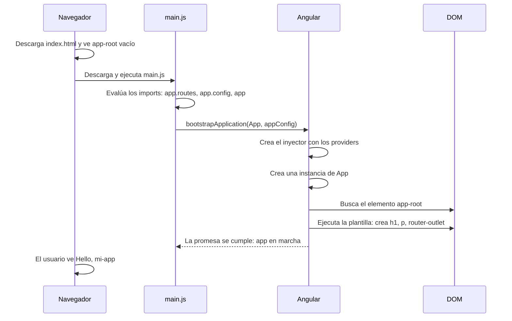

Ya sabes cómo llega Angular al navegador: `index.html` tiene el hueco `<app-root>`, `main.ts` da la orden de arrancar y `appConfig` prepara las piezas globales. Ahora toca el protagonista: el componente `App`, que se pinta justo en ese hueco.

> [!analogia]
> Seguimos en el teatro: `App` es **la obra**. Su `selector` es la marca en el suelo del escenario, y su plantilla es el guion de lo que se ve.

## 1. app.ts: la clase del componente

```typescript
// src/app/app.ts
import { Component, signal } from '@angular/core';
import { RouterOutlet } from '@angular/router';

@Component({
  imports: [RouterOutlet],
  selector: 'app-root',
  styleUrl: './app.css',
  templateUrl: './app.html',
})
export class App {
  protected readonly title = signal('mi-app');
}
```

- `@Component({...})` es un **decorador**: una etiqueta que convierte la clase en componente y le da sus datos.
- `selector: 'app-root'`: "píntame donde haya un `<app-root>`". Así se conecta con `index.html`.
- `templateUrl` y `styleUrl`: su HTML y su CSS, en archivos aparte.
- `imports: [RouterOutlet]`: los componentes y directivas que usa su plantilla. Usa `<router-outlet />`, así que lo importa.
- `export class App`: la clase. `export` permite que `main.ts` la importe.
- `title = signal('mi-app')`: un *signal*, un valor que avisa a Angular cuando cambia (módulo 7). `protected` hace que lo use la plantilla pero no otras clases; `readonly`, que nadie lo sustituya por otro signal.

## 2. app.html: la plantilla

Dentro de los 20 kB de `app.html`, lo esencial es esto:

```html
<!-- src/app/app.html (resumido) -->
<h1>Hello, {{ title() }}</h1>
<p>Congratulations! Your app is running. 🎉</p>

<router-outlet />
```

`{{ title() }}` lee el signal y escribe su valor. `<router-outlet />` es el hueco donde el router pintará la página de la ruta actual (de momento, nada).

## 3. El arranque completo



Fíjate en el tercer paso: antes de ejecutar la línea de `bootstrapApplication`, el navegador **evalúa todos los archivos importados**, en el orden de los `import`. Solo entonces se ejecuta el cuerpo de `main.ts`.

Y un detalle que impresiona: el navegador nunca ve tu plantilla HTML. El compilador de Angular la convierte en una función de JavaScript. Esto es un trozo real de lo que `ng serve` envía para `App`:

```javascript
static ɵcmp = i0.ɵɵdefineComponent({
  type: _App,
  selectors: [["app-root"]],
  template: function App_Template(rf, ctx) {
    // ...
    i0.ɵɵtextInterpolate1("Hello, ", ctx.title());
  }
});
```

Tu decorador se ha convertido en una propiedad estática (`ɵcmp`), tu selector en `selectors` y `{{ title() }}` en una instrucción que escribe el texto. La `ɵ` marca código interno: nunca lo escribirás tú.

> [!cuidado]
> Si cambias el `selector` de `App` a `'mi-raiz'` y no cambias `index.html`, la página sale **en blanco** y la consola dice `NG05104: The selector "mi-raiz" did not match any elements`. El selector y la etiqueta de `index.html` tienen que coincidir.

```pantalla
@url localhost:4200/
<h1>Hello, mi-app</h1>
<p>Congratulations! Your app is running. 🎉</p>
```

> [!prueba]
> En tu proyecto, cambia `signal('mi-app')` por `signal('Ada')` en `app.ts` y guarda. Con `ng serve` en marcha, el navegador se recarga solo y muestra «Hello, Ada».

> [!resumen]
> - `App` es un componente: una clase con `@Component` cuyo `selector` coincide con `<app-root>`.
> - Angular crea una instancia de `App` y ejecuta su plantilla dentro de ese elemento.
> - Las plantillas se compilan a funciones JavaScript; el navegador nunca lee tu HTML de Angular.
