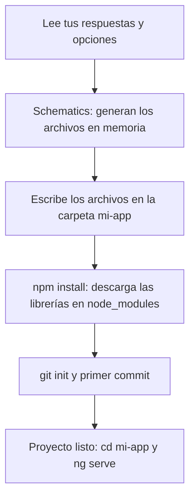

En la lección anterior viste las preguntas y las opciones de `ng new`. Ahora seguimos lo que ocurre **después** de responder: qué hace la CLI hasta dejarte un proyecto listo para `ng serve`.

> [!analogia]
> Es el camión de la casa prefabricada: primero llega el plano, luego las piezas, después las instalaciones y, por último, te entregan las llaves con una foto del estado inicial.

## Las cuatro fases

Cuando respondes la última pregunta, `ng new` trabaja en cuatro fases:



1. **Schematics.** Un *schematic* es una plantilla de código con instrucciones: «crea este archivo, con este nombre, rellenando estos huecos». `ng new` ejecuta tres: `workspace` (archivos de configuración), `application` (el código de la app) y `ai-config` (los archivos para la IA, si los pediste). Todo ocurre primero **en memoria**; por eso `--dry-run` puede enseñarte el resultado sin tocar el disco.
2. **Escribe los archivos.** Esto es lo que ves en la terminal:

```text
CREATE mi-app/README.md (1458 bytes)
CREATE mi-app/angular.json (1903 bytes)
CREATE mi-app/package.json (782 bytes)
CREATE mi-app/tsconfig.json (908 bytes)
CREATE mi-app/src/main.ts (222 bytes)
CREATE mi-app/src/index.html (291 bytes)
CREATE mi-app/src/app/app.ts (289 bytes)
CREATE mi-app/src/app/app.html (20144 bytes)
CREATE mi-app/src/app/app.config.ts (312 bytes)
...
```

3. **Instala las dependencias.** Ejecuta `npm install` dentro de la carpeta. npm lee `package.json`, descarga las librerías y las de las que estas dependen (unos 400 paquetes, unos 300 MB) y escribe `package-lock.json`. Es el paso lento.
4. **Git.** Crea un repositorio y hace un primer commit con el mensaje `initial commit`, para que tengas un punto de partida al que volver.

> [!cuidado]
> Si ejecutas `ng new` dentro de otro proyecto Angular, la CLI se niega con `Error: This command is not available when running the Angular CLI inside a workspace.` Ve antes a la carpeta donde guardas tus proyectos (`cd ~/proyectos`) y vuelve a intentarlo. Al revés pasa lo mismo: `ng generate` o `ng serve` fuera de un proyecto dicen `...outside a workspace`.

Cuando termina, solo te quedan dos órdenes:

```bash
cd mi-app
ng serve
```

Abre `http://localhost:4200/` y verás la página de bienvenida:

```pantalla
@url localhost:4200/
<h1>Hello, mi-app</h1>
<p>Congratulations! Your app is running. 🎉</p>
<p><a href="#">Explore the Docs</a> · <a href="#">Learn with Tutorials</a> · <a href="#">CLI Docs</a></p>
```

En las próximas lecciones veremos de dónde sale cada palabra de esa página.

> [!prueba]
> Ejecuta `ng new prueba --defaults --skip-install --skip-git` en una carpeta vacía. Verás que crea los archivos al instante, sin descargar nada. Entra con `cd prueba` y comprueba que no existe `node_modules`: te falta la fase 3.

> [!resumen]
> - `ng new` trabaja en cuatro fases: schematics en memoria, escribir archivos, `npm install` y primer commit de Git.
> - `npm install` es el paso lento; `--skip-install` y `--skip-git` se saltan las fases 3 y 4.
> - No ejecutes `ng new` dentro de otro proyecto Angular.
