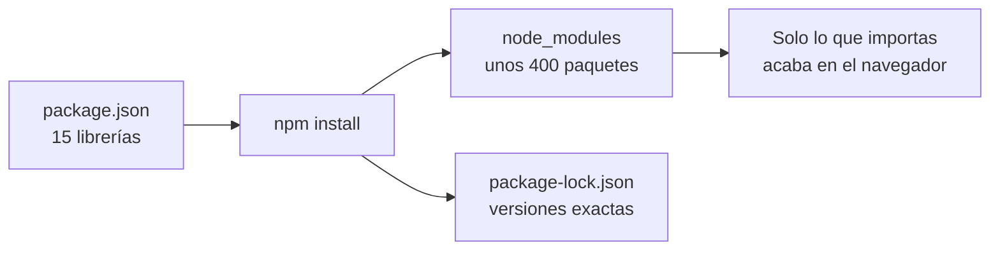

Angular no es un único programa: es un **equipo de librerías**, cada una con un trabajo. Unas viajan dentro de tu aplicación hasta el navegador del usuario; otras se quedan en tu ordenador y solo sirven para construir, probar y formatear. La lista completa está en `package.json`, y entenderla te dice exactamente con qué está hecho tu proyecto.

> [!analogia]
> Piensa en una película. Los **actores** salen en pantalla: son las `dependencies`, que acaban dentro de la app que ve el usuario. El **equipo técnico** (cámaras, focos, montadores) es imprescindible para rodar, pero no sale en la película: son las `devDependencies`.

## package.json, línea a línea

```json
{
  "name": "mi-app",
  "version": "0.0.0",
  "scripts": {
    "ng": "ng",
    "start": "ng serve",
    "build": "ng build",
    "watch": "ng build --watch --configuration development",
    "test": "ng test"
  },
  "private": true,
  "packageManager": "npm@11.19.0",
  "dependencies": {
    "@angular/common": "^22.2.0",
    "@angular/compiler": "^22.2.0",
    "@angular/core": "^22.2.0",
    "@angular/forms": "^22.2.0",
    "@angular/platform-browser": "^22.2.0",
    "@angular/router": "^22.2.0",
    "rxjs": "~7.8.0",
    "tslib": "^2.3.0"
  },
  "devDependencies": {
    "@angular/build": "^22.2.1",
    "@angular/cli": "^22.2.1",
    "@angular/compiler-cli": "^22.2.0",
    "jsdom": "^30.0.0",
    "prettier": "^3.8.1",
    "typescript": "~6.0.2",
    "vitest": "^5.0.0"
  }
}
```

- `name` y `version`: identifican el paquete. `0.0.0` porque aún no has publicado nada.
- `scripts`: atajos que ejecutas con `npm run <nombre>` (o `npm start` / `npm test`, que no necesitan `run`). Fíjate en que todos llaman a la CLI: `npm start` es lo mismo que `ng serve`. ¿Por qué existen, entonces? Porque usan la CLI **del proyecto** (la de `node_modules`), no la que tengas instalada globalmente, y así todo el equipo usa la misma versión. `watch` recompila en modo desarrollo cada vez que guardas.
- `private: true`: evita publicar por error tu app en el registro público de npm.
- `packageManager`: qué gestor de paquetes (y qué versión) usa el proyecto.
- `^22.2.0` y `~7.8.0`: recuerda del módulo 3 que `^` acepta nuevas versiones *minor* (22.3, 22.4…) y `~` solo *patch* (7.8.1, 7.8.2…).

## Las dependencies: lo que llega al navegador

| Librería | Para qué sirve |
| --- | --- |
| `@angular/core` | El corazón: componentes (`@Component`), *signals* (`signal`, `computed`), inyección de dependencias (`inject`), detección de cambios y el ciclo de vida. Casi todos tus archivos importan algo de aquí. |
| `@angular/common` | Utilidades comunes que usan las plantillas: pipes (`date`, `currency`, `uppercase`…), `NgOptimizedImage`, `Location` y también el cliente HTTP (`@angular/common/http`). |
| `@angular/platform-browser` | El puente con el navegador: `bootstrapApplication` arranca la app y su *renderer* crea y modifica elementos reales del DOM. También trae `Title`, `Meta` y la sanitización de seguridad. |
| `@angular/router` | La navegación entre "páginas" sin recargar: `provideRouter`, `<router-outlet>`, `routerLink`. Lo verás en el módulo 11. |
| `@angular/forms` | Formularios: `FormsModule` (`ngModel`), `ReactiveFormsModule` (`FormControl`, `FormGroup`) y validadores. Módulo 12. |
| `@angular/compiler` | El compilador de plantillas: convierte `<h1>{{ title() }}</h1>` en instrucciones JavaScript. Normalmente trabaja durante el build (a través de `compiler-cli`), así que en producción casi nunca viaja al navegador; está aquí porque algunas herramientas, como las pruebas, lo usan al ejecutar. |
| `rxjs` | La librería de *observables*: flujos de valores en el tiempo (respuestas HTTP, eventos del router). Angular la usa por dentro. Módulo 14. |
| `tslib` | Pequeñas funciones de ayuda que TypeScript necesita al traducir ciertas construcciones (decoradores, `async`…). Con la opción `importHelpers` se importan de aquí en vez de copiarse en cada archivo. |

## Las devDependencies: el equipo técnico

| Librería | Para qué sirve |
| --- | --- |
| `@angular/cli` | El comando `ng`: `ng serve`, `ng build`, `ng generate`, `ng test`, `ng add`, `ng update`. Lee `angular.json` y delega el trabajo en los *builders*. |
| `@angular/build` | Los *builders*, las piezas que hacen el trabajo pesado: `application` (compila con **esbuild**, un empaquetador muy rápido), `dev-server` (sirve la app con **Vite**, un servidor de desarrollo con recarga instantánea) y `unit-test` (lanza Vitest). También compila Sass (y Less, si instalas el paquete `less`). |
| `@angular/compiler-cli` | El compilador de Angular para la línea de comandos (`ngc`). Envuelve a TypeScript, compila las plantillas y comprueba sus tipos: si escribes `{{ titel() }}` por error, el fallo aparece al compilar, no al usuario. |
| `typescript` | El compilador de TypeScript (versión 6.0): comprueba los tipos y traduce a JavaScript. |
| `vitest` | El ejecutor de pruebas: encuentra los `*.spec.ts`, ejecuta `describe`/`it`/`expect` y te dice qué pasa y qué falla. Módulo 18. |
| `jsdom` | Un navegador falso hecho en JavaScript: imita `document` y el DOM dentro de Node.js para que las pruebas puedan "pintar" componentes sin abrir Chrome. |
| `prettier` | El formateador de código. Lo usas tú (o tu editor) y también la CLI, que formatea con él los archivos que genera. |

> [!idea]
> Fíjate en lo que **no** está: `zone.js`. Las versiones antiguas de Angular la necesitaban para enterarse de los cambios. Las apps nuevas de Angular 22 son *zoneless*: Angular sabe qué repintar gracias a los *signals* y a los eventos de la plantilla.

## Qué descarga de verdad npm install

Ocho dependencias más siete de desarrollo son quince librerías… pero `node_modules` acaba con **unos 400 paquetes y unos 300 MB**. Cada librería trae las suyas: `@angular/build` necesita `esbuild`, `vite`, `sass`, `postcss`, `browserslist`…; `vitest` y `jsdom` traen decenas más. npm resuelve ese árbol entero, descarga cada paquete una vez y anota la versión exacta de todos en `package-lock.json`.



Lo importante es la última caja: el navegador **no** recibe 300 MB. En el build solo entra el código que tu aplicación importa de verdad, y el resto se descarta (a eso se le llama *tree shaking*, "sacudir el árbol" para que caigan las hojas que no usas). La app de bienvenida ocupa unos 216 kB, unos 59 kB comprimidos.

> [!cuidado]
> No muevas una librería de `dependencies` a `devDependencies` "para que pese menos": el tamaño final no depende de esa lista, sino de lo que importas. Y no instales paquetes de Angular con versiones mezcladas (`@angular/core` 22 con `@angular/router` 21): deben ir siempre juntos. Para actualizar, usa `ng update` (módulo 21).

> [!prueba]
> En tu proyecto, abre `node_modules/@angular/core/package.json` y busca `"version"`. Después ejecuta `ng version`: verás la misma versión junto a la de cada paquete de la lista.

> [!resumen]
> - `dependencies` viajan con la app (core, common, platform-browser, router, forms, compiler, rxjs, tslib); `devDependencies` solo construyen y prueban (cli, build, compiler-cli, typescript, vitest, jsdom, prettier).
> - Los `scripts` son atajos a la CLI del proyecto: `npm start` = `ng serve`.
> - npm descarga unos 400 paquetes, pero al navegador solo llega lo que importas.
> - Angular 22 ya no usa zone.js.
