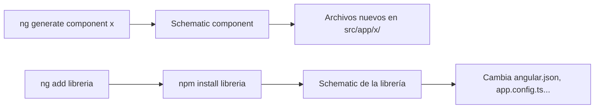

Vas a crear decenas de componentes, servicios y pipes. Cada componente necesita una carpeta, tres o cuatro archivos, un decorador con su selector, una clase con el nombre bien escrito y una prueba. Hacerlo a mano es lento y es fácil equivocarse en una letra. Para eso está **`ng generate`** (o su abreviatura, **`ng g`**): crea las piezas con el formato exacto que espera Angular.

> [!analogia]
> `ng generate` es un **molde de galletas**: le dices la forma (componente, servicio, pipe…) y el nombre, y te da una pieza perfecta, igual a todas las demás. Por dentro usa los mismos *schematics* que `ng new`, pero para una pieza en vez de para un proyecto entero.

## Generar un componente

Desde la carpeta del proyecto:

```bash
ng generate component tarjeta-usuario
```

```text
CREATE src/app/tarjeta-usuario/tarjeta-usuario.css (0 bytes)
CREATE src/app/tarjeta-usuario/tarjeta-usuario.spec.ts (589 bytes)
CREATE src/app/tarjeta-usuario/tarjeta-usuario.ts (220 bytes)
CREATE src/app/tarjeta-usuario/tarjeta-usuario.html (30 bytes)
```

```arbol
src/
  app/
    tarjeta-usuario/            # Una carpeta por componente, con su nombre en kebab-case
      tarjeta-usuario.css       # Sus estilos (vacío); solo afectan a este componente
      tarjeta-usuario.html      # Su plantilla, con un texto de ejemplo
      tarjeta-usuario.spec.ts   # Una prueba que comprueba que el componente se crea
      tarjeta-usuario.ts        # La clase TarjetaUsuario con su decorador @Component
```

Y el archivo principal:

```typescript
// src/app/tarjeta-usuario/tarjeta-usuario.ts
import { Component } from '@angular/core';

@Component({
  imports: [],
  selector: 'app-tarjeta-usuario',
  styleUrl: './tarjeta-usuario.css',
  templateUrl: './tarjeta-usuario.html',
})
export class TarjetaUsuario {}
```

Fíjate en las tres formas del mismo nombre:

| Dónde | Forma | Ejemplo |
| --- | --- | --- |
| Archivos y carpeta | *kebab-case* (minúsculas y guiones) | `tarjeta-usuario.ts` |
| Clase | *PascalCase* | `TarjetaUsuario` |
| Selector | prefijo + *kebab-case* | `app-tarjeta-usuario` |

Tú escribes el nombre una vez y la CLI lo transforma. El prefijo `app` sale de `angular.json`. En Angular 22 **no se añade el sufijo** `Component` (ni `.component` al archivo): el componente se llama `TarjetaUsuario`, no `TarjetaUsuarioComponent`.

La plantilla generada solo dice `<p>tarjeta-usuario works!</p>`. Para que se vea, hay que usarla en otro componente: lo verás en el siguiente módulo.

## Las demás piezas

`ng generate --help` lista todo lo que sabe crear. Las que más usarás:

| Comando | Crea | Módulo |
| --- | --- | --- |
| `ng g c nombre` | Componente: carpeta con `.ts`, `.html`, `.css` y `.spec.ts` | 5 |
| `ng g s nombre` | Servicio: `nombre.ts` con `@Service()` | 10 |
| `ng g d nombre` | Directiva: `nombre.ts` con selector `[appNombre]` | 9 |
| `ng g p nombre` | Pipe: `nombre-pipe.ts` con la clase `NombrePipe` | 9 |
| `ng g guard nombre` | Guard funcional para rutas: `nombre-guard.ts` | 11 |
| `ng g interceptor nombre` | Interceptor HTTP funcional | 13 |
| `ng g interface nombre` | Una `interface` de TypeScript vacía | 2 |
| `ng g environments` | Archivos de entorno (desarrollo/producción) | 21 |

Un servicio recién generado es así de corto:

```typescript
// src/app/usuarios.ts  (ng g s usuarios)
import { Service } from '@angular/core';

@Service()
export class Usuarios {}
```

> [!idea]
> En Angular 22 los servicios se generan con el decorador `@Service()`. En proyectos y tutoriales anteriores verás `@Injectable({ providedIn: 'root' })`, que hace casi lo mismo y sigue funcionando (y `ng g s nombre --injectable` lo genera así). Los verás los dos en el módulo 10.

## Opciones que conviene conocer

```bash
ng g c tarjeta-usuario --dry-run           # ensayo: muestra qué crearía, sin escribir
ng g c tarjeta-usuario --skip-tests        # sin el archivo .spec.ts
ng g c aviso --inline-template --inline-style   # todo en aviso.ts (abreviado: -t -s)
ng g c features/carrito/resumen            # dentro de src/app/features/carrito/resumen/
ng g c menu --flat                         # sin carpeta propia: directamente en src/app/
```

La ruta del nombre decide dónde se crea: `features/carrito/resumen` genera la carpeta `src/app/features/carrito/resumen/` y la clase `Resumen`. Y la CLI formatea todo lo que crea con Prettier, así que el código sale con el estilo del proyecto.

## ng generate frente a ng add

`ng generate` crea **tus** piezas. `ng add` instala **una librería** y la configura: por ejemplo, `ng add @angular/material` la descarga, añade sus estilos a `angular.json` y sus proveedores a `app.config.ts`. Es `npm install` más un *schematic* que hace el cableado por ti.



> [!cuidado]
> `ng generate` solo funciona **dentro** de un proyecto. Fuera, la CLI responde `Error: This command is not available when running the Angular CLI outside a workspace.` Y no pongas el tipo en el nombre: `ng g c tarjeta-component` crearía la clase `TarjetaComponent` en `tarjeta-component.ts`. Escribe solo `ng g c tarjeta`.

> [!prueba]
> En tu proyecto, ejecuta `ng g c saludo --dry-run`. Lee la lista de archivos. Después quita `--dry-run`, abre `src/app/saludo/saludo.ts` y comprueba que la clase se llama `Saludo` y el selector es `app-saludo`.

> [!resumen]
> - `ng generate` (`ng g`) crea piezas con el formato exacto: `ng g c` componentes, `ng g s` servicios, `ng g p` pipes, `ng g d` directivas, `ng g guard`…
> - Un componente es una carpeta con `.ts`, `.html`, `.css` y `.spec.ts`; la clase va en *PascalCase* sin sufijo y el selector lleva el prefijo `app-`.
> - `--dry-run`, `--skip-tests`, `-t -s` y `--flat` cambian qué y dónde se crea.
> - `ng add` instala y configura librerías; `ng generate` crea tu código.
