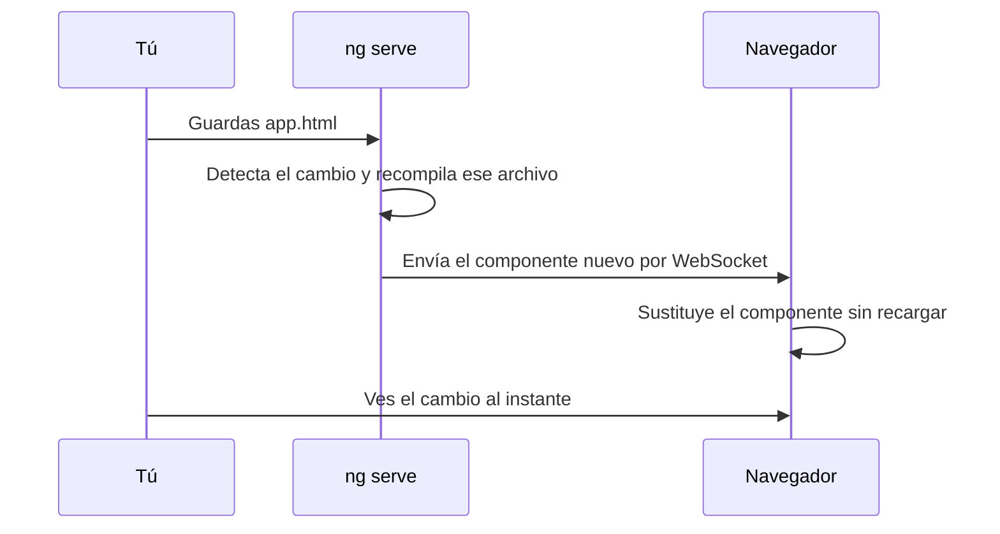

El navegador no entiende TypeScript, ni decoradores, ni `{{ title() }}`. Solo entiende HTML, CSS y JavaScript. Así que entre tu código y la pantalla siempre hay un paso de **compilación**. Angular te da dos comandos para hacerlo, cada uno para un momento distinto:

- **`ng serve`**: mientras desarrollas. Compila, sirve la app en `localhost:4200` y recompila cada vez que guardas.
- **`ng build`**: cuando terminas. Compila una versión optimizada y la deja en `dist/`, lista para subir a un servidor.

> [!analogia]
> `ng serve` es la **cocina abierta** de un restaurante: cocinas y pruebas al momento, y si cambias la sal, lo notas en el siguiente bocado. `ng build` es la **fábrica de conservas**: tarda más, lo envasa todo bien sellado y etiquetado, y el resultado puede viajar a cualquier tienda.

## ng serve por dentro

Esto es lo que aparece de verdad en la terminal:

```text
❯ Building...
✔ Building...
Initial chunk files | Names         | Raw size
main.js             | main          | 47.96 kB |
styles.css          | styles        | 95 bytes |

                    | Initial total | 48.06 kB

Application bundle generation complete. [1.871 seconds]

Watch mode enabled. Watching for file changes...
  ➜  Local:   http://localhost:4200/
```

Por orden, `ng serve`:

1. Lee el target `serve` de `angular.json`, que apunta al target `build` con la configuración `development`.
2. **Compila** con esbuild: TypeScript a JavaScript, plantillas a funciones, comprobando tipos por el camino. Si hay un error, lo ves aquí y en el navegador.
3. **Guarda el resultado en memoria**, no en disco: por eso no aparece ninguna carpeta `dist/`.
4. Arranca un **servidor de desarrollo** (Vite) en el puerto 4200. Las librerías de `node_modules` las prepara una sola vez y las guarda en `.angular/cache/`; por eso `main.js` solo pesa 48 kB: lleva tu código, y Angular va aparte.
5. **Vigila** tus archivos (*watch mode*). Al guardar, recompila solo lo que cambió.

Y aquí viene lo bonito. Así responde cuando cambias **una plantilla** y cuando cambias **un archivo TypeScript**:

```text
❯ Changes detected. Rebuilding...
Application bundle generation complete. [0.221 seconds]
Component update sent to client(s).

❯ Changes detected. Rebuilding...
Application bundle generation complete. [0.161 seconds]
Page reload sent to client(s).
```

- Si cambias una plantilla o unos estilos, envía **solo ese componente** al navegador y lo sustituye en caliente (*Hot Module Replacement*, HMR): la página no se recarga y no pierdes lo que habías escrito en un formulario.
- Si cambias código TypeScript, **recarga la página entera** (*live reload*).

En los dos casos, en menos de medio segundo.



Opciones útiles: `ng serve --open` (abre el navegador), `ng serve --port 4300` (otro puerto si el 4200 está ocupado). Para pararlo, `Ctrl + C`.

> [!cuidado]
> `ng serve` es solo para desarrollar: no está optimizado ni pensado para recibir usuarios reales. Nunca publiques una app arrancando `ng serve` en un servidor. Para eso está `ng build`.

## ng build por dentro

```bash
ng build
```

```text
Initial chunk files | Names         |  Raw size | Estimated transfer size
main-O7QUVEYP.js    | main          | 216.46 kB |                59.41 kB
styles-5INURTSO.css | styles        |   0 bytes |                 0 bytes

                    | Initial total | 216.46 kB |                59.41 kB

Application bundle generation complete. [5.368 seconds]

Output location: /home/ana/mi-app/dist/mi-app
```

Usa la configuración `production` y hace mucho más trabajo que `ng serve`:

- **Empaqueta** tu código y el de Angular en un solo `main-....js`.
- ***Tree shaking***: descarta todo lo que no importas.
- **Minimiza**: quita espacios y comentarios y acorta los nombres internos. `Raw size` es el tamaño del archivo; `Estimated transfer size`, lo que viaja comprimido por la red.
- **Comprueba los presupuestos** (*budgets*) de `angular.json`.
- **Copia** `public/` y escribe las licencias de terceros.

El resultado en disco:

```arbol
dist/                       # Carpeta de salida de ng build (no va a Git)
  mi-app/                   # Una por proyecto
    3rdpartylicenses.txt    # Licencias de las librerías incluidas en tu app
    browser/                # Esto es lo que subes al servidor web
      index.html            # Tu index.html con los link y script ya añadidos
      main-O7QUVEYP.js      # Todo el JavaScript de la app, minimizado; la huella cambia si cambia el código
      styles-5INURTSO.css   # Los estilos globales, minimizados
      favicon.ico           # Copiado tal cual desde public/
```

Y el `index.html` final ya enlaza los archivos con su nombre exacto:

```html
<!-- dist/mi-app/browser/index.html -->
<link rel="stylesheet" href="styles-5INURTSO.css">
...
<app-root></app-root>
<script src="main-O7QUVEYP.js" type="module"></script>
```

## ¿Por qué esos nombres tan raros?

`O7QUVEYP` es una **huella** (*hash*) calculada a partir del contenido del archivo. Si el contenido cambia una sola letra, la huella cambia.

Los navegadores guardan los archivos descargados en su **caché** para no bajarlos otra vez. Eso es bueno… hasta que publicas una versión nueva: si el archivo se llamara siempre `main.js`, el navegador podría seguir usando el viejo. Con la huella en el nombre, una versión nueva es un archivo con **otro nombre**, así que el navegador lo descarga sí o sí; y si no cambió, reutiliza el de la caché. Eso es lo que activa `"outputHashing": "all"`.

> [!idea]
> Producción y desarrollo son el **mismo código** compilado de dos formas. `ng build -c development` da un `main.js` sin huella, sin minimizar y con *source maps*: 1,39 MB frente a 216 kB.

> [!prueba]
> En tu proyecto, ejecuta `ng build` y abre `dist/mi-app/browser/main-....js` en el editor: es una sola línea gigantesca. Cambia una palabra en `app.html`, vuelve a ejecutar `ng build` y compara el nombre del archivo: la huella ha cambiado.

> [!resumen]
> - `ng serve` compila en memoria con la configuración `development`, sirve en `localhost:4200` y recompila al guardar: HMR para plantillas y estilos, recarga completa para TypeScript.
> - `ng build` usa `production`: empaqueta, descarta lo que no usas, minimiza, comprueba presupuestos y escribe en `dist/<proyecto>/browser/`.
> - Las huellas en los nombres (`main-O7QUVEYP.js`) obligan al navegador a descargar la versión nueva solo cuando el archivo cambia.
