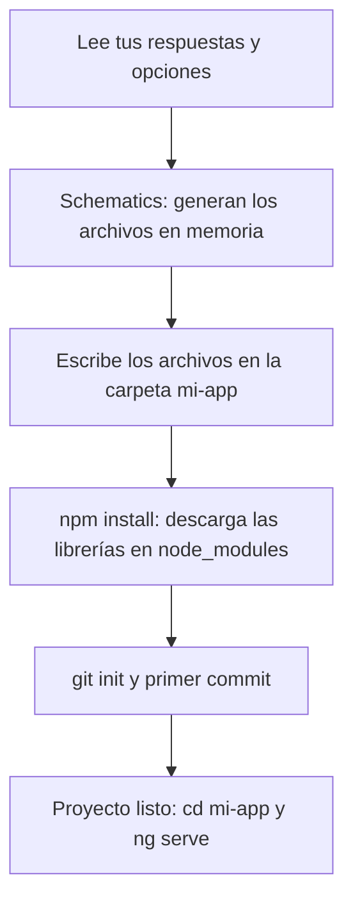

Ya tienes Node.js, npm y la Angular CLI instalados (módulo 3). Ahora escribes una sola línea en la terminal:

```bash
ng new mi-app
```

Unos segundos después tienes una carpeta con más de veinte archivos, unas 400 librerías descargadas y una aplicación que funciona. Parece magia, pero no lo es. En este módulo vamos a abrir esa caja y mirar **cada pieza**: qué te pregunta, qué crea, qué descarga y qué pasa cuando la aplicación arranca en el navegador.

> [!analogia]
> `ng new` es como encargar una casa prefabricada. Primero te preguntan cuatro cosas (¿cuántas plantas?, ¿qué suelo?). Luego llega el camión con las piezas ya cortadas y las monta según un plano. Al final te dan las llaves: puedes entrar a vivir el primer día y reformar lo que quieras después.

## Las preguntas que te hace

Si ejecutas `ng new` sin opciones, la CLI te hace unas preguntas en inglés. Con Angular 22 son estas:

```text
? What name would you like to use for the new workspace and initial project? mi-app
? Which stylesheet system would you like to use? (Use arrow keys)
❯ CSS
  Tailwind CSS
  Sass (SCSS)
  Sass (Indented)
  Less
? Do you want to enable Server-Side Rendering (SSR) and Static Site Generation (SSG/Prerendering)? (y/N)
? Which AI tools should Angular integrate with?
❯ None
  Claude Code
  Cursor
  Gemini CLI
  ...
```

Qué significa cada una:

| Pregunta | Qué decide | Qué elegir al empezar |
| --- | --- | --- |
| **Nombre** | El nombre de la carpeta y del proyecto. Se usa también en `package.json`, `angular.json` y el título de la página. | Minúsculas y guiones: `mi-app`, `tienda-online`. |
| **Stylesheet system** | En qué lenguaje escribirás los estilos: CSS normal, Tailwind (clases de utilidad ya hechas), Sass/SCSS o Less (CSS con variables y anidación). | **CSS**. Es lo que ya conoces y no necesita nada más. |
| **SSR / SSG** | Si la página se dibuja también en un servidor antes de llegar al navegador. Ayuda al SEO y a la primera carga, pero añade un servidor Node.js. | **No**. Lo verás en el módulo 19. |
| **AI tools** | Si crea archivos de instrucciones para asistentes de IA (`CLAUDE.md`, `AGENTS.md`, `GEMINI.md`) y la configuración del servidor MCP de Angular, para que la IA escriba Angular moderno. | **None**, o tu herramienta si la usas. |

> [!idea]
> Las respuestas no son para siempre. Casi todo se puede añadir después: `ng add @angular/ssr` añade SSR y `ng generate ai-config` crea los archivos para la IA.

## Las opciones de la línea de comandos

Cada pregunta tiene su opción, y hay más que no se preguntan. Las ves todas con `ng new --help`. Las más útiles:

| Opción | Qué hace |
| --- | --- |
| `--defaults` | No pregunta: usa los valores por defecto (CSS, sin SSR, sin IA). |
| `--style=scss` | Elige el lenguaje de estilos sin preguntar. |
| `--ssr` / `--no-ssr` | Activa o desactiva SSR. |
| `--ai-config=claude-code` | Genera los archivos para esa herramienta de IA. |
| `--prefix=tienda` | Prefijo de los selectores: los componentes se llamarán `<tienda-...>` en vez de `<app-...>`. |
| `--skip-tests` | No crea los archivos de prueba `.spec.ts`. |
| `--skip-install` | Crea los archivos pero no ejecuta `npm install`. |
| `--skip-git` | No crea el repositorio Git. |
| `--inline-template` / `--inline-style` | Pone la plantilla o los estilos del componente raíz dentro de `app.ts`, sin archivos aparte. |
| `--minimal` | Proyecto mínimo sin pruebas: para experimentar, no para producción. |
| `--dry-run` | Ensayo: muestra qué crearía, sin escribir nada. |

Y algunas que vienen ya en el valor moderno y conviene reconocer: `--zoneless` (sin la librería zone.js, el valor por defecto en las apps nuevas), `--standalone` (sin `NgModule`, por defecto), `--strict` (comprobaciones estrictas, por defecto), `--test-runner=vitest` (por defecto) y `--file-name-style-guide=2025` (archivos `app.ts` en vez del antiguo `app.component.ts`).

> [!prueba]
> En una carpeta que **no** sea un proyecto Angular, ejecuta `ng new prueba --defaults --dry-run`. Verás la lista de archivos que crearía y, al final, `NOTE: The "--dry-run" option means no changes were made.`

## Lo que hace, paso a paso

Cuando respondes la última pregunta, `ng new` trabaja en cuatro fases:



1. **Schematics.** Un *schematic* es una plantilla de código con instrucciones: «crea este archivo, con este nombre, rellenando estos huecos». `ng new` ejecuta tres: `workspace` (archivos de configuración), `application` (el código de la app) y `ai-config` (los archivos para la IA, si los pediste). Todo ocurre primero **en memoria**; por eso `--dry-run` puede enseñarte el resultado sin tocar el disco.
2. **Escribe los archivos.** Esto es lo que ves en la terminal:

```text
CREATE mi-app/README.md (1458 bytes)
CREATE mi-app/angular.json (1903 bytes)
CREATE mi-app/package.json (782 bytes)
CREATE mi-app/tsconfig.json (908 bytes)
CREATE mi-app/src/main.ts (222 bytes)
CREATE mi-app/src/index.html (291 bytes)
CREATE mi-app/src/app/app.ts (289 bytes)
CREATE mi-app/src/app/app.html (20144 bytes)
CREATE mi-app/src/app/app.config.ts (312 bytes)
...
```

3. **Instala las dependencias.** Ejecuta `npm install` dentro de la carpeta. npm lee `package.json`, descarga las librerías y las de las que estas dependen (unos 400 paquetes, unos 300 MB) y escribe `package-lock.json`. Es el paso lento.
4. **Git.** Crea un repositorio y hace un primer commit con el mensaje `initial commit`, para que tengas un punto de partida al que volver.

> [!cuidado]
> Si ejecutas `ng new` dentro de otro proyecto Angular, la CLI se niega con `Error: This command is not available when running the Angular CLI inside a workspace.` Ve antes a la carpeta donde guardas tus proyectos (`cd ~/proyectos`) y vuelve a intentarlo. Al revés pasa lo mismo: `ng generate` o `ng serve` fuera de un proyecto dicen `...outside a workspace`.

Cuando termina, solo te quedan dos órdenes:

```bash
cd mi-app
ng serve
```

Abre `http://localhost:4200/` y verás la página de bienvenida:

```pantalla
@url localhost:4200/
<h1>Hello, mi-app</h1>
<p>Congratulations! Your app is running. 🎉</p>
<p><a href="#">Explore the Docs</a> · <a href="#">Learn with Tutorials</a> · <a href="#">CLI Docs</a></p>
```

En las próximas lecciones veremos de dónde sale cada palabra de esa página.

> [!resumen]
> - `ng new` pregunta el nombre, el sistema de estilos, si quieres SSR y si quieres archivos para herramientas de IA. Con `--defaults` no pregunta.
> - Trabaja en cuatro fases: schematics en memoria, escribir archivos, `npm install` y primer commit de Git.
> - `ng new --help` lista todas las opciones; `--dry-run` enseña qué crearía sin escribir nada.
> - Las apps nuevas de Angular 22 son *standalone*, *zoneless*, estrictas y usan Vitest por defecto.
