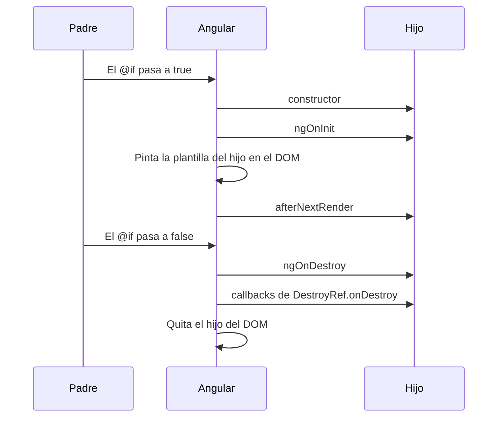

Un componente no vive para siempre. Nace cuando su etiqueta aparece en la pantalla, se pinta, se actualiza mientras el usuario lo usa y **muere** cuando su etiqueta desaparece (por ejemplo, al cambiar de página o al ocultarlo con un `@if`). A veces necesitas hacer algo en un momento concreto de esa vida: arrancar un temporizador al nacer, poner el cursor en un campo justo después de pintarlo, pararlo todo al morir.

Angular te avisa en cada uno de esos momentos. Son los **ganchos del ciclo de vida** (*lifecycle hooks*).

> [!analogia]
> Piensa en una **obra de teatro**. Antes de salir, el actor se viste en el camerino (constructor). Cuando le dan el papel, repasa su texto (`ngOnInit`). Cuando se abre el telón y ya está en escena, puede mirar al público (`afterNextRender`). Y al acabar, recoge sus cosas y apaga la luz del camerino (`ngOnDestroy` y `DestroyRef`). Si se le olvida apagar la luz, se queda encendida toda la noche.

## Los momentos, en orden

He comprobado este orden en un proyecto real con Angular 22: un componente hijo que se muestra y luego se oculta con un `@if`.



| Momento | Cuándo | Úsalo para |
| --- | --- | --- |
| `constructor` | Al crear la instancia de la clase | Inicializar propiedades, `inject()` de servicios, registrar `afterNextRender` y `DestroyRef`. |
| `ngOnInit` | Una vez, después del constructor, cuando ya tiene los datos que le pasa su padre | Lógica que depende de esos datos (*inputs*, módulo 8), como pedir algo al servidor con un id recibido. |
| `afterNextRender` | Una vez, cuando su plantilla ya está en el DOM real | Tocar el DOM: dar el foco a un campo, medir un elemento, iniciar una librería de gráficos. |
| `ngOnDestroy` | Justo antes de destruirlo | Limpiar: parar temporizadores, cancelar suscripciones. |
| `DestroyRef.onDestroy` | Igual, justo después de `ngOnDestroy` | Lo mismo, pero registrado donde creas el recurso. |

## constructor y DestroyRef: crear y limpiar juntos

Un reloj que se actualiza cada segundo:

```typescript
// src/app/reloj/reloj.ts
import { Component, DestroyRef, inject, signal } from '@angular/core';

function ahora(): string {
  return new Date().toLocaleTimeString();
}

@Component({
  selector: 'app-reloj',
  template: `<p>Son las {{ hora() }}</p>`,
})
export class Reloj {
  protected readonly hora = signal(ahora());

  constructor() {
    const id = setInterval(() => this.hora.set(ahora()), 1000);
    inject(DestroyRef).onDestroy(() => clearInterval(id));
  }
}
```

- `setInterval(..., 1000)` (del navegador) ejecuta la función cada segundo y devuelve un `id` para poder pararlo.
- `this.hora.set(...)` cambia el signal; como la plantilla lo lee, Angular repinta el texto.
- `inject(DestroyRef)` (de `@angular/core`) pide a Angular el objeto que representa "la destrucción de este componente". `inject` solo funciona mientras se crea la clase: en el constructor o al declarar una propiedad.
- `.onDestroy(() => clearInterval(id))`: "cuando me destruyan, para el temporizador".

La ventaja: **crear y limpiar están juntos**, en dos líneas seguidas. No tienes que guardar el `id` en una propiedad para encontrarlo después en otro método.

```pantalla
@url localhost:4200/
<p>Son las 10:42:07</p>
```

> [!cuidado]
> Si olvidas el `clearInterval`, al ocultar el reloj el temporizador **sigue funcionando** para siempre, en segundo plano, cambiando un componente que ya no existe. Si el usuario lo muestra y oculta diez veces, tendrás diez temporizadores. Es una **fuga de memoria**: la app se va volviendo lenta sin motivo aparente. Todo lo que arrancas (temporizadores, suscripciones, escuchas de eventos de `window`) tiene que pararse.

## ngOnInit y ngOnDestroy: la forma con interfaces

Los ganchos con prefijo `ng` son **métodos** que escribes en la clase. Angular los llama si existen. Las interfaces `OnInit` y `OnDestroy` (de `@angular/core`) no son obligatorias, pero hacen que TypeScript compruebe que escribes bien el nombre:

```typescript
import { Component, OnDestroy, OnInit } from '@angular/core';

@Component({
  selector: 'app-temporizador',
  template: `<p>Abierto</p>`,
})
export class Temporizador implements OnInit, OnDestroy {
  private inicio = 0;

  ngOnInit() {
    this.inicio = Date.now();
  }

  ngOnDestroy() {
    console.log(`Estuvo abierto ${Date.now() - this.inicio} ms`);
  }
}
```

Hoy, para limpiar, se prefiere `DestroyRef` (junto a lo que creas); `ngOnDestroy` sigue siendo perfectamente válido y lo verás muchísimo.

## afterNextRender: cuando el DOM ya existe

En el constructor la plantilla **todavía no** se ha pintado: si intentas dar el foco a un `<input>`, no existe. `afterNextRender` espera a que esté en el DOM:

```typescript
// src/app/buscador/buscador.ts
import { Component, ElementRef, afterNextRender, viewChild } from '@angular/core';

@Component({
  selector: 'app-buscador',
  template: `<input #caja placeholder="Buscar..." />`,
})
export class Buscador {
  private readonly caja = viewChild.required<ElementRef<HTMLInputElement>>('caja');

  constructor() {
    afterNextRender(() => {
      this.caja().nativeElement.focus();
    });
  }
}
```

`#caja` da un nombre al `<input>` y `viewChild` lo busca (lo verás en el módulo 8). Al abrir la página, el cursor ya parpadea en el buscador. Existe también `afterEveryRender`, que se ejecuta tras **cada** repintado; úsalo poco, porque se llama muchas veces. Además, estos dos solo se ejecutan en el navegador, nunca en el servidor (módulo 19).

> [!idea]
> Regla rápida: **preparar** en el constructor, **usar datos del padre** en `ngOnInit`, **tocar el DOM** en `afterNextRender`, **limpiar** con `DestroyRef`. Y si un valor se calcula a partir de otros, no necesitas ningún gancho: usa `computed` (módulo 7).

En código antiguo verás también `ngAfterViewInit` (parecido a `afterNextRender`), `ngOnChanges` (cuando cambian los datos del padre; lo verás con los *inputs*) y `ngDoCheck`. Existen y funcionan, pero en código nuevo casi nunca hacen falta.

> [!prueba]
> En tu proyecto, crea el `Reloj` de esta lección y muéstralo dentro de un `@if` con un botón que lo oculte (módulo 6). Añade un `console.log('tic')` dentro del `setInterval`. Oculta el reloj y mira la consola: los `tic` se detienen. Después quita la línea de `DestroyRef` y repite: los `tic` siguen.

> [!resumen]
> - Orden: `constructor` → `ngOnInit` → plantilla en el DOM → `afterNextRender`; al quitarlo, `ngOnDestroy` → `DestroyRef.onDestroy`.
> - `inject(DestroyRef).onDestroy(...)` registra la limpieza junto a lo que creas; todo lo que arrancas se debe parar.
> - `afterNextRender` es el sitio para tocar el DOM; en el constructor aún no existe.
