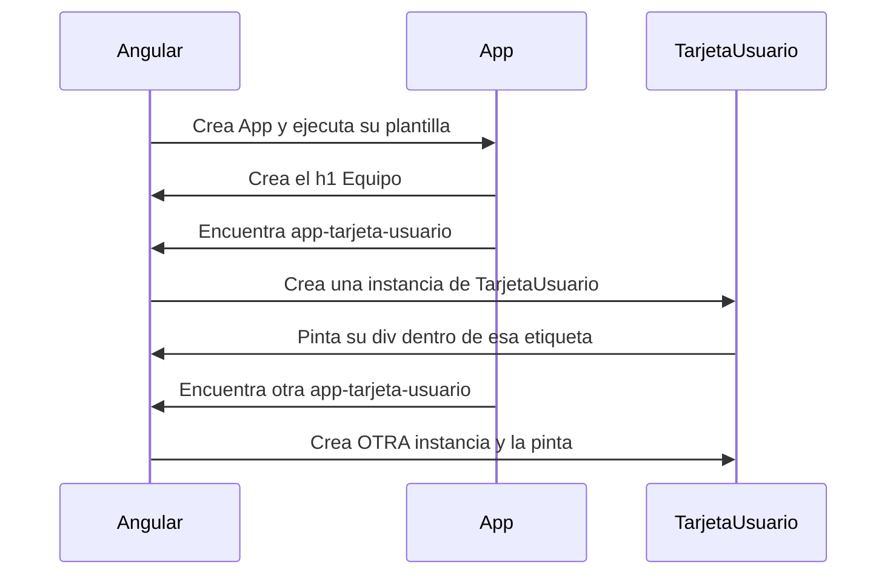

Ya sabes cómo es un componente por dentro. Ahora toca el ciclo completo que harás cientos de veces: **crear** un componente con la CLI y **usarlo** dentro de otro. Son tres pasos y uno de ellos se olvida siempre al principio, así que vamos a verlo con calma, y también el error que aparece cuando falta.

> [!analogia]
> Usar un componente dentro de otro es como **invitar a alguien a una fiesta**. No basta con que exista (crear el componente): tienes que ponerlo en la lista de invitados (`imports`) y después reservarle un sitio en la mesa (su etiqueta en la plantilla). Si le guardas sitio pero no está en la lista, el portero no le deja pasar.

## Paso 1: crearlo

```bash
ng generate component tarjeta-usuario
```

```text
CREATE src/app/tarjeta-usuario/tarjeta-usuario.css (0 bytes)
CREATE src/app/tarjeta-usuario/tarjeta-usuario.spec.ts (589 bytes)
CREATE src/app/tarjeta-usuario/tarjeta-usuario.ts (220 bytes)
CREATE src/app/tarjeta-usuario/tarjeta-usuario.html (30 bytes)
```

Cambia su plantilla por algo propio:

```html
<!-- src/app/tarjeta-usuario/tarjeta-usuario.html -->
<div class="tarjeta">
  <strong>{{ nombre }}</strong>
  <span>{{ rol }}</span>
</div>
```

```typescript
// src/app/tarjeta-usuario/tarjeta-usuario.ts
import { Component } from '@angular/core';

@Component({
  imports: [],
  selector: 'app-tarjeta-usuario',
  styleUrl: './tarjeta-usuario.css',
  templateUrl: './tarjeta-usuario.html',
})
export class TarjetaUsuario {
  protected readonly nombre = 'Grace Hopper';
  protected readonly rol = 'Administradora';
}
```

Si ahora miras el navegador… no ha cambiado nada. Crear un componente no lo pone en ninguna parte: **existe, pero nadie lo usa**.

## Pasos 2 y 3: importarlo y colocar su etiqueta

Para que aparezca, otro componente (aquí, `App`) tiene que usarlo:

```typescript
// src/app/app.ts
import { Component } from '@angular/core';
import { TarjetaUsuario } from './tarjeta-usuario/tarjeta-usuario';

@Component({
  selector: 'app-root',
  imports: [TarjetaUsuario],
  template: `
    <h1>Equipo</h1>
    <app-tarjeta-usuario />
    <app-tarjeta-usuario />
  `,
})
export class App {}
```

Tres piezas, cada una con su motivo:

1. **`import { TarjetaUsuario } from './tarjeta-usuario/tarjeta-usuario'`**: el `import` de TypeScript (módulo 2). Trae la clase a este archivo. La ruta es relativa a `app.ts` y no lleva `.ts`.
2. **`imports: [TarjetaUsuario]`**: le dice al **compilador de Angular** que la plantilla de `App` puede usar ese componente. Es la lista de invitados.
3. **`<app-tarjeta-usuario />`**: dónde se pinta, usando su `selector`. Se puede cerrar en la misma etiqueta (`/>`) o con `<app-tarjeta-usuario></app-tarjeta-usuario>`: es lo mismo.

```pantalla
@url localhost:4200/
<h1>Equipo</h1>
<div><strong>Grace Hopper</strong> <span>Administradora</span></div>
<div><strong>Grace Hopper</strong> <span>Administradora</span></div>
```

## Qué pasa al pintar



Angular recorre el árbol **de arriba abajo**: primero el padre, después cada hijo en el orden en que aparece en la plantilla. Cada etiqueta es una instancia nueva, con sus propios datos.

## El árbol, en el DOM

Así queda la página en las herramientas de desarrollo (F12):

```html
<app-root>
  <h1>Equipo</h1>
  <app-tarjeta-usuario>
    <div class="tarjeta"><strong>Grace Hopper</strong><span>Administradora</span></div>
  </app-tarjeta-usuario>
  <app-tarjeta-usuario>
    <div class="tarjeta"><strong>Grace Hopper</strong><span>Administradora</span></div>
  </app-tarjeta-usuario>
</app-root>
```

La etiqueta del componente (`<app-tarjeta-usuario>`) se queda en el DOM y **envuelve** su plantilla. Ese elemento es el *host* del que hablamos en la lección anterior.

> [!cuidado]
> Si pones la etiqueta pero olvidas añadir la clase a `imports`, el build falla con:
>
> `NG8001: 'app-tarjeta-usuario' is not a known element: 1. If 'app-tarjeta-usuario' is an Angular component, then verify that it is included in the '@Component.imports' of this component.`
>
> El mensaje lo dice todo: añádelo a `imports`. Y al revés: si lo importas pero no usas su etiqueta, Angular te avisa de que sobra.

> [!idea]
> Un componente solo puede usar en su plantilla lo que tiene en **sus** `imports`. Que `App` importe `TarjetaUsuario` no permite a otros componentes usarla: cada uno declara lo suyo. Así, leyendo un archivo, sabes exactamente de qué depende.

En proyectos antiguos verás los componentes declarados en un `@NgModule` con `declarations: [...]` y compartidos a través del módulo. Es la forma anterior a los componentes *standalone*; hoy no se usa en código nuevo.

> [!prueba]
> En tu proyecto, genera `ng g c saludo`, cambia su plantilla por `<p>¡Hola desde Saludo!</p>` y úsalo en `app.html` (sin olvidar `imports` en `app.ts`). Después quita `Saludo` de `imports` y guarda: lee el error NG8001 en la terminal y en el navegador.

> [!resumen]
> - `ng g c nombre` crea el componente, pero no lo coloca en ninguna parte.
> - Para usarlo en otro: `import` de TypeScript + añadirlo a `imports` del decorador + su etiqueta en la plantilla.
> - Sin el paso de `imports`, el build falla con NG8001.
> - Cada etiqueta crea una instancia; Angular pinta el árbol del padre a los hijos.
