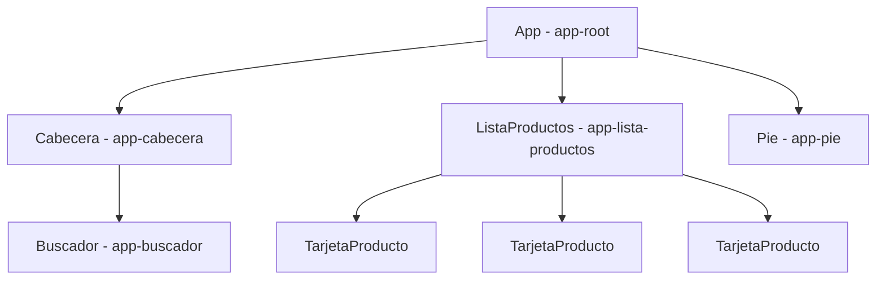

Mira cualquier web que uses a diario: una tienda online, por ejemplo. Arriba hay una cabecera con el logo y el buscador. Debajo, una lista de productos, y cada producto es una tarjeta con foto, nombre y precio. Abajo, un pie con enlaces. Esa tarjeta de producto aparece cincuenta veces, siempre igual, solo cambian los datos.

Si escribieras esa página en un único archivo HTML enorme, cambiar el diseño de la tarjeta significaría cambiarlo en cincuenta sitios. Angular propone otra forma de pensar: **divide la página en piezas**, y cada pieza se escribe una vez y se usa donde haga falta. Esas piezas son los **componentes**.

> [!analogia]
> Un componente es como una **pieza de LEGO**. Cada pieza tiene una forma propia (su HTML), un color (su CSS) y unos enganches para unirse a otras (su selector). Con pocas piezas distintas construyes algo grande, y si una pieza se rompe, la cambias sin desmontar el castillo entero.

## Las tres partes de un componente

Todo componente de Angular tiene tres partes, más una etiqueta que las une:

| Parte | Lenguaje | Qué hace |
| --- | --- | --- |
| **La clase** | TypeScript | Guarda los datos y el comportamiento: qué nombre mostrar, qué hacer al pulsar un botón. |
| **La plantilla** | HTML de Angular | Dice qué se ve y dónde van los datos de la clase (`{{ nombre }}`). |
| **Los estilos** | CSS | Dicen cómo se ve. Por defecto solo afectan a este componente. |
| **El decorador** `@Component` | TypeScript | Une las tres: dice que la clase es un componente, cuál es su plantilla, sus estilos y su selector. |

Este es un componente completo, con sus tres archivos:

```typescript
// src/app/perfil/perfil.ts
import { Component } from '@angular/core';

@Component({
  selector: 'app-perfil',
  templateUrl: './perfil.html',
  styleUrl: './perfil.css',
})
export class Perfil {
  protected readonly nombre = 'Ada Lovelace';
  protected readonly oficio = 'Programadora';
  protected readonly lenguajes = 3;
}
```

```html
<!-- src/app/perfil/perfil.html -->
<article class="tarjeta">
  <h2>{{ nombre }}</h2>
  <p>{{ oficio }} · {{ lenguajes }} lenguajes</p>
</article>
```

```css
/* src/app/perfil/perfil.css */
.tarjeta {
  border: 1px solid #ccc;
  border-radius: 8px;
  padding: 1rem;
}
```

Línea a línea:

- `import { Component } from '@angular/core'`: el decorador viene del corazón de Angular.
- `@Component({...})`: lo que hay entre llaves son los **metadatos**, datos *sobre* la clase. Los verás uno a uno en la próxima lección.
- `selector: 'app-perfil'`: el nombre de la etiqueta. Donde escribas `<app-perfil />`, aparecerá este componente.
- `export class Perfil`: la clase. Sus propiedades (`nombre`, `oficio`, `lenguajes`) son los datos que la plantilla puede mostrar. Son `protected` porque solo las usa su plantilla, y `readonly` porque no van a cambiar.
- En la plantilla, `{{ nombre }}` es una **interpolación**: "escribe aquí el valor de `nombre`". El módulo 6 está dedicado a las plantillas.

Si otro componente usa `<app-perfil />` dos veces, se ve así:

```pantalla
@url localhost:4200/
<article style="border:1px solid #ccc;border-radius:8px;padding:1rem;margin-bottom:8px">
  <h2>Ada Lovelace</h2>
  <p>Programadora · 3 lenguajes</p>
</article>
<article style="border:1px solid #ccc;border-radius:8px;padding:1rem">
  <h2>Ada Lovelace</h2>
  <p>Programadora · 3 lenguajes</p>
</article>
```

Cada `<app-perfil />` es una **instancia** distinta: Angular crea un objeto `Perfil` nuevo para cada etiqueta, igual que `new Perfil()` dos veces. Cuando aprendas a pasarle datos (módulo 8), cada tarjeta podrá mostrar a una persona diferente.

## El árbol de componentes

Una app de Angular es un **árbol** de componentes. Arriba del todo está `App`, el componente raíz que arranca `main.ts`. Su plantilla usa otros componentes, cuyas plantillas usan otros, y así hasta las piezas más pequeñas:



En el navegador, ese árbol es literalmente el DOM: dentro de `<app-root>` hay un `<app-cabecera>`, dentro de este un `<app-buscador>`… Si abres las herramientas de desarrollo (F12), verás esas etiquetas tal cual.

> [!idea]
> Un componente = **una responsabilidad**. Si al describirlo usas la palabra "y" («muestra el carrito *y* gestiona el pago *y* el login»), probablemente son varios componentes.

¿Cuándo crear un componente nuevo? Cuando un trozo de pantalla **se repite** (la tarjeta), cuando tiene **sentido por sí mismo** (el buscador) o cuando un archivo se hace **demasiado largo** para entenderlo de un vistazo.

> [!cuidado]
> En proyectos antiguos verás `export class PerfilComponent` en `perfil.component.ts` y, a veces, componentes declarados en un `@NgModule`. Es el estilo anterior a Angular 17–20. Hoy los componentes son *standalone* (independientes): no necesitan módulos y el CLI los genera sin el sufijo `Component`.

> [!prueba]
> En tu proyecto, abre la página de bienvenida, pulsa F12 y busca `app-root` en la pestaña Elementos. Despliégalo: todo lo que ves dentro lo ha creado la plantilla del componente `App`.

> [!resumen]
> - Un componente es una pieza reutilizable de interfaz: clase (datos y lógica) + plantilla (HTML) + estilos (CSS), unidas por `@Component`.
> - Su `selector` es la etiqueta con la que se usa: `<app-perfil />`. Cada etiqueta crea una instancia nueva.
> - Una app es un árbol de componentes con `App` en la raíz.
