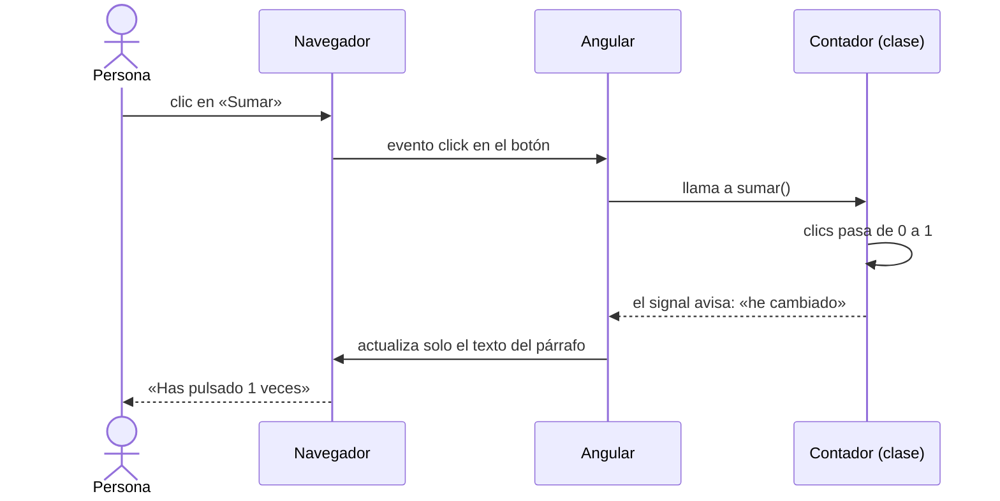

Hasta ahora los datos solo viajaban en un sentido: de la clase a la pantalla. Pero una página de verdad escucha: pulsas **Añadir a la cesta**, escribes en un buscador, aprietas Enter. Para reaccionar a lo que hace la persona, Angular tiene el **enlace de eventos**, con paréntesis: `( )`.

> [!analogia]
> Un evento es un timbre. El navegador lo hace sonar cada vez que pasa algo: un clic, una tecla, el ratón encima. `(click)="sumar()"` es una nota pegada al timbre que dice: «cuando suene, llama a `sumar()`».

## Paréntesis: del elemento a la clase

```typescript
// src/app/contador/contador.ts
import { Component, signal } from '@angular/core';

@Component({
  selector: 'app-contador',
  template: `
    <p>Has pulsado {{ clics() }} veces</p>
    <button (click)="sumar()">Sumar</button>
    <button (click)="clics.set(0)">Reiniciar</button>
  `,
})
export class Contador {
  protected readonly clics = signal(0);

  protected sumar(): void {
    this.clics.update((n) => n + 1);
  }
}
```

- `signal(0)` crea un valor que empieza en 0 y **avisa a Angular cuando cambia**. Así Angular sabe que tiene que repintar. (Por qué hace falta ese aviso lo descubrirás en el módulo 7).
- `(click)="sumar()"`: el nombre entre paréntesis es el evento del DOM (`click`, `input`, `keyup`, `submit`, `mouseenter`…). Lo de la derecha es una **instrucción** que se ejecuta cuando ocurre.
- `this.clics.update((n) => n + 1)` cambia el valor a partir del anterior: si era 2, pasa a 3.
- `(click)="clics.set(0)"`: puedes escribir una instrucción corta directamente en la plantilla. Si ocupa más de una línea, llévala a un método.

Antes de pulsar y después de pulsar tres veces **Sumar**:

```pantalla
@url localhost:4200/
<p>Has pulsado 0 veces</p>
<button>Sumar</button> <button>Reiniciar</button>
```

```pantalla
@url localhost:4200/
<p>Has pulsado 3 veces</p>
<button>Sumar</button> <button>Reiniciar</button>
```

## Qué ocurre, paso a paso, en cada clic



Angular no recarga la página ni rehace la lista de elementos: cambia un único texto. Es la fase **actualizar** de la lección anterior.

## `$event`: los detalles del evento

Cada evento trae información: qué tecla se pulsó, qué hay escrito en una caja de texto… Angular te la da con la variable especial `$event`:

```typescript
// src/app/eco/eco.ts
import { Component, signal } from '@angular/core';

@Component({
  selector: 'app-eco',
  template: `
    <input (input)="escribir($event)" placeholder="Escribe algo" />
    <p>Has escrito: {{ texto() }}</p>

    <input #campo placeholder="Tu nombre y Enter" (keyup.enter)="saludar(campo.value)" />
    <button (click)="saludar(campo.value)">Saludar</button>
    <p>{{ saludo() }}</p>
  `,
})
export class Eco {
  protected readonly texto = signal('');
  protected readonly saludo = signal('');

  protected escribir(evento: Event): void {
    const input = evento.target as HTMLInputElement;
    this.texto.set(input.value);
  }

  protected saludar(nombre: string): void {
    this.saludo.set(`¡Hola, ${nombre}!`);
  }
}
```

- `(input)` se dispara con cada letra que escribes. `$event` es el objeto `Event` del navegador.
- `evento.target` es el elemento que lanzó el evento. TypeScript solo sabe que es «algo del DOM», así que con `as HTMLInputElement` le dices que es una caja de texto y puedes leer su `.value`.
- `(keyup.enter)` es un evento con **filtro de tecla**: solo salta al soltar Enter. Existen `keydown.escape`, `keyup.arrowdown`, `keydown.control.s`…

## `#ref`: ponerle nombre a un elemento

`#campo` es una **variable de plantilla**: un nombre para ese `<input>` que puedes usar en cualquier sitio de la misma plantilla. `campo.value` lee lo que hay escrito en el momento del clic. Es la forma más corta de pasar un valor sin `$event`.

Si escribes «hola» en la primera caja y «Ada» + Enter en la segunda:

```pantalla
@url localhost:4200/
<input value="hola" /> <p>Has escrito: hola</p>
<input value="Ada" /> <button>Saludar</button>
<p>¡Hola, Ada!</p>
```

> [!prueba]
> En tu proyecto, copia el componente `Eco`, añádelo a los `imports` de `App` y pon `<app-eco />` en `app.html`. Cambia `(keyup.enter)` por `(keyup.escape)` y comprueba que ahora saluda al pulsar Escape.

> [!cuidado]
> Escribir `(click)="sumar"` sin paréntesis no llama a nada: solo nombra la función. El botón no hace nada. El compilador solo te deja un aviso en la terminal de `ng serve` (`NG8111: Function in event binding should be invoked: sumar()`), fácil de pasar por alto. En un evento, el método siempre lleva `()`.

En proyectos antiguos verás contadores con una propiedad normal (`clics = 0`) y `clics++`. Funcionaba porque una librería llamada zone.js vigilaba cada evento. Las apps nuevas de Angular 22 no la usan; por eso aquí usamos signals.

> [!resumen]
> - `(evento)="instrucción"` ejecuta código cuando el elemento lanza ese evento.
> - `$event` es el objeto del evento; `(keyup.enter)` filtra por tecla.
> - `#nombre` da nombre a un elemento para usarlo en la plantilla, por ejemplo `campo.value`.
> - Al cambiar un signal en el evento, Angular actualiza solo lo que depende de él.
