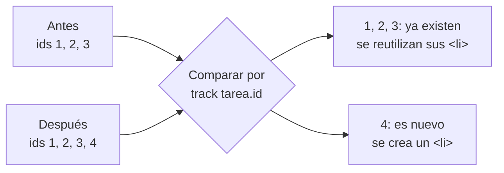

Tu lista de tareas tiene 3 elementos hoy y 12 mañana. Los resultados de una búsqueda pueden ser 0 o 500. No puedes escribir un `<li>` a mano por cada uno: necesitas decir «por cada tarea, pinta esto». Eso es `@for`, el bucle de la plantilla.

> [!analogia]
> `@for` es un sello de tinta. Diseñas el sello una vez (el `<li>` con sus huecos) y lo estampas una vez por cada elemento de la lista. El `track` es la etiqueta con el número de pedido que pegas en cada estampa: así, si la lista cambia de orden, sabes qué hoja es cuál sin volver a estampar todo.

## Un `@for` completo

```typescript
// src/app/lista-tareas/lista-tareas.ts
import { Component, signal } from '@angular/core';

interface Tarea {
  id: number;
  titulo: string;
}

@Component({
  selector: 'app-lista-tareas',
  template: `
    <ul>
      @for (tarea of tareas(); track tarea.id; let i = $index, ultima = $last) {
        <li [class.ultima]="ultima">{{ i + 1 }}. {{ tarea.titulo }}</li>
      } @empty {
        <li>No tienes tareas</li>
      }
    </ul>
    <p>Total: {{ tareas().length }}</p>
    <button (click)="anadir()">Añadir</button>
    <button (click)="vaciar()">Vaciar</button>
  `,
})
export class ListaTareas {
  private siguienteId = 4;
  protected readonly tareas = signal<Tarea[]>([
    { id: 1, titulo: 'Comprar pan' },
    { id: 2, titulo: 'Estudiar Angular' },
    { id: 3, titulo: 'Regar las plantas' },
  ]);

  protected anadir(): void {
    const nueva = { id: this.siguienteId++, titulo: 'Tarea nueva' };
    this.tareas.update((lista) => [...lista, nueva]);
  }

  protected vaciar(): void {
    this.tareas.set([]);
  }
}
```

La línea clave, trozo a trozo:

- `tarea of tareas()`: recorre el array; en cada vuelta, `tarea` es un elemento.
- `track tarea.id`: **obligatorio**. Le dice a Angular cómo reconocer cada elemento: por su `id`. Lo explicamos abajo.
- `let i = $index, ultima = $last`: da nombres cortos a las **variables implícitas** del bucle.
- `@empty { ... }`: lo que se pinta cuando el array está vacío. Es opcional.
- `[...lista, nueva]` crea un array **nuevo** con lo de antes más la tarea nueva. En el módulo 7 verás por qué es mejor que `push`.

Las variables implícitas que tienes en cada vuelta:

| Variable | Qué vale |
| --- | --- |
| `$index` | La posición: 0, 1, 2… |
| `$first` / `$last` | `true` en el primer / último elemento |
| `$even` / `$odd` | `true` en posiciones pares / impares |
| `$count` | Cuántos elementos tiene la lista |

Puedes usarlas tal cual (`{{ $index }}`) o renombrarlas con `let`.

Así se ve al principio, después de pulsar **Añadir** y después de pulsar **Vaciar**:

```pantalla
@url localhost:4200/tareas
<ul><li>1. Comprar pan</li><li>2. Estudiar Angular</li><li>3. Regar las plantas</li></ul>
<p>Total: 3</p>
<button>Añadir</button> <button>Vaciar</button>
```

```pantalla
@url localhost:4200/tareas
<ul><li>1. Comprar pan</li><li>2. Estudiar Angular</li><li>3. Regar las plantas</li><li>4. Tarea nueva</li></ul>
<p>Total: 4</p>
<button>Añadir</button> <button>Vaciar</button>
```

```pantalla
@url localhost:4200/tareas
<ul><li>No tienes tareas</li></ul>
<p>Total: 0</p>
<button>Añadir</button> <button>Vaciar</button>
```

## Por qué `track` es obligatorio

Cuando el array cambia, Angular podría borrar todos los `<li>` y crearlos de nuevo. Funcionaría, pero es lento con listas largas y tiene efectos raros: si estabas escribiendo en un `<input>` de la lista, perderías el foco y lo escrito. Con `track`, Angular compara la lista vieja con la nueva **por identidad** y toca lo mínimo:



Qué poner en `track`:

- Si tus datos tienen un identificador único (`id`, un código, un email), úsalo: `track tarea.id`.
- Si es una lista de textos o números que no se repiten, el propio valor: `track nombre`.
- `track $index` solo si la lista nunca se reordena ni se borra por el medio: identifica por posición, no por contenido.

> [!prueba]
> En tu proyecto, añade `<span>({{ $count }})</span>` dentro del `<li>` y guarda: cada línea dirá cuántas tareas hay. Después cambia `@empty` por otro mensaje y pulsa **Vaciar**.

> [!cuidado]
> Si olvidas el `track`, el compilador se niega: `NG5002: @for loop must have a "track" expression`. Y si pones algo que se repite (por ejemplo `track tarea.titulo` con dos tareas iguales), Angular no puede distinguirlas y, cuando la lista cambia, avisa en la consola del navegador: `NG0955: The provided track expression resulted in duplicated keys`. En proyectos antiguos verás `*ngFor="let t of tareas; trackBy: fn"`, donde el `trackBy` era opcional y casi siempre se olvidaba.

> [!resumen]
> - `@for (x of lista; track x.id) { }` repite un bloque por cada elemento.
> - `track` es obligatorio: identifica cada elemento para reutilizar su DOM.
> - `@empty { }` se pinta cuando la lista está vacía.
> - `$index`, `$first`, `$last`, `$even`, `$odd` y `$count` dan información de cada vuelta.
