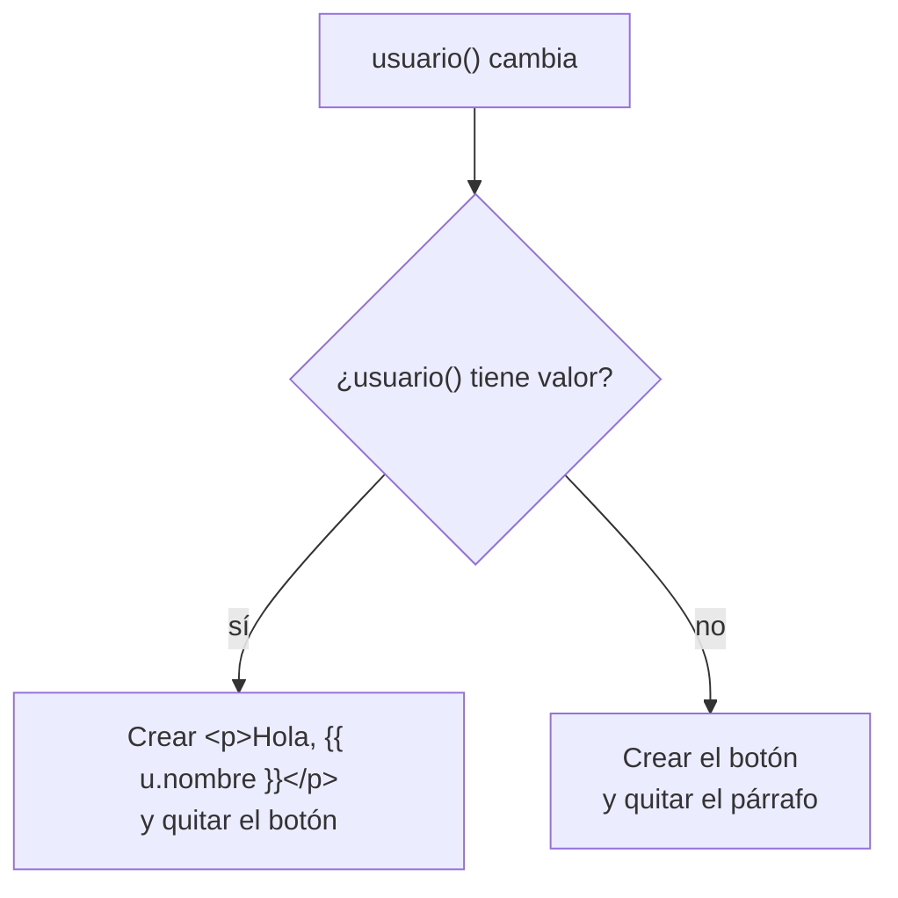

Una página no siempre enseña lo mismo. Si no has iniciado sesión, ves **Iniciar sesión**; si ya entraste, ves «Hola, Ada». Si tu cesta está vacía, un aviso; si llevas tres artículos, «¡Envío gratis!». Decidir **qué partes existen** según los datos es el trabajo del **control de flujo** de la plantilla: `@if`, `@switch` y su ayudante `@let`.

> [!analogia]
> Es como el escaparate de una tienda que se monta cada mañana según el tiempo: si llueve, se ponen los paraguas; si no, las gafas de sol. No se tapan con una sábana: los que no tocan **ni siquiera se sacan del almacén**. `@if` hace lo mismo con los elementos.

## `@if`, `@else if` y `@else`

```typescript
// src/app/pedido/pedido.ts
import { Component, signal } from '@angular/core';

type Estado = 'pendiente' | 'enviado' | 'entregado';

interface Usuario {
  nombre: string;
  puntos: number;
}

@Component({
  selector: 'app-pedido',
  template: `
    @if (usuario(); as u) {
      <p>Hola, {{ u.nombre }}</p>
    } @else {
      <button (click)="entrar()">Iniciar sesión</button>
    }

    @if (unidades() === 0) {
      <p>Tu cesta está vacía</p>
    } @else if (unidades() < 3) {
      <p>Llevas {{ unidades() }} artículos</p>
    } @else {
      <p>¡Envío gratis! Llevas {{ unidades() }} artículos</p>
    }

    @switch (estado()) {
      @case ('pendiente') { <p>Preparando tu pedido</p> }
      @case ('enviado') { <p>Tu pedido va de camino</p> }
      @default { <p>Pedido entregado</p> }
    }

    @let total = unidades() * precio;
    <p>Total: {{ total }} €</p>
    @if (total > 50) {
      <p>Te regalamos una taza</p>
    }
  `,
})
export class Pedido {
  protected readonly usuario = signal<Usuario | null>(null);
  protected readonly unidades = signal(2);
  protected readonly estado = signal<Estado>('enviado');
  protected readonly precio = 15;

  protected entrar(): void {
    this.usuario.set({ nombre: 'Ada', puntos: 120 });
  }
}
```

Vamos por partes:

- `@if (condición) { ... }`: el bloque entre llaves **solo existe** si la condición es verdadera. No hay que importar nada: `@if` es sintaxis del propio compilador.
- `@if (usuario(); as u)`: además de comprobar que `usuario()` no es `null`, guarda el valor en `u` para usarlo dentro sin volver a escribir `usuario()`.
- `} @else {`: lo que se pinta cuando la condición es falsa.
- `@else if (...)`: más casos, que se comprueban en orden. El primero que se cumple gana; los demás ni se miran.
- `signal<Usuario | null>(null)`: entre `< >` va el tipo del signal: un `Usuario` o `null` (todavía nadie).
- `type Estado = 'pendiente' | 'enviado' | 'entregado'`: un tipo de TypeScript que solo admite esos tres textos.

Antes y después de pulsar **Iniciar sesión**:

```pantalla
@url localhost:4200/pedido
<button>Iniciar sesión</button>
<p>Llevas 2 artículos</p>
<p>Tu pedido va de camino</p>
<p>Total: 30 €</p>
```

```pantalla
@url localhost:4200/pedido
<p>Hola, Ada</p>
<p>Llevas 2 artículos</p>
<p>Tu pedido va de camino</p>
<p>Total: 30 €</p>
```

Al pulsar, `usuario` cambia de `null` a un objeto. Angular **destruye** el botón (lo quita del DOM) y **crea** el párrafo. «Te regalamos una taza» no aparece porque 30 no es mayor que 50.



## `@switch`: elegir entre muchos casos de un mismo valor

Cuando comparas **un valor** con varias opciones, `@switch` es más claro que una cadena de `@else if`. Angular compara `estado()` con cada `@case` usando `===` y pinta solo el que coincide. `@default` cubre todo lo demás. No hay que poner `break`, como pasa en el `switch` de TypeScript: nunca «se cuela» al caso siguiente.

## `@let`: un nombre para un cálculo

`@let total = unidades() * precio;` crea una variable **dentro de la plantilla** que puedes usar más abajo. Te evita repetir el mismo cálculo en tres sitios. Termina en `;`, solo existe en esa plantilla (y en los bloques que hay dentro) y no se puede reasignar. Si el cálculo es importante para tu lógica, mejor llévalo a la clase (con `computed`, módulo 7).

> [!prueba]
> En tu proyecto, cambia el signal a `unidades = signal(4)`. Guarda: verás «¡Envío gratis! Llevas 4 artículos», «Total: 60 €» y «Te regalamos una taza». Prueba también `estado = signal<Estado>('entregado')`.

> [!cuidado]
> En proyectos antiguos verás `<p *ngIf="usuario">` y `[ngSwitch]`. Son **directivas** de `@angular/common` que había que importar. Hacen lo mismo, pero el control de flujo con `@` es el estándar desde Angular 17: no necesita imports, se lee mejor y TypeScript entiende los tipos dentro de cada rama. Si un `*ngIf` no funciona en un componente nuevo, es porque falta importar `NgIf`; mejor cámbialo por `@if`.

> [!resumen]
> - `@if (cond) { } @else if (cond) { } @else { }` crea o destruye partes de la plantilla.
> - `@if (valor(); as v)` comprueba y guarda el valor con un nombre corto.
> - `@switch (valor) { @case (x) { } @default { } }` elige un caso; no lleva `break`.
> - `@let nombre = expresión;` guarda un cálculo para usarlo en la plantilla.
