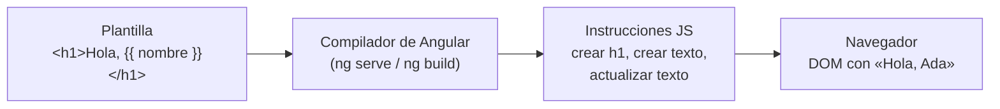

Imagina una tienda online que te saluda: «Hola, Ada». Cuando entra Grace, debe decir «Hola, Grace». Con HTML puro tendrías que buscar el `<h1>` con JavaScript y cambiar su texto a mano cada vez (lo viste con el DOM en el módulo 1). Si la página tiene cien datos que cambian, son cien búsquedas y cien cambios que no puedes olvidar.

Angular lo resuelve con la **plantilla**: el HTML de un componente con huecos que se rellenan solos con datos de la clase. El hueco más sencillo es la **interpolación**: `{{ }}`.

> [!analogia]
> Una plantilla es como una carta modelo: «Estimado/a ______, su pedido de ______ llegará el ______». Tú escribes la carta una vez. Para cada cliente se rellenan los huecos con sus datos. En Angular, los huecos son `{{ }}` y los datos salen de la clase del componente.

## Tu primera interpolación

```typescript
// src/app/saludo/saludo.ts
import { Component, signal } from '@angular/core';

@Component({
  selector: 'app-saludo',
  template: `
    <h1>Hola, {{ nombre }}</h1>
    <p>El año que viene tendrás {{ edad + 1 }} años.</p>
    <p>Sabes {{ lenguajes.length }} lenguajes; el primero es {{ lenguajes[0] }}.</p>
    <p>Tu inicial es {{ inicial() }} y tu ciudad, {{ ciudad() }}.</p>
    <p>{{ edad >= 18 ? 'Mayor de edad' : 'Menor de edad' }}</p>
  `,
})
export class Saludo {
  protected readonly nombre = 'Ada';
  protected readonly edad = 36;
  protected readonly lenguajes = ['TypeScript', 'HTML', 'CSS'];
  protected readonly ciudad = signal('Londres');

  protected inicial(): string {
    return this.nombre.charAt(0);
  }
}
```

Línea a línea:

- `import { Component, signal } from '@angular/core'`: trae dos herramientas de **@angular/core**, la librería central de Angular (componentes, signals, inyección…). `Component` es el decorador; `signal` crea un valor que avisa cuando cambia.
- `template:` con comillas invertidas (`` ` ``) es la plantilla escrita dentro del propio archivo. En tu proyecto lo normal es `templateUrl: './saludo.html'` con la plantilla en su propio archivo; en los ejemplos cortos de este curso la verás en línea para tenerlo todo junto. Funcionan igual.
- `{{ nombre }}` busca una propiedad `nombre` **en la clase** y pinta su valor como texto.
- `{{ edad + 1 }}`, `{{ lenguajes[0] }}`, el `? :`: dentro de las llaves cabe una **expresión**, un trozo de código que da un valor.
- `{{ inicial() }}` llama a un método y pinta lo que devuelve.
- `{{ ciudad() }}`: `ciudad` es un **signal**, y un signal se lee llamándolo con `()`. Es lo mismo que hace el `{{ title() }}` del `app.html` que creó `ng new`. Los signals los estudiarás a fondo en el módulo 7.
- `protected` deja usar la propiedad en la plantilla pero no desde otros archivos. `readonly` impide reasignarla por error.

Así se ve en el navegador:

```pantalla
@url localhost:4200/
<h1>Hola, Ada</h1>
<p>El año que viene tendrás 37 años.</p>
<p>Sabes 3 lenguajes; el primero es TypeScript.</p>
<p>Tu inicial es A y tu ciudad, Londres.</p>
<p>Mayor de edad</p>
```

> [!prueba]
> En tu proyecto, abre `src/app/app.html`, borra todo y escribe `<h1>Hola desde {{ title() }}</h1>`. Guarda: `ng serve` recompila y el navegador se recarga solo con «Hola desde mi-app».

## Qué cabe dentro de `{{ }}` y qué no

Caben expresiones que **dan un valor**: propiedades, operaciones, llamadas a métodos, el ternario `? :`, `??`, acceder a arrays y objetos. No caben **instrucciones**: nada de `let x = 1`, `if`, bucles ni `;`. Tampoco ves variables globales como `window` o `Math`: la plantilla solo conoce lo que tiene su clase.

La interpolación pinta **texto**. Si `nombre` valiera `'<b>Ada</b>'`, verías las etiquetas tal cual, sin negrita. Es una protección: nadie puede colar HTML (ni scripts) a través de un dato.

## Por qué la plantilla no es HTML normal

El navegador no entiende `{{ nombre }}`. Si abrieras la plantilla tal cual, verías las llaves. Lo que pasa es que el **compilador de Angular** (el paquete `@angular/compiler-cli`, que trabaja dentro de `ng serve` y `ng build`) lee tu plantilla y la convierte en **instrucciones de JavaScript**.



Este es, simplificado, el código que genera para las dos primeras líneas (lo puedes encontrar en `dist/` tras un `ng build --configuration development`):

```typescript
// Generado por el compilador (simplificado)
function Saludo_Template(rf, ctx) {
  if (rf & 1) {                       // 1 = crear: solo la primera vez
    ɵɵdomElementStart(0, 'h1');
    ɵɵtext(1);
    ɵɵdomElementEnd();
  }
  if (rf & 2) {                       // 2 = actualizar: cada vez que hay que repintar
    ɵɵadvance();
    ɵɵtextInterpolate1('Hola, ', ctx.nombre);
  }
}
```

Fíjate en dos cosas. Primero, `ctx` es tu componente: por eso la plantilla solo ve lo que hay en la clase. Segundo, hay dos fases: **crear** los elementos una vez y **actualizar** solo los textos que dependen de datos. Angular no rehace la página: cambia el texto del `<h1>` y nada más. Esa es la base de todo lo que verás en este módulo.

> [!cuidado]
> Si escribes `{{ ciudad }}` sin paréntesis, no lees el signal: le pasas la función entera. El compilador te avisa con `NG8117: Function in text interpolation should be invoked: ciudad()`. Cuando veas ese aviso, añade los `()`.

> [!resumen]
> - La plantilla es el HTML del componente con huecos; `{{ expresión }}` pinta su valor como texto.
> - Dentro de `{{ }}` van expresiones (propiedades, operaciones, métodos, ternario), no instrucciones.
> - Los signals se leen con `()`: `{{ ciudad() }}`.
> - El compilador convierte la plantilla en instrucciones JS que crean el DOM una vez y luego solo actualizan lo que cambia.
