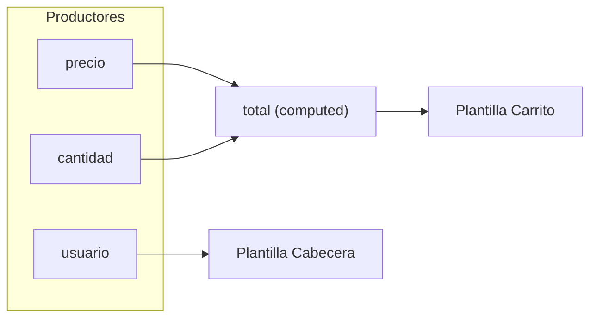

Una página real tiene cientos de componentes. Cuando cambia un signal, Angular no revisa la página entera: va directo a los componentes que lo usan. ¿Cómo lo sabe? Y, sobre todo, ¿qué cosas **parecen** un cambio pero Angular no ve? Esta lección te da el modelo mental que usarás el resto del curso.

> [!analogia]
> Imagina una red de suscripciones de un periódico. Cada signal es un periódico; cada `computed`, `effect` o plantilla es un suscriptor. Al leer un signal, te suscribes sin rellenar ningún formulario. Cuando sale una edición nueva, solo se reparte a los suscriptores. Y ojo: si alguien tacha una noticia a boli en su ejemplar, no sale ninguna edición nueva.

## El grafo de dependencias

Hay dos papeles:

- **Productores**: tienen un valor y avisan. `signal`, `computed`, `linkedSignal`, los `input()` del módulo 8.
- **Consumidores**: leen productores y quieren enterarse de sus cambios. `computed`, `effect` y **la plantilla de cada componente**.

Un `computed` hace los dos papeles. Cada vez que un consumidor se ejecuta, Angular anota qué productores ha leído en esa ejecución. Así se forma el grafo:



Si cambia `cantidad`, el aviso sigue las flechas: `total` → plantilla de `Carrito`. La plantilla de `Cabecera` no depende de `cantidad`, así que **ni se mira**. En Angular 22 los componentes son `OnPush` por defecto: solo se revisan cuando algo les concierne (lo verás a fondo en el módulo 17).

## Qué cuenta como cambio

Un signal solo avisa cuando recibe un valor **distinto** del que tenía, comparando con `Object.is` (en la práctica, `===`). Con números y textos es lo esperable. Con arrays y objetos, lo que se compara es **la referencia**: si es el mismo array, no hay cambio, aunque por dentro tenga otra cosa.

```typescript
// src/app/tareas/tareas.ts
import { Component, computed, signal } from '@angular/core';

@Component({
  selector: 'app-tareas',
  template: `
    <p>Tareas: {{ cuantas() }}</p>
    <button (click)="anadirMal()">Mal</button>
    <button (click)="anadirBien()">Bien</button>
  `,
})
export class Tareas {
  protected readonly tareas = signal(['Comprar pan']);
  protected readonly cuantas = computed(() => this.tareas().length);

  protected anadirMal(): void {
    this.tareas().push('Llamar a Ana');
  }

  protected anadirBien(): void {
    this.tareas.update((lista) => [...lista, 'Regar']);
  }
}
```

Pulsa **Mal** y luego **Bien**:

```pantalla
@url localhost:4200/tareas
<p>Tareas: 1</p>
<button>Mal</button> <button>Bien</button>
```

```pantalla
@url localhost:4200/tareas
<p>Tareas: 3</p>
<button>Mal</button> <button>Bien</button>
```

- **Mal**: `push` mete «Llamar a Ana» en el mismo array. El signal no se ha enterado (nadie llamó a `set` ni `update`) y `cuantas` sigue guardando 1 en su memoria. La pantalla miente: hay 2 tareas y dice 1.
- **Bien**: `[...lista, 'Regar']` crea un array **nuevo**. El signal avisa, `cuantas` recalcula y encuentra 3 elementos (el `push` de antes sí estaba en el array).

Esta forma de trabajar se llama **inmutabilidad**: no modificas los datos, creas una copia con el cambio. Con objetos igual: `usuario.update((u) => ({ ...u, puntos: u.puntos + 10 }))`.

## Solo lectura: `asReadonly()`

A veces quieres que otros puedan **leer** un signal pero no cambiarlo, para que todas las modificaciones pasen por un sitio controlado:

```typescript
// src/app/marcador.ts
import { signal } from '@angular/core';

export class Marcador {
  private readonly _puntos = signal(0);
  readonly puntos = this._puntos.asReadonly();

  anotar(): void {
    this._puntos.update((p) => p + 1);
  }
}
```

- `_puntos` es `private`: solo esta clase lo escribe.
- `asReadonly()` devuelve una vista de solo lectura (tipo `Signal<number>`): se lee con `puntos()`, cambia cuando cambia `_puntos`, pero no tiene `set` ni `update`.
- Quien use `Marcador` solo puede sumar puntos con `anotar()`. Es el patrón que usarás en los servicios (módulo 10) y en el estado compartido (módulo 15).

> [!prueba]
> En tu proyecto, copia el componente `Tareas` y añade `<ul>@for (t of tareas(); track $index) { <li>{{ t }}</li> }</ul>`. Pulsa **Mal** varias veces y observa el contador. Después cambia `anadirMal` para que use `update` con un array nuevo.

> [!cuidado]
> `asReadonly()` impide llamar a `set`, pero no protege lo de dentro: si el valor es un array, alguien podría hacer `puntos().push(...)`. Combina solo lectura con inmutabilidad (crear copias) y no tendrás sorpresas.

> [!resumen]
> - Productores (signal, computed) avisan; consumidores (computed, effect, plantillas) escuchan lo que leyeron.
> - Angular solo revisa los componentes cuyo grafo ha cambiado.
> - Un signal avisa si el valor nuevo no es `===` al anterior: con arrays y objetos, crea copias en vez de modificarlos.
> - `asReadonly()` expone un signal que se puede leer pero no escribir.
