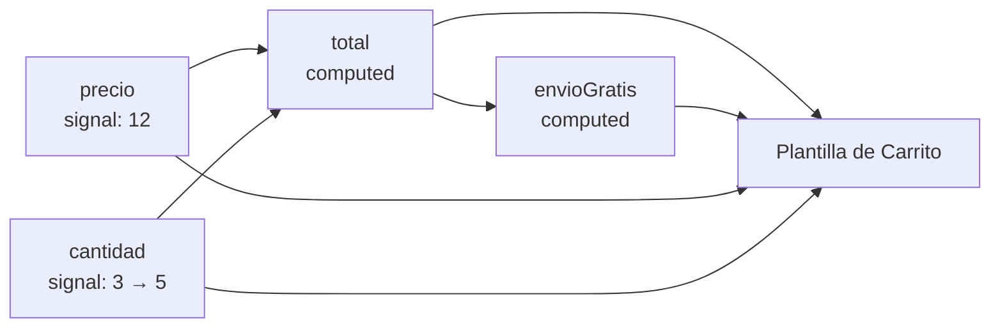

En una cesta de la compra, el **total** no es un dato que tú escribas: sale de multiplicar precio por cantidad. Si guardas el total en otro signal y lo actualizas a mano, tarde o temprano se te olvidará en algún sitio y la pantalla dirá «3 × 12 = 24». Lo que necesitas es un valor que **se calcule solo** a partir de otros. Eso es `computed()`.

> [!analogia]
> Piensa en una hoja de cálculo. En la celda C1 escribes `=A1*B1`. Nunca tocas C1: cuando cambias A1 o B1, C1 se recalcula. Un `signal` es una celda donde escribes; un `computed` es una celda con fórmula.

## Un total que se calcula solo

```typescript
// src/app/carrito/carrito.ts
import { Component, computed, signal } from '@angular/core';

@Component({
  selector: 'app-carrito',
  template: `
    <p>{{ cantidad() }} × {{ precio() }} € = {{ total() }} €</p>
    @if (envioGratis()) {
      <p>Envío gratis</p>
    }
    <button (click)="cantidad.update((c) => c + 1)">Una más</button>
  `,
})
export class Carrito {
  protected readonly precio = signal(12);
  protected readonly cantidad = signal(3);
  protected readonly total = computed(() => this.precio() * this.cantidad());
  protected readonly envioGratis = computed(() => this.total() >= 50);
}
```

- `computed` se importa de `@angular/core`, igual que `signal`.
- Recibe una **función sin parámetros** que devuelve el valor. Dentro lees otros signals: `this.precio()`, `this.cantidad()`.
- Angular **apunta automáticamente** qué signals has leído dentro. Esas son sus **dependencias**. No las declaras en ningún sitio.
- Un computed se lee igual que un signal: `total()`. Pero **no tiene `set` ni `update`**: su valor solo lo decide la fórmula.
- Un computed puede depender de otro computed: `envioGratis` depende de `total`.

Así se ve al principio y después de pulsar **Una más** dos veces:

```pantalla
@url localhost:4200/cesta
<p>3 × 12 € = 36 €</p>
<button>Una más</button>
```

```pantalla
@url localhost:4200/cesta
<p>5 × 12 € = 60 €</p>
<p>Envío gratis</p>
<button>Una más</button>
```

## Cómo se propaga un cambio

Las dependencias forman un **grafo**: un dibujo de quién depende de quién.



Al pulsar el botón, `cantidad` cambia. El aviso viaja por las flechas: `total` queda marcado como «quizá desactualizado», luego `envioGratis`, y la plantilla queda pendiente de repintar. Cuando Angular repinta, lee `total()`; solo entonces se ejecuta la fórmula.

## Perezoso y con memoria

Dos propiedades hacen que `computed` sea barato:

```typescript
const a = signal(2);
const doble = computed(() => {
  console.log('calculo');
  return a() * 2;
});

console.log('antes');
console.log(doble());   // calculo, 4
console.log(doble());   // 4  (no recalcula)
a.set(5);
console.log(doble());   // calculo, 10
a.set(5);               // mismo valor: no avisa a nadie
console.log(doble());   // 10 (no recalcula)
```

Consola:

```text
antes
calculo
4
4
calculo
10
10
```

- **Perezoso**: crear el computed no ejecuta la fórmula. Solo se calcula cuando alguien lo lee.
- **Con memoria**: guarda el último resultado. Si sus dependencias no cambian, lo devuelve sin recalcular, aunque lo leas mil veces.
- Un signal que recibe el **mismo valor** (`5` cuando ya era `5`) no avisa.

Por eso puedes poner cálculos en un `computed` y leerlo en muchos sitios de la plantilla sin miedo.

> [!prueba]
> En tu proyecto, añade al `Carrito` un `iva = computed(() => this.total() * 0.21)` y muéstralo con `{{ iva() }}`. Pulsa **Una más** y comprueba que también sube.

> [!cuidado]
> Dentro de un `computed` solo se **calcula**: nada de `set` a otros signals, llamadas al servidor ni `console.log` de verdad (el de arriba es solo para verlo por dentro). Y si una dependencia solo se lee dentro de un `if`, Angular solo la apunta cuando ese `if` se ejecuta: dependencias que no se leen no cuentan.

> [!resumen]
> - `computed(() => expresión)` crea un valor derivado de otros signals.
> - Sus dependencias se descubren solas: son los signals que lee.
> - Es de solo lectura, perezoso (calcula al leerse) y con memoria (no repite si nada cambió).
> - Prefiere `computed` a guardar a mano valores que salen de otros.
