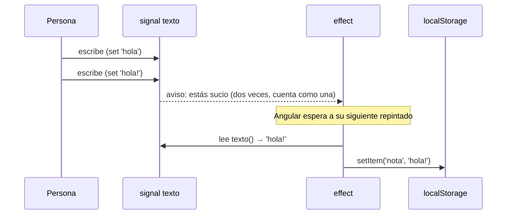

Escribes una nota en una app y cierras la pestaña. Al volver, la nota sigue ahí. Algo la ha **guardado** en el navegador cada vez que cambiaba. Guardar no es pintar ni calcular un valor: es hacer algo **fuera** de Angular (en `localStorage`, en la consola, en una librería de gráficos). A eso se le llama un **efecto secundario**, y para eso existe `effect()`.

> [!analogia]
> Un `computed` es la celda con fórmula de una hoja de cálculo: da un valor. Un `effect` es la alarma que pones en la hoja: «cuando cambie esta celda, mándame un correo». No produce ningún valor; **hace** algo.

## Guardar la nota cada vez que cambia

```typescript
// src/app/nota/nota.ts
import { Component, effect, signal, untracked } from '@angular/core';

@Component({
  selector: 'app-nota',
  template: `
    <textarea (input)="escribir($event)">{{ texto() }}</textarea>
    <p>{{ texto().length }} caracteres</p>
  `,
})
export class Nota {
  protected readonly texto = signal(localStorage.getItem('nota') ?? '');
  protected readonly usuario = signal('Ada');

  constructor() {
    effect(() => {
      const actual = this.texto();
      localStorage.setItem('nota', actual);
      console.log(`${untracked(this.usuario)} guardó ${actual.length} caracteres`);
    });
  }

  protected escribir(evento: Event): void {
    this.texto.set((evento.target as HTMLTextAreaElement).value);
  }
}
```

- `localStorage` es un pequeño almacén del navegador que sobrevive a recargas. `getItem('nota') ?? ''` lee lo guardado o, si no hay nada, un texto vacío.
- `effect(() => { ... })` registra una función que Angular ejecuta **una vez al principio** y **otra vez cada vez que cambie algún signal que haya leído**. Como `computed`, descubre sus dependencias sola: aquí, `this.texto()`.
- Se crea en el `constructor` porque `effect` necesita saber a qué componente pertenece (el **contexto de inyección**, módulo 10). Cuando el componente desaparece, su efecto se destruye solo.
- `untracked(this.usuario)` lee `usuario` **sin apuntarlo como dependencia**. Si el usuario cambia, el efecto no se repite; solo nos interesa su valor en el momento de guardar.

Qué ves al escribir «hola» y luego «!»:

```pantalla
@url localhost:4200/nota
<textarea>hola!</textarea>
<p>5 caracteres</p>
```

```text
Ada guardó 0 caracteres
Ada guardó 5 caracteres
```

¿Por qué no hay una línea para cada letra? Los efectos de componente **no se ejecutan en el mismo instante** del cambio: Angular los programa y los ejecuta durante su siguiente repintado. Si `texto` cambia varias veces antes, el efecto se ejecuta una sola vez con el valor final.



## Cuándo NO usar `effect`

`effect` es la herramienta más fácil de usar mal. Antes de escribir uno, pregúntate: «¿estoy calculando un valor?». Si la respuesta es sí, quieres `computed`.

```typescript
// MAL: copiar un signal en otro con un efecto
readonly total = signal(0);
constructor() {
  effect(() => this.total.set(this.precio() * this.cantidad()));
}

// BIEN: un valor derivado es un computed
readonly total = computed(() => this.precio() * this.cantidad());
```

La versión con efecto funciona, pero durante un instante `total` está desactualizado, hace trabajo extra y crea cadenas de avisos difíciles de seguir. Usa `effect` solo para **sincronizar con el mundo exterior**: guardar en `localStorage`, escribir logs, pintar en un `<canvas>`, avisar a una librería que no conoce signals.

## `untracked`: leer sin depender

`untracked(signal)` o `untracked(() => ...)` lee valores sin crear dependencia. Sirve dentro de `effect` y de `computed` cuando necesitas un dato «de paso» que no debe disparar la repetición. Su nombre lo dice: lectura no **rastreada**.

> [!prueba]
> En tu proyecto, crea el componente `Nota`, escribe algo y recarga la página (F5): la nota sigue ahí. Abre las herramientas del navegador (F12), pestaña **Consola**, y mira los mensajes de cada guardado.

> [!cuidado]
> Si un efecto cambia un signal que él mismo lee (`effect(() => this.n.set(this.n() + 1))`), se vuelve a disparar a sí mismo una y otra vez, sin fin: la pestaña se queda colgada. Angular 22 no corta ese bucle por ti. Si un efecto escribe signals, casi siempre hay un `computed` o un `linkedSignal` (siguiente lección) que lo hace mejor.

> [!resumen]
> - `effect(() => ...)` ejecuta código de efecto secundario al principio y cada vez que cambian los signals que lee.
> - Se crea en el constructor (contexto de inyección) y se destruye con su componente.
> - Los efectos se agrupan: varios cambios seguidos provocan una sola ejecución.
> - Para calcular valores, `computed`; `effect` solo para hablar con el mundo exterior.
> - `untracked(...)` lee un signal sin convertirlo en dependencia.
