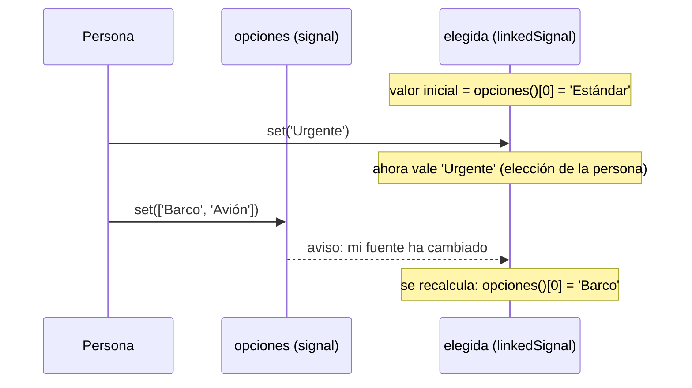

Al pagar en una tienda eliges el tipo de envío. Por defecto viene marcado el primero, «Estándar», pero puedes elegir «Urgente». Ahora cambias la dirección a Canarias y las opciones pasan a ser «Barco» y «Avión». Tu elección anterior, «Urgente», ya no existe: lo lógico es que vuelva a marcarse la primera opción nueva.

Fíjate en lo que necesitas: un valor que **la persona puede cambiar** (como un `signal`) pero que **se reinicia solo** cuando cambia otro dato (como un `computed`). Ninguno de los dos sirve por separado. Para eso está `linkedSignal()`.

> [!analogia]
> Es el asiento que te asignan en un vuelo. Puedes cambiarlo por otro que te guste más. Pero si la compañía cambia el avión, te asignan uno nuevo automáticamente: tu elección anterior iba ligada al avión viejo.

## La forma corta

```typescript
// src/app/envio/envio.ts
import { Component, linkedSignal, signal } from '@angular/core';

@Component({
  selector: 'app-envio',
  template: `
    @for (opcion of opciones(); track opcion) {
      <button (click)="elegida.set(opcion)">{{ opcion }}</button>
    }
    <p>Envío: {{ elegida() }}</p>
    <button (click)="cambiarPais()">Cambiar a Canarias</button>
  `,
})
export class Envio {
  protected readonly opciones = signal(['Estándar', 'Urgente', 'Recogida en tienda']);
  protected readonly elegida = linkedSignal(() => this.opciones()[0]);

  protected cambiarPais(): void {
    this.opciones.set(['Barco', 'Avión']);
  }
}
```

- `linkedSignal(() => this.opciones()[0])` se escribe como un `computed`: una función que lee otros signals. Su resultado es el **valor inicial**, y se vuelve a calcular cada vez que esos signals cambian.
- Pero devuelve un `WritableSignal`: tiene `set` y `update`, como un `signal`. Por eso `elegida.set(opcion)` funciona.
- Viene de `@angular/core` y es una API estable desde Angular 20.

Tres momentos: al cargar, tras pulsar **Urgente** y tras pulsar **Cambiar a Canarias**:

```pantalla
@url localhost:4200/pago
<button>Estándar</button> <button>Urgente</button> <button>Recogida en tienda</button>
<p>Envío: Estándar</p>
<button>Cambiar a Canarias</button>
```

```pantalla
@url localhost:4200/pago
<button>Estándar</button> <button>Urgente</button> <button>Recogida en tienda</button>
<p>Envío: Urgente</p>
<button>Cambiar a Canarias</button>
```

```pantalla
@url localhost:4200/pago
<button>Barco</button> <button>Avión</button>
<p>Envío: Barco</p>
<button>Cambiar a Canarias</button>
```



La regla: **gana el último que habla**. Si lo último fue un `set`, vale lo que se puso. Si lo último fue un cambio en la fuente, vale el cálculo.

## La forma larga: recordar lo anterior

¿Y si la nueva lista **todavía contiene** la opción elegida? Sería molesto perder la elección. La forma larga te da acceso al valor anterior:

```typescript
// src/app/envio/envio.ts (versión que conserva la elección)
readonly elegida = linkedSignal<string[], string>({
  source: this.opciones,
  computation: (nuevas, anterior) => {
    if (anterior && nuevas.includes(anterior.value)) {
      return anterior.value;
    }
    return nuevas[0];
  },
});
```

- `source`: el signal que hace de fuente. Cuando cambia, se ejecuta `computation`.
- `computation(nuevas, anterior)`: `nuevas` es el valor nuevo de la fuente; `anterior` (que no existe la primera vez, por eso el `if (anterior && ...)`) tiene `anterior.value`, el valor que tenía `elegida`, y `anterior.source`, la fuente de antes.
- `<string[], string>`: el tipo de la fuente y el tipo del valor.

Si eliges «Urgente» y las opciones pasan a `['Urgente', 'Barco']`, se conserva «Urgente». Si pasan a `['Barco', 'Avión']`, vale «Barco».

> [!prueba]
> En tu proyecto, copia el componente `Envio`, elige «Recogida en tienda» y pulsa **Cambiar a Canarias**. Luego sustituye `elegida` por la versión larga y cambia `cambiarPais` para que ponga `['Recogida en tienda', 'Barco']`: tu elección sobrevive.

> [!cuidado]
> El error típico es resolver esto con un `signal` más un `effect` que lo resetea (`effect(() => this.elegida.set(this.opciones()[0]))`). Funciona a medias: hay un instante en que `elegida` tiene un valor que ya no existe, y es justo lo que la lección anterior desaconsejaba. Si un valor editable depende de otro, `linkedSignal`.

> [!resumen]
> - `linkedSignal(() => calculo)` es un signal editable cuyo valor se recalcula cuando cambian sus dependencias.
> - Gana el último que habla: un `set` de la persona o un cambio en la fuente.
> - La forma `{ source, computation: (nuevo, anterior) => ... }` permite conservar la elección anterior.
> - Úsalo en lugar de `signal` + `effect` para «elección que se reinicia».
