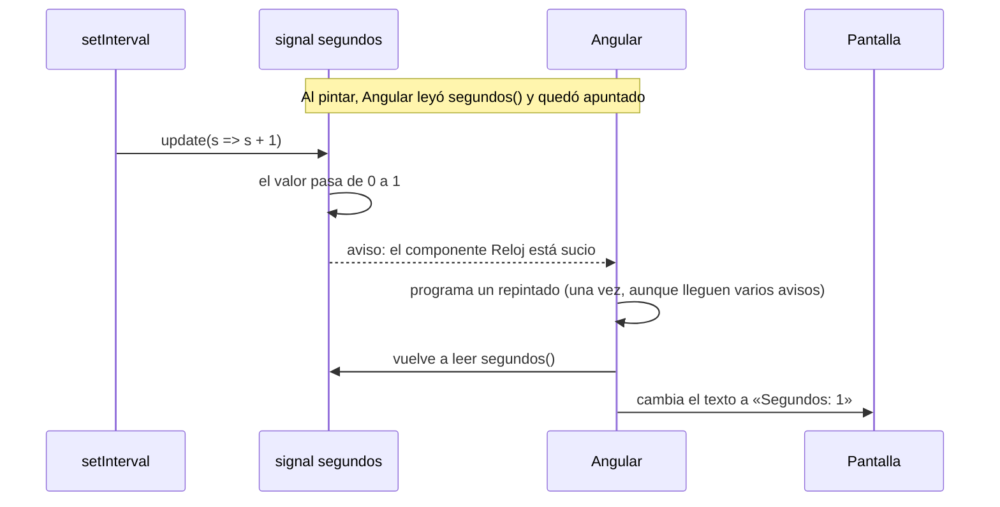

Una página tiene que estar **al día**: si llega un mensaje nuevo, el contador de la campana sube; si pasa un segundo, el cronómetro avanza. El problema es que Angular no lee tu mente. Cuando un dato cambia dentro de la clase, ¿cómo se entera de que tiene que repintar la pantalla?

Hagamos la prueba con un cronómetro que suma 1 cada segundo usando una variable normal:

```typescript
// src/app/reloj/reloj.ts
import { Component } from '@angular/core';

@Component({
  selector: 'app-reloj',
  template: `<p>Segundos: {{ segundos }}</p>`,
})
export class Reloj {
  protected segundos = 0;

  constructor() {
    setInterval(() => this.segundos++, 1000);
  }
}
```

`setInterval` es una función del navegador que ejecuta algo cada cierto tiempo (aquí, cada 1000 milisegundos). Tras tres segundos, la variable vale 3. ¿Y la pantalla?

```pantalla
@url localhost:4200/
<p>Segundos: 0</p>
```

Se queda en 0 para siempre. La variable cambia, pero **nadie avisa a Angular**. Las apps de Angular 22 son *zoneless*: ya no usan zone.js, una librería que antes vigilaba cada temporizador y cada evento para repintar «por si acaso». Ahora el componente solo se repinta cuando algo avisa. Un clic en su plantilla avisa; un temporizador o una respuesta del servidor, no.

## La solución: un signal

Un **signal** es un valor que **avisa cuando cambia**. Cambia una sola cosa en el ejemplo:

```typescript
// src/app/reloj/reloj.ts
import { Component, signal } from '@angular/core';

@Component({
  selector: 'app-reloj',
  template: `<p>Segundos: {{ segundos() }}</p>`,
})
export class Reloj {
  protected readonly segundos = signal(0);

  constructor() {
    setInterval(() => this.segundos.update((s) => s + 1), 1000);
  }
}
```

```pantalla
@url localhost:4200/
<p>Segundos: 3</p>
```

> [!analogia]
> Una variable normal es una pizarra: puedes cambiar lo escrito, pero quien la mira tiene que acordarse de volver a mirarla. Un signal es una pizarra con timbre: cada vez que alguien escribe algo nuevo, suena y todos los que la estaban leyendo se enteran.

## Las tres operaciones de un signal

```typescript
import { signal } from '@angular/core';

const precio = signal(10);          // crear, con valor inicial 10
console.log(precio());              // leer: 10
precio.set(20);                     // cambiar por un valor nuevo
console.log(precio());              // 20
precio.update((p) => p * 2);        // cambiar a partir del valor anterior
console.log(precio());              // 40
```

- `signal(valorInicial)` viene de `@angular/core`. TypeScript deduce el tipo del valor inicial (`number` aquí). Si empieza vacío, dilo tú: `signal<string[]>([])` o `signal<Usuario | null>(null)`.
- **Leer** es llamarlo como una función: `precio()`. En la plantilla igual: `{{ precio() }}`.
- `set(nuevo)` sustituye el valor.
- `update(fn)` recibe una función que toma el valor actual y devuelve el nuevo. Úsalo cuando el nuevo depende del anterior (sumar, añadir a una lista).
- El signal en sí es de tipo `WritableSignal<number>`: un signal que se puede escribir. Por eso lo declaramos `readonly`: lo que no cambia es la **caja**; su contenido sí.

## Qué pasa por dentro cuando cambia



El detalle importante es la primera nota: cuando la plantilla lee `segundos()`, el signal **apunta quién lo ha leído**. Por eso sabe a quién avisar. Lo verás con detalle en la última lección del módulo.

> [!prueba]
> En tu proyecto, crea el componente `Reloj` con la variable normal, ponlo en `app.html` y comprueba que se queda en 0. Después cámbialo a signal y guarda. Mira también el `app.ts` que creó `ng new`: `title = signal('mi-app')`. Ya estabas usando signals sin saberlo.

> [!cuidado]
> Dos errores muy típicos: escribir `{{ segundos }}` sin paréntesis (no lees el valor; el compilador avisa con NG8117) y asignar `this.segundos = 5`. Lo segundo **sustituye el signal entero por un número**: se rompe el aviso y TypeScript se queja si el campo es `readonly`. Para cambiarlo, siempre `set` o `update`.

> [!resumen]
> - Angular 22 no vigila tus variables: solo repinta cuando algo le avisa.
> - Un signal es un valor que avisa al cambiar: `signal(inicial)`.
> - Se lee con `nombre()`, se cambia con `set(valor)` o `update(anterior => nuevo)`.
> - La plantilla que lee un signal queda apuntada y se repinta cuando cambia.
