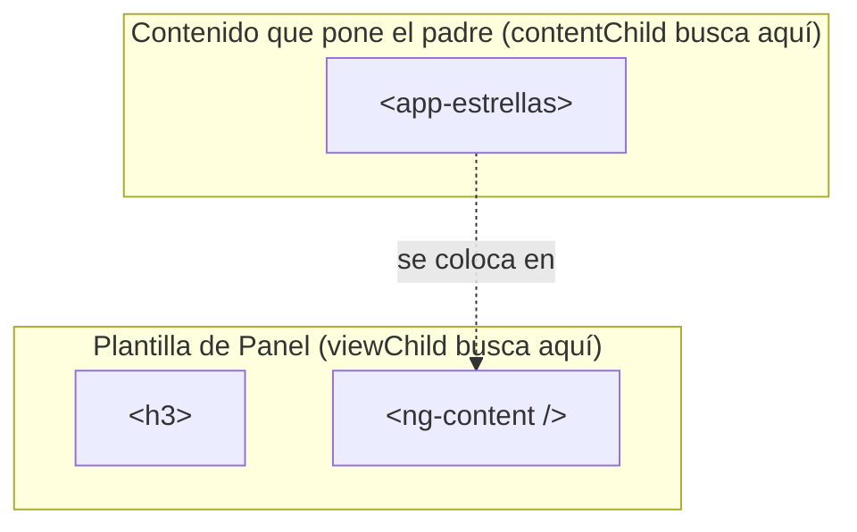

Un buscador tiene un botón **Buscar** que, al pulsarlo, debe poner el cursor en la caja de texto. Mover el foco no es un dato que puedas enlazar con `[ ]`: es una **acción** sobre el elemento real del DOM (`input.focus()`). Para eso la clase necesita **tener en la mano** ese elemento o ese componente hijo. Eso hacen las **consultas** (*queries*): `viewChild()`, `viewChildren()` y `contentChild()`.

> [!analogia]
> Una consulta es preguntar en voz alta en tu propia casa: «¿dónde está el mando de la tele?». `viewChild` busca uno y te lo da; `viewChildren` busca todos los que haya; `contentChild` busca entre las cosas que un invitado ha traído (el contenido proyectado de la lección anterior).

## `viewChild`: un elemento o componente de mi plantilla

```typescript
// src/app/buscador/buscador.ts
import { Component, ElementRef, viewChild, viewChildren } from '@angular/core';
import { Estrellas } from '../estrellas/estrellas';

@Component({
  selector: 'app-buscador',
  imports: [Estrellas],
  template: `
    <input #campo placeholder="Buscar…" />
    <button (click)="enfocar()">Buscar</button>
    <app-estrellas />
    <app-estrellas />
    <p>Hay {{ estrellas().length }} valoraciones</p>
  `,
})
export class Buscador {
  private readonly campo = viewChild.required<ElementRef<HTMLInputElement>>('campo');
  protected readonly estrellas = viewChildren(Estrellas);

  protected enfocar(): void {
    this.campo().nativeElement.focus();
  }
}
```

- `viewChild('campo')` busca en **la plantilla de este componente** el elemento marcado con `#campo` (la variable de plantilla del módulo 6).
- `.required` dice «siempre existe»: así el resultado nunca es `undefined`. Sin `.required`, el tipo sería `ElementRef | undefined` (útil si el elemento está dentro de un `@if`).
- `ElementRef<HTMLInputElement>` es un envoltorio de Angular alrededor del elemento real del DOM; `.nativeElement` es el `<input>` de verdad, con sus métodos (`focus()`, `select()`…).
- El resultado es un **signal**: se lee con `this.campo()`. Se rellena cuando la vista se ha creado; antes (en el constructor) todavía no hay nada que encontrar.
- `viewChildren(Estrellas)` busca **todos** los componentes `Estrellas` de la plantilla, por su clase. Devuelve un signal con un array de solo lectura: aquí, 2. Si un `@if` añadiera o quitara uno, el signal cambiaría.

```pantalla
@url localhost:4200/buscar
<input placeholder="Buscar…" style="outline: 2px solid #4a7dff" /> <button>Buscar</button>
<div>☆☆☆☆☆</div>
<div>☆☆☆☆☆</div>
<p>Hay 2 valoraciones</p>
```

(El borde azul de la caja es el foco, justo después de pulsar **Buscar**.)

## `contentChild`: algo que me ha proyectado el padre

```typescript
// src/app/panel/panel.ts
import { Component, contentChild, input } from '@angular/core';
import { Estrellas } from '../estrellas/estrellas';

@Component({
  selector: 'app-panel',
  template: `
    <h3>{{ titulo() }}</h3>
    <ng-content />
    @if (valoracion(); as v) {
      <p>Valoración proyectada: {{ v.valor() }}</p>
    }
  `,
})
export class Panel {
  readonly titulo = input('');
  protected readonly valoracion = contentChild(Estrellas);
}
```

Con `<app-panel titulo="Hotel"><app-estrellas [valor]="4" /></app-panel>`, el panel encuentra las estrellas que le han proyectado y lee su `valor()`: «Valoración proyectada: 4». La diferencia con `viewChild` es **dónde busca**: `viewChild` en la plantilla propia; `contentChild` en lo que el padre puso entre las etiquetas. También existe `contentChildren`, para varios.



## ¿Qué patrón elijo?

Ya tienes todas las herramientas de comunicación entre componentes. Úsalas en este orden de preferencia:

| Necesidad | Herramienta |
| --- | --- |
| El padre le da un dato al hijo | `input()` y `[dato]` |
| El hijo avisa al padre de algo | `output()` y `(evento)` |
| El hijo edita un valor del padre | `model()` y `[(valor)]` |
| El padre pone contenido libre dentro del hijo | `<ng-content>` |
| Hacer una acción sobre un elemento o hijo (foco, scroll, medir) | `viewChild()` |
| Saber qué hijos hay (contar, recorrer) | `viewChildren()` / `contentChildren()` |
| Componentes lejanos (primos, de otra página) | un servicio compartido (módulo 10) |

Las consultas son la **última** opción entre padre e hijo: si llamas a métodos del hijo desde el padre con `viewChild`, los dos quedan muy acoplados. Siempre que un input o un output resuelva el problema, prefiérelos.

> [!prueba]
> En tu proyecto, en el `Buscador`, cambia `focus()` por `select()` y escribe algo antes de pulsar: todo el texto queda seleccionado. Luego añade una tercera `<app-estrellas />` y comprueba que el contador dice 3.

> [!cuidado]
> No leas una consulta en el `constructor`: la vista aún no existe. Con `viewChild.required`, Angular 22 ya te lo dice al compilar: `NG8118: 'campo' is a required viewChild and does not have a value in this context`. Léelas en métodos que se ejecutan tras un evento, en un `computed`, o en `afterNextRender` (módulo 5). En proyectos antiguos verás `@ViewChild('campo') campo!: ElementRef;` y `ngAfterViewInit`; la versión con signals los sustituye.

> [!resumen]
> - `viewChild('ref')` o `viewChild(Clase)` devuelve un signal con un elemento o componente de la propia plantilla; `.required` si siempre existe.
> - `ElementRef.nativeElement` es el elemento real del DOM.
> - `viewChildren` da todos; `contentChild`/`contentChildren` buscan en el contenido proyectado.
> - Prefiere inputs, outputs y model; usa consultas para acciones sobre el DOM o hijos concretos.
