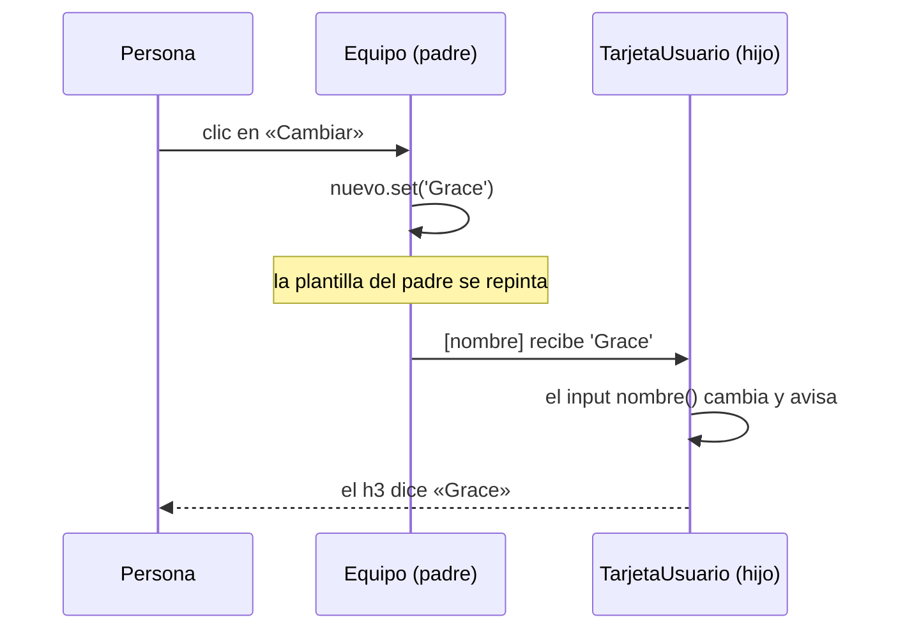

En una red social, la tarjeta de un usuario se repite cientos de veces: la misma forma (foto, nombre, rol), con datos distintos en cada una. Lo sensato es crear **un** componente `TarjetaUsuario` y que quien lo use le **pase** los datos. El componente que lo usa es el **padre**; la tarjeta es el **hijo**. Los datos bajan del padre al hijo por los **inputs**.

> [!analogia]
> Un componente con inputs es como una máquina de café con ranuras: una para la cápsula, otra para el tamaño de la taza. La máquina no decide qué café sale: lo decide quien mete la cápsula. Los inputs son las ranuras; el padre es quien mete las cápsulas.

## Declarar inputs en el hijo

```typescript
// src/app/tarjeta-usuario/tarjeta-usuario.ts
import { Component, booleanAttribute, input, numberAttribute } from '@angular/core';

@Component({
  selector: 'app-tarjeta-usuario',
  template: `
    <h3 [class.destacado]="destacado()">{{ nombre() }}</h3>
    <p>Rol: {{ rol() }}</p>
    <p>Nivel {{ nivel() }}</p>
  `,
})
export class TarjetaUsuario {
  readonly nombre = input.required<string>();
  readonly rol = input('invitado');
  readonly destacado = input(false, { transform: booleanAttribute });
  readonly nivel = input(1, { alias: 'level', transform: numberAttribute });
}
```

- `input` viene de `@angular/core`. Cada `input()` crea una **ranura** con el nombre de la propiedad.
- `input.required<string>()`: **obligatorio**. El padre tiene que dárselo; si no, la app no compila. Entre `< >` va el tipo.
- `input('invitado')`: **opcional** con valor por defecto. Si el padre no lo pasa, vale `'invitado'`.
- Un input es un **signal de solo lectura**: se lee con `nombre()`, tanto en la plantilla como en la clase, y puedes usarlo dentro de un `computed`. El hijo no puede hacer `set`: el dato es del padre.
- No llevan `protected` porque el padre tiene que poder verlos.

### Transformaciones y alias

- `transform: booleanAttribute` convierte lo que llega en `true`/`false`. Así el padre puede escribir solo `destacado`, sin valor, como el `disabled` de HTML: el atributo vacío llega como `''` y se convierte en `true`.
- `transform: numberAttribute` convierte el texto `"3"` en el número `3`.
- Ambas funciones vienen de `@angular/core`. Puedes escribir la tuya: `transform: (v: string) => v.trim()`.
- `alias: 'level'` cambia el nombre **público**: el padre escribe `level="3"`, pero dentro de la clase sigue siendo `nivel`. Úsalo poco; suele confundir.

## Pasar datos desde el padre

```typescript
// src/app/equipo/equipo.ts
import { Component, signal } from '@angular/core';
import { TarjetaUsuario } from '../tarjeta-usuario/tarjeta-usuario';

@Component({
  selector: 'app-equipo',
  imports: [TarjetaUsuario],
  template: `
    <app-tarjeta-usuario nombre="Ada" rol="admin" destacado level="3" />
    <app-tarjeta-usuario [nombre]="nuevo()" />
    <button (click)="nuevo.set('Grace')">Cambiar</button>
  `,
})
export class Equipo {
  protected readonly nuevo = signal('Alan');
}
```

- `imports: [TarjetaUsuario]`: el padre tiene que importar al hijo para poder usar su etiqueta.
- `nombre="Ada"`: sin corchetes, pasas el **texto** «Ada».
- `[nombre]="nuevo()"`: con corchetes, pasas el **valor de una expresión**: es el enlace de propiedades del módulo 6 aplicado a un componente.

```pantalla
@url localhost:4200/equipo
<h3 style="color:#b5179e">Ada</h3><p>Rol: admin</p><p>Nivel 3</p>
<h3>Alan</h3><p>Rol: invitado</p><p>Nivel 1</p>
<button>Cambiar</button>
```

Al pulsar **Cambiar**, la segunda tarjeta pasa a decir «Grace». El hijo no hace nada: su input es un signal y el padre le ha dado un valor nuevo.



> [!idea]
> Los datos **bajan** por los inputs: del padre al hijo, nunca al revés. El hijo no modifica sus inputs. Si necesita contarle algo al padre, usa un output (siguiente lección).

> [!prueba]
> En tu proyecto, genera el hijo con `ng generate component tarjeta-usuario` y copia el código. Luego, en `app.html`, quita el `nombre` de una tarjeta y guarda: la terminal de `ng serve` mostrará el error.

> [!cuidado]
> Si olvidas un input obligatorio, el compilador se niega: `NG8008: Required input 'nombre' from component TarjetaUsuario must be specified.` Y si escribes `nombre="nuevo()"` sin corchetes, la tarjeta mostrará literalmente el texto `nuevo()`. En proyectos antiguos verás `@Input() nombre: string;`, un decorador que hace lo mismo pero sin signals.

> [!resumen]
> - `input()` declara una ranura opcional con valor por defecto; `input.required<T>()`, una obligatoria.
> - Un input es un signal de solo lectura: se lee con `()` y el hijo no lo cambia.
> - `transform` convierte lo que llega (`booleanAttribute`, `numberAttribute`); `alias` cambia el nombre público.
> - El padre importa al hijo y pasa texto (`nombre="Ada"`) o expresiones (`[nombre]="valor()"`).
