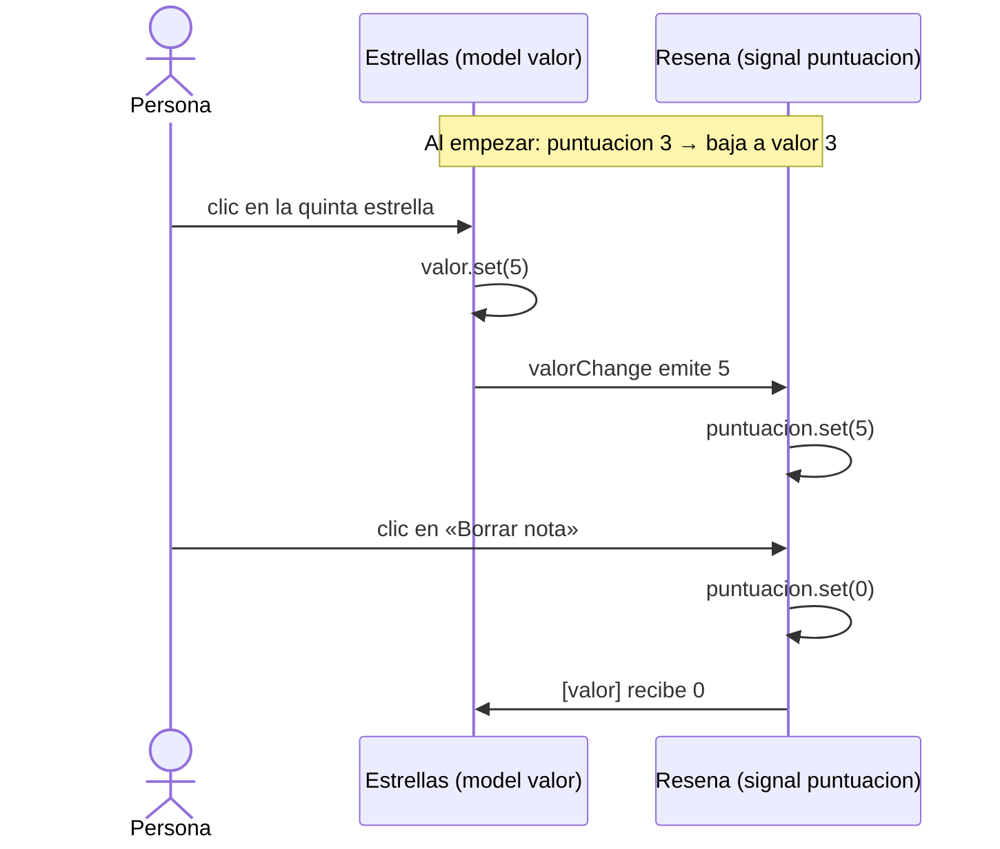

Un componente de estrellas para valorar un hotel tiene que hacer dos cosas: **mostrar** la nota que le da el padre (si ya habías votado un 3, se ven 3 estrellas) y **cambiarla** cuando haces clic en la quinta. Con lo que sabes, serían un input `valor` y un output `valorChange`, y en el padre `[valor]="nota()" (valorChange)="nota.set($event)"`. Funciona, pero es mucha ceremonia para algo tan común. Angular lo resume en una sola pieza: `model()`, y una sola sintaxis: `[( )]`.

> [!analogia]
> Es un mando de la tele compartido. Si tú cambias de canal en el sofá, la tele cambia; si alguien cambia el canal desde la tele, tu mando lo ve. Los dos lados pueden mover el mismo valor, y siempre coinciden.

## El hijo: `model()`

```typescript
// src/app/estrellas/estrellas.ts
import { Component, model } from '@angular/core';

@Component({
  selector: 'app-estrellas',
  template: `
    @for (n of [1, 2, 3, 4, 5]; track n) {
      <button (click)="valor.set(n)">{{ n <= valor() ? '★' : '☆' }}</button>
    }
  `,
})
export class Estrellas {
  readonly valor = model(0);
}
```

- `model` viene de `@angular/core`. `model(0)` crea a la vez un **input** llamado `valor` y un **output** llamado `valorChange` (el nombre + `Change`).
- A diferencia de un `input()`, un model es un signal **escribible**: el hijo puede hacer `valor.set(n)`.
- Cuando el hijo hace `set`, el model **emite** `valorChange` con el nuevo valor automáticamente.
- También existe `model.required<number>()`, si el padre está obligado a darlo.

## El padre: `[( )]`, la «caja de plátanos»

```typescript
// src/app/resena/resena.ts
import { Component, signal } from '@angular/core';
import { Estrellas } from '../estrellas/estrellas';

@Component({
  selector: 'app-resena',
  imports: [Estrellas],
  template: `
    <app-estrellas [(valor)]="puntuacion" />
    <p>Tu nota: {{ puntuacion() }} de 5</p>
    <button (click)="puntuacion.set(0)">Borrar nota</button>
  `,
})
export class Resena {
  protected readonly puntuacion = signal(3);
}
```

- `[(valor)]="puntuacion"` es el **enlace bidireccional** (*two-way binding*). Los corchetes por fuera y los paréntesis por dentro recuerdan a un plátano en una caja: *banana in a box*, `[()]`.
- Fíjate: va `puntuacion`, **sin paréntesis**. Le das el signal entero para que Angular pueda leerlo **y escribirlo**.
- Es una abreviatura. Angular lo convierte en `[valor]="puntuacion()" (valorChange)="puntuacion.set($event)"`.

Tres momentos: al cargar, tras pulsar la quinta estrella y tras **Borrar nota**:

```pantalla
@url localhost:4200/hotel
<button>★</button><button>★</button><button>★</button><button>☆</button><button>☆</button>
<p>Tu nota: 3 de 5</p>
<button>Borrar nota</button>
```

```pantalla
@url localhost:4200/hotel
<button>★</button><button>★</button><button>★</button><button>★</button><button>★</button>
<p>Tu nota: 5 de 5</p>
<button>Borrar nota</button>
```

```pantalla
@url localhost:4200/hotel
<button>☆</button><button>☆</button><button>☆</button><button>☆</button><button>☆</button>
<p>Tu nota: 0 de 5</p>
<button>Borrar nota</button>
```

## En los dos sentidos



El valor vive en el padre (`puntuacion`) y el hijo lo refleja; cualquiera de los dos puede moverlo y el otro se entera.

> [!idea]
> Usa `input()` cuando el hijo solo **muestra** un dato, y `model()` cuando el hijo también lo **edita** (estrellas, interruptores, selectores, un campo de texto propio). Si el hijo avisa de algo que no es «mi valor ha cambiado», usa `output()`.

> [!prueba]
> En tu proyecto, pon dos `<app-estrellas [(valor)]="puntuacion" />` seguidos. Pulsa en uno y mira cómo el otro se actualiza: los dos comparten el mismo signal del padre.

> [!cuidado]
> Escribir `[(valor)]="puntuacion()"` con paréntesis es un error: le pasas el número 3, y a un número no se le puede hacer `set`. El compilador lo rechaza con `NG5002: Unsupported expression in a two-way binding`. Con `[(...)]`, el signal va **sin** paréntesis. Verás `[(ngModel)]` en formularios: es la misma idea aplicada a un `<input>`, y la estudiarás en el módulo 12.

> [!resumen]
> - `model(inicial)` declara un input escribible que emite `nombreChange` cuando el hijo lo cambia.
> - El padre lo enlaza en los dos sentidos con `[(nombre)]="miSignal"`, sin paréntesis.
> - `[(x)]="s"` equivale a `[x]="s()" (xChange)="s.set($event)"`.
> - `input` para mostrar, `model` para editar, `output` para otros avisos.
