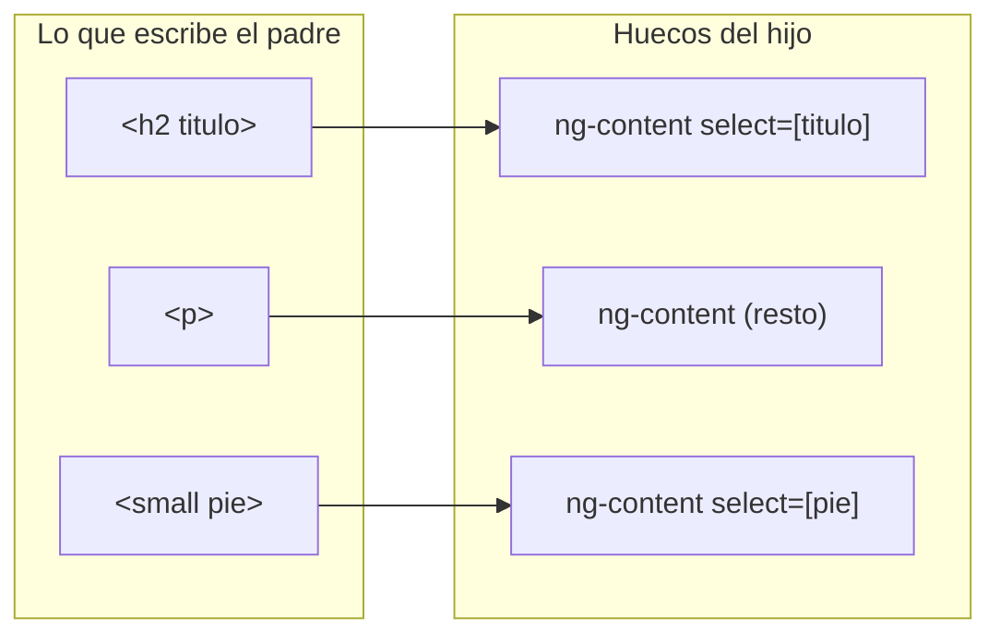

Una web está llena de **tarjetas**: un marco con borde, sombra, una cabecera y un pie. Dentro de una hay una noticia; en otra, un formulario; en otra, un gráfico. Pasar todo eso por inputs sería imposible: no puedes meter un formulario entero en un `input<string>()`. Lo que quieres es un componente que ponga **el marco** y deje que el padre ponga **el contenido**, escribiéndolo entre sus etiquetas, como haces con `<p>texto</p>`. Eso se llama **proyección de contenido**, y se hace con `<ng-content>`.

> [!analogia]
> Un componente con `<ng-content>` es un marco de fotos con huecos: uno grande en el centro y uno pequeño abajo para la fecha. El marco no sabe qué foto pondrás. Tú (el padre) la colocas, y el marco decide **dónde** queda cada cosa.

## Un hueco y varios huecos con nombre

```typescript
// src/app/tarjeta/tarjeta.ts
import { Component } from '@angular/core';

@Component({
  selector: 'app-tarjeta',
  template: `
    <article>
      <header><ng-content select="[titulo]" /></header>
      <section><ng-content /></section>
      <footer><ng-content select="[pie]" /></footer>
    </article>
  `,
  styles: `
    article { border: 1px solid #ccc; border-radius: 8px; padding: 16px; }
    footer { color: gray; font-size: 0.8em; }
  `,
})
export class Tarjeta {}
```

- `<ng-content />` es un **hueco**: ahí aparecerá lo que el padre escriba entre `<app-tarjeta>` y `</app-tarjeta>`. No es un elemento real: no queda ninguna etiqueta `ng-content` en la página.
- `select="[titulo]"` hace el hueco **selectivo**: solo recibe los elementos que tengan el atributo `titulo`. El valor de `select` es un selector CSS: `[atributo]`, `etiqueta`, `.clase`…
- El `<ng-content />` sin `select` recoge **todo lo demás**.

Y el padre:

```typescript
// src/app/noticia/noticia.ts
import { Component } from '@angular/core';
import { Tarjeta } from '../tarjeta/tarjeta';

@Component({
  selector: 'app-noticia',
  imports: [Tarjeta],
  template: `
    <app-tarjeta>
      <small pie>Publicado hoy</small>
      <p>Angular pinta este párrafo dentro de la tarjeta.</p>
      <h2 titulo>Proyección de contenido</h2>
    </app-tarjeta>
  `,
})
export class Noticia {}
```

- `titulo` y `pie` son atributos **inventados**, sin valor. Solo sirven de etiqueta para que el `select` los encuentre.
- El padre los ha escrito en desorden a propósito. Mira el resultado:

```pantalla
@url localhost:4200/noticias
<article style="border:1px solid #ccc; border-radius:8px; padding:16px">
  <header><h2>Proyección de contenido</h2></header>
  <section><p>Angular pinta este párrafo dentro de la tarjeta.</p></section>
  <footer style="color:gray; font-size:0.8em"><small>Publicado hoy</small></footer>
</article>
```

El orden lo decide **la plantilla del hijo**, no el padre: primero la cabecera, luego el cuerpo, luego el pie.

## Qué pasa al compilar



El compilador reparte cada elemento hijo directo del padre al primer hueco cuyo `select` encaja; lo que no encaja en ninguno va al hueco sin `select`. Si no hay hueco sin `select`, lo que sobra **no se muestra**.

Un detalle importante: el contenido proyectado **pertenece al padre**. Sus `{{ }}`, sus eventos y sus estilos son los del padre. La tarjeta solo decide dónde colocarlo.

> [!prueba]
> En tu proyecto, crea la `Tarjeta` y úsala tres veces con contenidos distintos: un texto, una lista `<ul>`, un `<button>`. Después quita el `<ng-content />` sin `select` de la tarjeta y guarda: el contenido sin atributo desaparece.

> [!cuidado]
> `<ng-content>` no se puede poner dentro de un `@if` o un `@for` para mostrarlo varias veces o «esconderlo de verdad»: el contenido se crea una sola vez, lo muestre el hijo o no. Si necesitas repetir o crear contenido bajo demanda, hay herramientas más avanzadas (`ng-template`), que verás más adelante.

> [!resumen]
> - `<ng-content />` es un hueco donde aparece lo que el padre escribe entre las etiquetas del hijo.
> - `select="selector CSS"` crea huecos con nombre; el hueco sin `select` recoge el resto.
> - El orden final lo decide la plantilla del hijo.
> - El contenido proyectado sigue siendo del padre: sus datos y eventos son del padre.
