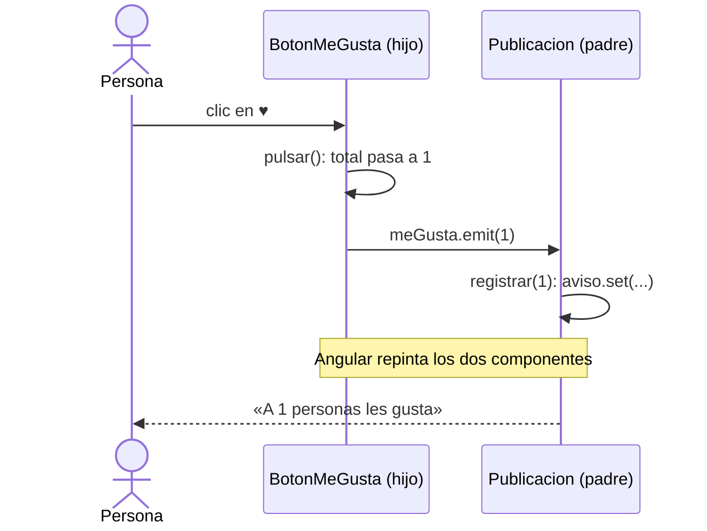
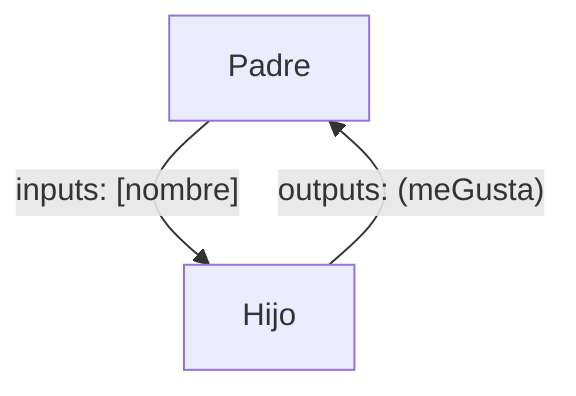

El botón ♥ de una publicación es un componente pequeño que se usa en muchos sitios. Cuando alguien lo pulsa, el botón sabe que lo han pulsado, pero no sabe qué hacer después: en el muro hay que mostrar un aviso, en el perfil hay que sumar a una estadística. Esa decisión es del **padre**. El hijo solo tiene que **avisar**: «me han pulsado, y van 2». Los avisos que suben del hijo al padre son los **outputs**.

> [!analogia]
> Un output es el timbre de una habitación de hotel. El huésped (hijo) pulsa el timbre; en recepción (padre) deciden qué hacer: subir toallas, llamar a un taxi. El huésped no baja a recepción ni sabe cómo se organiza: solo avisa, y puede decir algo con el aviso («habitación 12»).

## Declarar y emitir en el hijo

```typescript
// src/app/boton-me-gusta/boton-me-gusta.ts
import { Component, output, signal } from '@angular/core';

@Component({
  selector: 'app-boton-me-gusta',
  template: `<button (click)="pulsar()">♥ {{ total() }}</button>`,
})
export class BotonMeGusta {
  readonly meGusta = output<number>();
  protected readonly total = signal(0);

  protected pulsar(): void {
    this.total.update((t) => t + 1);
    this.meGusta.emit(this.total());
  }
}
```

- `output` viene de `@angular/core`. `output<number>()` declara un evento propio llamado `meGusta` que llevará un número. Si el aviso no lleva datos, `output()` a secas (su tipo es `void`).
- `this.meGusta.emit(valor)` **lanza** el evento con ese valor. Es el «ding» del timbre.
- Un output **no es un signal**: no tiene valor que leer. Es un aviso que ocurre en un momento.

## Escuchar en el padre

```typescript
// src/app/publicacion/publicacion.ts
import { Component, signal } from '@angular/core';
import { BotonMeGusta } from '../boton-me-gusta/boton-me-gusta';

@Component({
  selector: 'app-publicacion',
  imports: [BotonMeGusta],
  template: `
    <p>Mi primera app en Angular</p>
    <app-boton-me-gusta (meGusta)="registrar($event)" />
    <p>{{ aviso() }}</p>
  `,
})
export class Publicacion {
  protected readonly aviso = signal('Nadie ha reaccionado todavía');

  protected registrar(total: number): void {
    this.aviso.set(`A ${total} personas les gusta`);
  }
}
```

- `(meGusta)="registrar($event)"`: la misma sintaxis de paréntesis que `(click)`. Para Angular, tu output es un evento más.
- `$event` aquí **no es un evento del navegador**: es exactamente el valor que pasaste a `emit()`, un `number`.

Antes de pulsar y después de pulsar ♥ dos veces:

```pantalla
@url localhost:4200/muro
<p>Mi primera app en Angular</p>
<button>♥ 0</button>
<p>Nadie ha reaccionado todavía</p>
```

```pantalla
@url localhost:4200/muro
<p>Mi primera app en Angular</p>
<button>♥ 2</button>
<p>A 2 personas les gusta</p>
```

## El viaje completo de un clic



Fíjate en que el hijo no sabe nada del padre: no lo importa ni llama a sus métodos. Por eso puedes reutilizar `BotonMeGusta` en cualquier sitio. Con inputs y outputs juntos tienes el patrón básico de Angular: **los datos bajan, los eventos suben**.



> [!prueba]
> En tu proyecto, añade al hijo un segundo output `readonly reiniciado = output();` y un botón que haga `this.total.set(0); this.reiniciado.emit();`. En el padre, escucha `(reiniciado)="aviso.set('Reiniciado')"`.

> [!cuidado]
> No llames a tus outputs como eventos del DOM (`click`, `change`, `input`): `(click)` en el padre escucharía a la vez el clic real del navegador y tu output, y te volverías loco. Tampoco les pongas el prefijo `on` (`onMeGusta`): la guía de estilo de Angular lo desaconseja. En proyectos antiguos verás `@Output() meGusta = new EventEmitter<number>();`, que hace lo mismo con un decorador.

> [!resumen]
> - `output<T>()` declara un evento propio del componente; `.emit(valor)` lo lanza.
> - El padre lo escucha con `(nombre)="metodo($event)"`; `$event` es el valor emitido.
> - Un output no guarda valor: es un aviso en un momento concreto.
> - Los datos bajan con inputs; los eventos suben con outputs.
