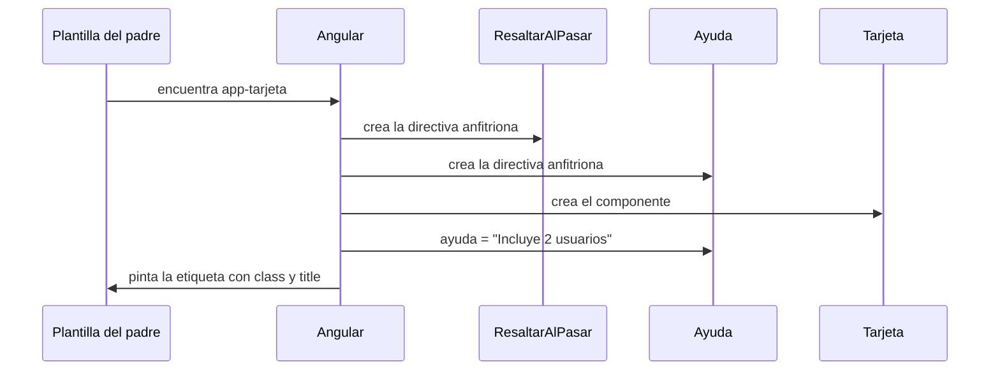

Tu tienda tiene tarjetas de planes de suscripción. Todas deben iluminarse al pasar el ratón y mostrar un texto de ayuda (el `title` que sale como globo). Ya tienes una directiva para cada cosa. Podrías obligar a quien use la tarjeta a escribir `<app-tarjeta appResaltar appAyuda="…">` cada vez… y alguien se olvidará. Mejor que la tarjeta **traiga esas directivas de serie**. Para eso existe `hostDirectives`.

> [!analogia]
> Es como comprar un coche que ya trae de fábrica el GPS y el sensor de aparcamiento. Podrías comprarlos aparte y montarlos tú, pero si vienen integrados, nadie se queda sin ellos.

## Directivas pensadas para componerse

Empezamos con dos directivas pequeñas. Como solo las vamos a usar dentro de otros componentes, **no llevan selector**: no se pueden poner a mano en una plantilla, solo componerse.

```typescript
// src/app/composicion.ts
import { Component, Directive, input, signal } from '@angular/core';

@Directive({
  host: {
    '[style.backgroundColor]': "encima() ? 'lightyellow' : null",
    '(mouseenter)': 'encima.set(true)',
    '(mouseleave)': 'encima.set(false)',
  },
})
export class ResaltarAlPasar {
  protected readonly encima = signal(false);
}

@Directive({
  host: {
    '[attr.title]': 'ayuda()',
  },
})
export class Ayuda {
  readonly ayuda = input('');
}

@Component({
  selector: 'app-tarjeta',
  hostDirectives: [ResaltarAlPasar, { directive: Ayuda, inputs: ['ayuda'] }],
  host: { class: 'tarjeta' },
  template: `<ng-content />`,
})
export class Tarjeta {}
```

Lo nuevo, línea a línea:

- `@Directive({ host: ... })` **sin `selector`**: una directiva así solo puede usarse como directiva anfitriona de otra.
- `'[attr.title]': 'ayuda()'`: binding de **atributo**. Pone el atributo HTML `title`, que el navegador muestra como globo de ayuda.
- `hostDirectives: [...]`: la lista de directivas que se aplican **automáticamente** al elemento anfitrión del componente cada vez que alguien escribe `<app-tarjeta>`.
- `ResaltarAlPasar`: se añade tal cual.
- `{ directive: Ayuda, inputs: ['ayuda'] }`: también se añade `Ayuda` y, además, **se expone su entrada** `ayuda` como si fuera de la tarjeta. Por defecto las entradas y salidas de una directiva anfitriona quedan ocultas; tú eliges cuáles abrir. Con `'ayuda: pista'` la expondrías con otro nombre.
- `host: { class: 'tarjeta' }`: un valor fijo en el anfitrión. Toda tarjeta lleva la clase `tarjeta`.
- `<ng-content />`: proyecta lo que el padre escriba dentro de la etiqueta (módulo 8).

Se usa así:

```html
<!-- src/app/app.html -->
<app-tarjeta ayuda="Incluye 2 usuarios">Plan básico</app-tarjeta>
```

Y Angular genera este HTML (con el ratón encima):

```pantalla
@url localhost:4200/planes
<app-tarjeta class="tarjeta" title="Incluye 2 usuarios" style="display: block; padding: 8px; background-color: lightyellow">Plan básico</app-tarjeta>
```

## En qué orden se crea todo



Angular crea primero las directivas anfitrionas, en el orden de la lista, y después el componente. Cada `<app-tarjeta>` recibe sus propias instancias.

> [!idea]
> `hostDirectives` es **composición**: construir piezas grandes juntando piezas pequeñas. Es la alternativa de Angular a la herencia de clases (`extends`), que obliga a una sola cadena de padres. Con composición, una tarjeta puede llevar resaltado, ayuda y lo que quieras, cada cosa en su directiva.

> [!cuidado]
> Las entradas de una directiva anfitriona no se ven desde fuera si no las listas en `inputs`. Sin `inputs: ['ayuda']`, `<app-tarjeta ayuda="…">` compila pero el texto **no llega** a la directiva: se queda como un atributo HTML suelto y `title` sale vacío. Con corchetes, `[ayuda]="…"`, el compilador sí avisa: `Can't bind to 'ayuda' since it isn't a known property of 'app-tarjeta'`. Y una directiva sin selector, como `Ayuda`, no se puede escribir a mano en una plantilla: no tiene ningún atributo que la active.

> [!prueba]
> En tu proyecto, cambia `{ directive: Ayuda, inputs: ['ayuda'] }` por solo `Ayuda` y guarda. Pasa el ratón por la tarjeta: el globo de ayuda ya no sale. Ahora escribe `[ayuda]="'Hola'"` en la etiqueta: el compilador se queja. Vuelve a exponer la entrada y todo regresa.

> [!resumen]
> - `hostDirectives` aplica directivas automáticamente al anfitrión de un componente (o de otra directiva).
> - Las directivas pensadas solo para componerse pueden no tener selector.
> - Las entradas y salidas de una directiva anfitriona son privadas salvo que las expongas con `inputs` y `outputs`.
> - `host: { class: '…' }` pone valores fijos en el anfitrión.
