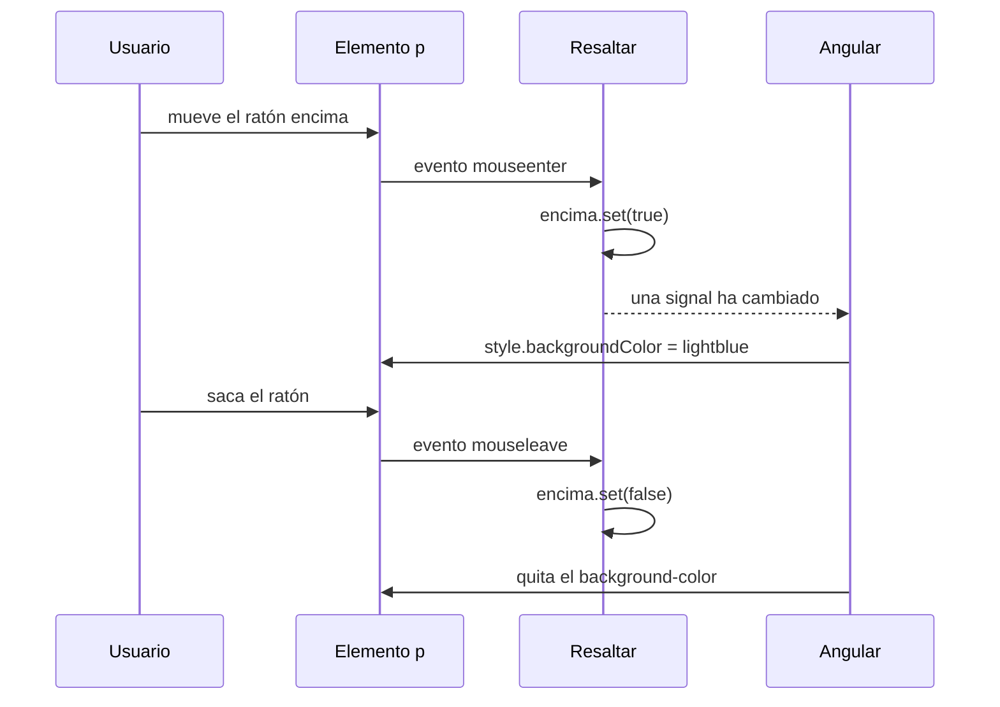

En una lista de productos quieres que cada fila se ilumine al pasar el ratón por encima. Lo necesitas en el catálogo, en el carrito y en el historial de pedidos. En vez de repetir el mismo código en tres componentes, creas **tu propia directiva de atributo** y la pegas donde haga falta: `<li appResaltar>`.

> [!analogia]
> Una directiva propia es como un imán de nevera que tú mismo fabricas. Lo diseñas una vez y luego lo pegas en cualquier superficie metálica. La nevera no cambia; el imán le añade algo encima.

## Generarla con la CLI

```bash
ng generate directive resaltar
CREATE src/app/resaltar.spec.ts (195 bytes)
CREATE src/app/resaltar.ts (115 bytes)
```

```arbol
src/
  app/
    resaltar.ts        # La clase de la directiva con su decorador @Directive
    resaltar.spec.ts   # Una prueba inicial que comprueba que la directiva se puede crear
```

El archivo generado en Angular 22 es mínimo:

```typescript
// src/app/resaltar.ts (tal como lo crea la CLI)
import { Directive } from '@angular/core';

@Directive({
  selector: '[appResaltar]',
})
export class Resaltar {}
```

Fíjate en tres detalles: la clase se llama `Resaltar`, sin sufijo `Directive`; el archivo es `resaltar.ts`; y el selector va **entre corchetes**. En CSS, `[appResaltar]` significa «cualquier elemento que tenga el atributo `appResaltar`». El prefijo `app` lo pone la CLI (sale de `"prefix": "app"` en `angular.json`) para que tus directivas no choquen con atributos de HTML ni de otras librerías.

## Darle comportamiento con `host`

El elemento donde se pega la directiva se llama **anfitrión** (*host*). En el decorador, la propiedad `host` dice qué hacer con él: qué propiedades enlazar y qué eventos escuchar.

```typescript
// src/app/resaltar.ts
import { Directive, input, signal } from '@angular/core';

@Directive({
  selector: '[appResaltar]',
  host: {
    '[style.backgroundColor]': "encima() ? color() || 'yellow' : null",
    '(mouseenter)': 'encima.set(true)',
    '(mouseleave)': 'encima.set(false)',
  },
})
export class Resaltar {
  readonly color = input('', { alias: 'appResaltar' });
  protected readonly encima = signal(false);
}
```

Línea a línea:

- `import { Directive, input, signal } from '@angular/core'`: las tres piezas vienen del núcleo de Angular. `Directive` es el decorador; `input` crea una entrada (módulo 8) y `signal` un valor reactivo (módulo 7).
- `host: { ... }`: un objeto con **bindings sobre el anfitrión**. Usa la misma sintaxis que la plantilla, pero escrita como texto.
- `'[style.backgroundColor]': "..."`: property binding sobre el anfitrión. Si el ratón está encima, el fondo es el color recibido o, si no hay ninguno, amarillo. Si no, `null` (quita el estilo).
- `'(mouseenter)': 'encima.set(true)'`: event binding. Cuando el ratón entra en el elemento, la signal pasa a `true`.
- `'(mouseleave)'`: cuando sale, vuelve a `false`.
- `input('', { alias: 'appResaltar' })`: una entrada cuyo nombre público es el mismo que el selector. Así puedes escribir `appResaltar="lightblue"` y pasar el color en el mismo atributo. Si lo pones sin valor (`<p appResaltar>`), llega `''` y por eso usamos `color() || 'yellow'`.
- `protected readonly encima = signal(false)`: el estado interno. Es `protected` porque solo lo usa el `host`, no otros componentes.

Para usarla, se importa como cualquier componente:

```typescript
// src/app/app.ts (fragmento)
import { Resaltar } from './resaltar';

@Component({
  selector: 'app-root',
  imports: [Resaltar],
  template: `
    <p appResaltar>Amarillo por defecto</p>
    <p appResaltar="lightblue">Azul claro</p>
  `,
})
export class App {}
```

Así se ve con el ratón sobre el segundo párrafo:

```pantalla
@url localhost:4200/
<p>Amarillo por defecto</p>
<p style="background-color: lightblue">Azul claro</p>
```

## Qué ocurre cuando pasas el ratón



Angular crea **una instancia de `Resaltar` por cada elemento** que lleva el atributo. Por eso cada párrafo tiene su propia signal `encima` y se ilumina por separado.

## Tocar el DOM a mano: `ElementRef`, con cuidado

A veces necesitas el elemento real del navegador, por ejemplo para darle el foco. `inject(ElementRef)` te lo da (verás `inject` a fondo en el módulo 10):

```typescript
// src/app/auto-foco.ts
import { Directive, ElementRef, afterNextRender, inject } from '@angular/core';

@Directive({
  selector: '[appAutoFoco]',
})
export class AutoFoco {
  private readonly elemento = inject<ElementRef<HTMLElement>>(ElementRef);

  constructor() {
    afterNextRender(() => {
      this.elemento.nativeElement.focus();
    });
  }
}
```

- `inject<ElementRef<HTMLElement>>(ElementRef)`: pide a Angular la «referencia al elemento» anfitrión. `nativeElement` es el nodo real del DOM.
- `afterNextRender(...)`: espera a que Angular haya pintado la pantalla antes de dar el foco (módulo 5). Antes de eso el elemento puede no estar en la página.

> [!cuidado]
> `ElementRef` es una puerta trasera: si con él escribes `innerHTML` con texto del usuario, abres la puerta a ataques XSS (módulo 20), y además el código deja de funcionar en el servidor (módulo 19). Úsalo solo cuando `host` no basta, como para llamar a `focus()`.

## En proyectos antiguos verás…

```typescript
@HostBinding('style.backgroundColor') fondo = '';
@HostListener('mouseenter') alEntrar() { this.fondo = 'yellow'; }
```

Los decoradores `@HostBinding` y `@HostListener` hacen lo mismo que `host:`. Siguen funcionando, pero la guía de estilo de Angular recomienda la propiedad `host`.

> [!prueba]
> En tu proyecto, genera la directiva con `ng generate directive resaltar`, copia el código y úsala en tres `<li>` con colores distintos. Pasa el ratón por encima de cada uno.

> [!resumen]
> - `ng generate directive resaltar` crea `resaltar.ts` con la clase `Resaltar` y el selector `[appResaltar]`.
> - La propiedad `host` enlaza propiedades y escucha eventos del elemento anfitrión.
> - Una entrada con `alias` igual al selector permite pasar un valor en el mismo atributo.
> - `inject(ElementRef)` da acceso al DOM real: úsalo poco y nunca para meter HTML.
