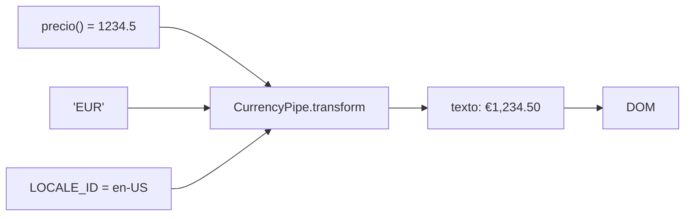

Tu componente tiene el precio `1234.5`, la fecha de un pedido y el nombre `Ada Lovelace`. En pantalla quieres ver `1.234,50 €`, `05/03/2026` y `ADA LOVELACE`. El dato no debe cambiar (el precio sigue siendo un número para poder sumarlo); solo cambia **cómo se muestra**. Para eso están los **pipes**.

> [!analogia]
> Un pipe es como un filtro de foto: la foto original no cambia, pero la ves en blanco y negro o con más brillo. El símbolo `|` es literalmente una tubería (*pipe* en inglés): el valor entra por la izquierda, pasa por el filtro y sale transformado por la derecha.

## La sintaxis

```html
<p>{{ nombre() | uppercase }}</p>
<p>{{ precio() | currency: 'EUR' }}</p>
<p>{{ precio() | currency: 'EUR' | lowercase }}</p>
```

- `valor | nombreDelPipe`: aplica el pipe al valor.
- `| pipe: parametro`: los dos puntos pasan un **parámetro** (aquí, el código de moneda). Si hay varios, se encadenan: `| date: 'short' : 'UTC'`.
- `| pipe1 | pipe2`: se pueden **encadenar**; la salida de uno es la entrada del siguiente, de izquierda a derecha.

Los pipes solo existen en la plantilla. En TypeScript trabajas siempre con el dato original.

## Los pipes de `@angular/common`

Todos vienen en `@angular/common`, ya instalado en tu proyecto, y se importan como las directivas: en TypeScript y en `imports` del componente.

```typescript
// src/app/pipes-incluidos.ts
import { Component, signal } from '@angular/core';
import {
  CurrencyPipe, DatePipe, DecimalPipe, JsonPipe,
  KeyValuePipe, PercentPipe, TitleCasePipe, UpperCasePipe,
} from '@angular/common';

@Component({
  selector: 'app-pipes-incluidos',
  imports: [CurrencyPipe, DatePipe, DecimalPipe, JsonPipe, KeyValuePipe, PercentPipe, TitleCasePipe, UpperCasePipe],
  template: `
    <p>{{ nombre() | uppercase }}</p>
    <p>{{ 'ada lovelace' | titlecase }}</p>
    <p>{{ precio() | currency }}</p>
    <p>{{ precio() | currency: 'EUR' }}</p>
    <p>{{ 3.14159 | number: '1.2-2' }}</p>
    <p>{{ 0.256 | percent }}</p>
    <p>{{ fecha | date }}</p>
    <p>{{ fecha | date: 'dd/MM/yyyy' }}</p>
    <pre>{{ usuario | json }}</pre>
    @for (par of stock | keyvalue; track par.key) {
      <p>{{ par.key }}: {{ par.value }}</p>
    }
  `,
})
export class PipesIncluidos {
  protected readonly nombre = signal('Ada Lovelace');
  protected readonly precio = signal(1234.5);
  protected readonly fecha = new Date(2026, 2, 5);
  protected readonly usuario = { nombre: 'Ada', edad: 36 };
  protected readonly stock = { peras: 4, manzanas: 10, kiwis: 0 };
}
```

Esto es lo que se ve (comprobado con Angular 22 y el idioma por defecto, inglés de EE. UU.):

```pantalla
@url localhost:4200/
<p>ADA LOVELACE</p>
<p>Ada Lovelace</p>
<p>$1,234.50</p>
<p>€1,234.50</p>
<p>3.14</p>
<p>26%</p>
<p>Mar 5, 2026</p>
<p>05/03/2026</p>
<pre>{
  "nombre": "Ada",
  "edad": 36
}</pre>
<p>kiwis: 0</p>
<p>manzanas: 10</p>
<p>peras: 4</p>
```

| Pipe | En la plantilla | Qué hace |
| --- | --- | --- |
| `UpperCasePipe` | `uppercase` | Todo a mayúsculas (`lowercase`: a minúsculas) |
| `TitleCasePipe` | `titlecase` | La primera letra de cada palabra en mayúscula |
| `CurrencyPipe` | `currency: 'EUR'` | Moneda con símbolo y dos decimales. Sin parámetro usa dólares |
| `DecimalPipe` | `number: '1.2-2'` | Número con separadores. `'1.2-2'` = mínimo 1 entero, entre 2 y 2 decimales |
| `PercentPipe` | `percent` | Multiplica por 100 y añade `%` (`0.256` → `26%`) |
| `DatePipe` | `date: 'dd/MM/yyyy'` | Fecha con formato: `dd` día, `MM` mes, `yyyy` año, `HH:mm` hora |
| `JsonPipe` | `json` | Convierte un objeto en texto JSON. Ideal para depurar |
| `KeyValuePipe` | `keyvalue` | Convierte un objeto en una lista de pares `{ key, value }` **ordenada por clave** |
| `AsyncPipe` | `async` | Muestra el último valor de un Observable o una Promise (módulo 14) |

> [!cuidado]
> Fíjate en `keyvalue`: el objeto tiene `peras, manzanas, kiwis`, pero salen `kiwis, manzanas, peras`. Ordena alfabéticamente por clave. Y `percent` redondea: `0.256` sale `26%`, salvo que pidas decimales con `percent: '1.1-1'` (`25.6%`).

## Qué ocurre al pintar



El compilador convierte `{{ precio() | currency: 'EUR' }}` en una llamada al método `transform(1234.5, 'EUR')` de una instancia de `CurrencyPipe`. Angular solo vuelve a llamarlo cuando cambia el valor de entrada o un parámetro.

## Formato en español: `LOCALE_ID`

Los formatos de número, moneda y fecha dependen del **idioma y región** (*locale*). Por defecto Angular usa `en-US`: coma para los miles y punto para los decimales. Para usar español, registra los datos del idioma y dile a Angular cuál usar:

```typescript
// src/app/app.config.ts
import { ApplicationConfig, DEFAULT_CURRENCY_CODE, LOCALE_ID, provideBrowserGlobalErrorListeners } from '@angular/core';
import { registerLocaleData } from '@angular/common';
import localeEs from '@angular/common/locales/es';
import { provideRouter } from '@angular/router';
import { routes } from './app.routes';

registerLocaleData(localeEs);

export const appConfig: ApplicationConfig = {
  providers: [
    provideBrowserGlobalErrorListeners(),
    provideRouter(routes),
    { provide: LOCALE_ID, useValue: 'es' },
    { provide: DEFAULT_CURRENCY_CODE, useValue: 'EUR' },
  ],
};
```

- `import localeEs from '@angular/common/locales/es'`: los datos del español (nombres de meses, separadores…). Hay un archivo por idioma; solo se incluye en tu aplicación el que importas.
- `registerLocaleData(localeEs)`: los registra para que los pipes puedan usarlos.
- `{ provide: LOCALE_ID, useValue: 'es' }`: le dice a toda la aplicación «el idioma es español». Esta forma de escribir proveedores la entenderás a fondo en el módulo 10.
- `DEFAULT_CURRENCY_CODE`: la moneda cuando escribes `currency` sin parámetro.

Con eso, los mismos pipes cambian de formato:

```pantalla
@url localhost:4200/
<p>1.234,50 €</p>
<p>1.234.567,891</p>
<p>5 mar 2026</p>
<p>jueves, 5 de marzo de 2026</p>
```

Son `precio() | currency`, `1234567.891 | number`, `fecha | date` y `fecha | date: 'fullDate'`.

> [!prueba]
> En tu proyecto, pon `{{ hoy | date: 'fullDate' }}` con `hoy = new Date()` en un componente. Mira el resultado, añade después `LOCALE_ID` en español en `app.config.ts` y guarda: la fecha cambia de idioma.

> [!resumen]
> - Un pipe transforma un valor **solo para mostrarlo**: `valor | pipe: parametro`.
> - Los pipes de Angular vienen en `@angular/common` y se importan en el componente.
> - Se pueden encadenar: `| currency: 'EUR' | lowercase`.
> - `LOCALE_ID` y `registerLocaleData` cambian el idioma de números, monedas y fechas.
