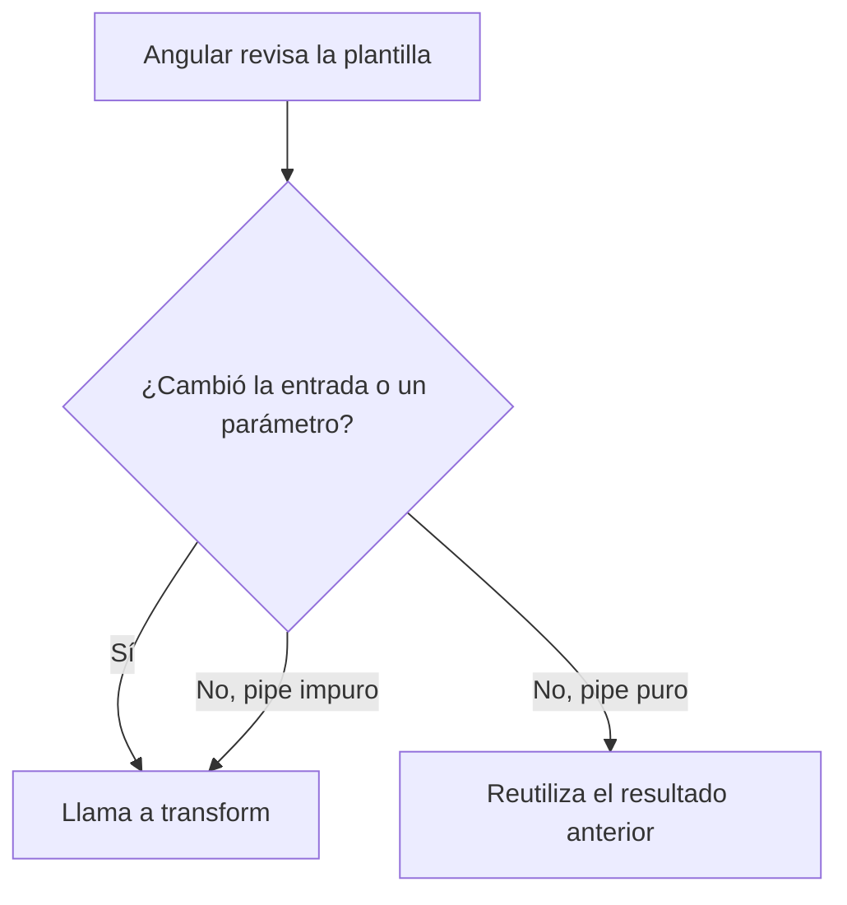

En la lista de clientes quieres un avatar con las iniciales: de `grace brewster hopper` a `GBH`. Y en el catálogo, las descripciones largas deben cortarse con `...`. Ningún pipe de Angular hace eso, pero escribir el tuyo es fácil: es una clase con **un solo método**.

> [!analogia]
> Un pipe propio es como una máquina de zumo que fabricas tú: tiene una entrada (la fruta), quizá un par de botones (los parámetros) y una salida (el zumo). No guarda nada dentro ni le importa quién la use: misma fruta, mismo zumo.

## Generarlo con la CLI

```bash
ng generate pipe iniciales
CREATE src/app/iniciales-pipe.spec.ts (199 bytes)
CREATE src/app/iniciales-pipe.ts (222 bytes)
```

```arbol
src/
  app/
    iniciales-pipe.ts        # La clase InicialesPipe con su decorador @Pipe
    iniciales-pipe.spec.ts   # Una prueba que comprueba que el pipe se puede crear
```

A diferencia de componentes, directivas y servicios, en Angular 22 los pipes **sí conservan el sufijo**: archivo `iniciales-pipe.ts`, clase `InicialesPipe`. Así no se confunde la clase con el nombre que usas en la plantilla (`iniciales`). La CLI genera este esqueleto:

```typescript
// src/app/iniciales-pipe.ts (tal como lo crea la CLI)
import { Pipe, PipeTransform } from '@angular/core';

@Pipe({
  name: 'iniciales',
})
export class InicialesPipe implements PipeTransform {
  transform(value: unknown, ...args: unknown[]): unknown {
    return null;
  }
}
```

## Escribir el `transform`

```typescript
// src/app/iniciales-pipe.ts
import { Pipe, PipeTransform } from '@angular/core';

@Pipe({
  name: 'iniciales',
})
export class InicialesPipe implements PipeTransform {
  transform(nombre: string): string {
    return nombre
      .split(' ')
      .filter((palabra) => palabra.length > 0)
      .map((palabra) => palabra[0].toUpperCase())
      .join('');
  }
}
```

- `@Pipe({ name: 'iniciales' })`: el decorador marca la clase como pipe. `name` es lo que escribes después de `|` en la plantilla.
- `implements PipeTransform`: una **interfaz** de `@angular/core` que obliga a tener un método `transform`. Si te equivocas de nombre, TypeScript te avisa.
- `transform(nombre: string): string`: recibe el valor de la izquierda del `|` y devuelve lo que se pinta. Cambiamos los `unknown` del esqueleto por tipos reales.
- El cuerpo: parte el texto por espacios, descarta huecos vacíos, toma la primera letra de cada palabra en mayúscula y las une.

## Parámetros

Cada parámetro que escribes tras `:` en la plantilla llega como un argumento más de `transform`, en el mismo orden. Con valores por defecto, son opcionales:

```typescript
// src/app/recortar-pipe.ts
import { Pipe, PipeTransform } from '@angular/core';

@Pipe({
  name: 'recortar',
})
export class RecortarPipe implements PipeTransform {
  transform(texto: string, maximo = 10, final = '...'): string {
    if (texto.length <= maximo) {
      return texto;
    }
    return texto.slice(0, maximo) + final;
  }
}
```

Se importan en el componente como cualquier pipe de Angular:

```typescript
// src/app/clientes.ts
import { Component, signal } from '@angular/core';
import { UpperCasePipe } from '@angular/common';
import { InicialesPipe } from './iniciales-pipe';
import { RecortarPipe } from './recortar-pipe';

@Component({
  selector: 'app-clientes',
  imports: [InicialesPipe, RecortarPipe, UpperCasePipe],
  template: `
    <p>{{ nombre() | iniciales }}</p>
    <p>{{ descripcion() | recortar }}</p>
    <p>{{ descripcion() | recortar: 5 }}</p>
    <p>{{ descripcion() | recortar: 5 : '!' }}</p>
    <p>{{ descripcion() | recortar: 8 | uppercase }}</p>
  `,
})
export class Clientes {
  protected readonly nombre = signal('grace brewster hopper');
  protected readonly descripcion = signal('Teclado mecánico retroiluminado');
}
```

```pantalla
@url localhost:4200/clientes
<p>GBH</p>
<p>Teclado me...</p>
<p>Tecla...</p>
<p>Tecla!</p>
<p>TECLADO ...</p>
```

En la última línea, `recortar: 8` da `Teclado ...` (el octavo carácter es el espacio) y `uppercase` lo pasa a mayúsculas.

## Puros e impuros

Por defecto, un pipe es **puro**: Angular solo vuelve a llamar a `transform` si cambia el valor de entrada o algún parámetro. Si `nombre()` sigue siendo el mismo texto, reutiliza el resultado anterior. Es rápido y casi siempre es lo que quieres.



Un pipe **impuro** (`pure: false`) se ejecuta en **cada** revisión de la pantalla, aunque nada haya cambiado. Solo tiene sentido si el resultado depende de algo que no son sus argumentos, como la hora actual:

```typescript
@Pipe({
  name: 'hace',
  pure: false,
})
export class HacePipe implements PipeTransform {
  transform(fecha: Date): string {
    const segundos = Math.round((Date.now() - fecha.getTime()) / 1000);
    return `hace ${segundos} s`;
  }
}
```

> [!cuidado]
> «Ha cambiado la entrada» significa que es **otro valor** (para objetos y arrays, otro objeto). Si añades un elemento a un array con `push`, el array es el mismo y un pipe puro no se entera. La solución no es hacerlo impuro, sino crear un array nuevo: `lista.update((l) => [...l, nuevo])`, igual que aprendiste con las signals en el módulo 7.

> [!prueba]
> En tu proyecto, genera el pipe con `ng generate pipe iniciales`, pega el código y usa `{{ 'ada lovelace' | iniciales }}`. Después prueba con dos espacios seguidos entre las palabras: gracias a `filter`, el resultado sigue siendo `AL`.

> [!resumen]
> - `ng generate pipe iniciales` crea `iniciales-pipe.ts` con la clase `InicialesPipe`.
> - `transform(valor, ...parametros)` recibe el valor del `|` y los parámetros tras `:`, en orden.
> - Los pipes son puros por defecto: solo se recalculan si cambian la entrada o los parámetros.
> - `pure: false` lo hace impuro: se ejecuta en cada revisión, úsalo solo cuando sea imprescindible.
