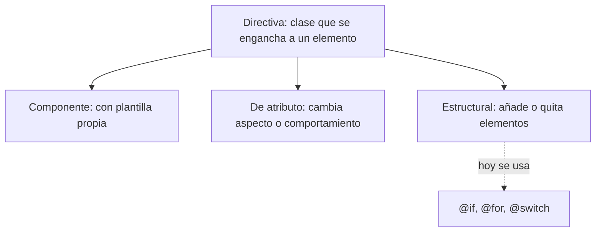

Imagina que en tu tienda online quieres que todos los precios en oferta se vean en rojo, que el campo de búsqueda reciba el cursor nada más abrir la página y que cualquier tarjeta se ilumine al pasar el ratón. Podrías copiar el mismo código en cada componente… o enseñar a las etiquetas HTML un **comportamiento nuevo** una sola vez y reutilizarlo donde quieras. Eso es una **directiva**.

> [!analogia]
> Una directiva es como una pegatina con superpoderes. Pegas la pegatina `appResaltar` en un párrafo y, a partir de ese momento, ese párrafo sabe iluminarse cuando pasas el ratón. La etiqueta sigue siendo un `<p>` normal; la pegatina le añade algo.

## Tres tipos de directivas

Angular llama **directiva** a cualquier clase que se engancha a un elemento de la plantilla y cambia su aspecto o su comportamiento. Hay tres familias:

| Tipo | Qué hace | Ejemplo |
| --- | --- | --- |
| Componente | Una directiva **con plantilla propia**: pinta su propio HTML | `<app-tarjeta>` |
| De atributo | Cambia el aspecto o el comportamiento del elemento donde la pones | `routerLink`, `ngModel`, `appResaltar` |
| Estructural | Añade o quita elementos del DOM | `*ngIf`, `*ngFor` (antiguas) |

Sí: **un componente es una directiva** que además trae su plantilla. Por eso `@Component` acepta todo lo que acepta `@Directive` y algo más (`template`, `styles`…).

Las directivas estructurales antiguas (`*ngIf`, `*ngFor`, `*ngSwitch`) están **obsoletas desde Angular 20**: hoy se usan los bloques `@if`, `@for` y `@switch` que viste en el módulo 6. Los bloques no son directivas: son parte del lenguaje de plantillas y el compilador los entiende directamente.



## Dos directivas de Angular: NgClass y NgStyle

`@angular/common` (la librería con las piezas «comunes» que casi toda app necesita) trae dos directivas de atributo muy conocidas: `NgClass`, que pone o quita clases CSS, y `NgStyle`, que pone estilos. Hoy casi siempre puedes hacer lo mismo con los **bindings** `[class]` y `[style]` del módulo 6, sin importar nada:

```typescript
// src/app/clases.ts
import { Component, signal } from '@angular/core';
import { NgClass, NgStyle } from '@angular/common';

@Component({
  selector: 'app-clases',
  imports: [NgClass, NgStyle],
  template: `
    <p [class.activa]="activa()">Con [class]</p>
    <p [style.color]="color()" [style.font-size.px]="tamano()">Con [style]</p>
    <p [ngClass]="{ activa: activa(), grande: grande() }">Con NgClass</p>
    <p [ngStyle]="{ color: color() }">Con NgStyle</p>
  `,
})
export class Clases {
  protected readonly activa = signal(true);
  protected readonly grande = signal(false);
  protected readonly color = signal('green');
  protected readonly tamano = signal(18);
}
```

Línea a línea:

- `import { NgClass, NgStyle } from '@angular/common'`: las dos directivas viven en `@angular/common`. Como cualquier pieza que uses en la plantilla, hay que **importarla dos veces**: en el `import` de TypeScript (para que el archivo la conozca) y en `imports: [...]` del componente (para que la plantilla pueda usarla).
- `[class.activa]="activa()"`: binding de clase. Si `activa()` es `true`, el párrafo lleva la clase `activa`; si es `false`, se la quita.
- `[style.font-size.px]="tamano()"`: binding de estilo con unidad. `18` se convierte en `font-size: 18px`.
- `[ngClass]="{ activa: activa(), grande: grande() }"`: la directiva recibe un objeto. Cada clave es una clase y su valor dice si se pone.
- `[ngStyle]="{ color: color() }"`: lo mismo, pero con estilos.

Así se ve (con la clase `activa` pintada en negrita):

```pantalla
@url localhost:4200/
<p class="activa" style="font-weight: bold">Con [class]</p>
<p style="color: green; font-size: 18px">Con [style]</p>
<p class="activa" style="font-weight: bold">Con NgClass</p>
<p style="color: green">Con NgStyle</p>
```

> [!idea]
> Prefiere `[class.x]`, `[class]` y `[style.x]`. Funcionan sin importar nada y son un poco más rápidos. `[class]` también acepta un objeto: `[class]="{ activa: activa(), grande: grande() }"`. `NgClass` y `NgStyle` no están obsoletas, pero las verás sobre todo en código antiguo.

## Qué pasa por dentro

Cuando el compilador de Angular lee la plantilla, busca qué directivas importadas coinciden con cada elemento usando su **selector**. `NgClass` tiene el selector `[ngClass]`: cualquier elemento con el atributo `ngClass` la activa. Entonces Angular crea una instancia de la clase `NgClass` **para ese elemento** y le pasa el valor del binding. Cada vez que el valor cambia, la directiva actualiza las clases del elemento real del DOM.

> [!cuidado]
> Si escribes `[ngClass]` y olvidas añadir `NgClass` a `imports`, el compilador se queja: `Can't bind to 'ngClass' since it isn't a known property of 'p'`. Ese mensaje casi siempre significa «te falta importar una directiva o un componente».

> [!prueba]
> En tu proyecto, crea el componente `Clases` de arriba, añade en `src/styles.css` la regla `.activa { font-weight: bold; }` y cambia `signal(true)` por `signal(false)`. Guarda: el navegador se recarga solo y la negrita desaparece.

> [!resumen]
> - Una directiva es una clase que se engancha a un elemento y le añade aspecto o comportamiento.
> - Hay tres tipos: componentes (con plantilla), de atributo y estructurales (hoy sustituidas por `@if`, `@for`, `@switch`).
> - `NgClass` y `NgStyle` vienen de `@angular/common`; los bindings `[class]` y `[style]` hacen lo mismo sin importar nada.
> - Para usar una directiva hay que importarla en TypeScript **y** en `imports` del componente.
