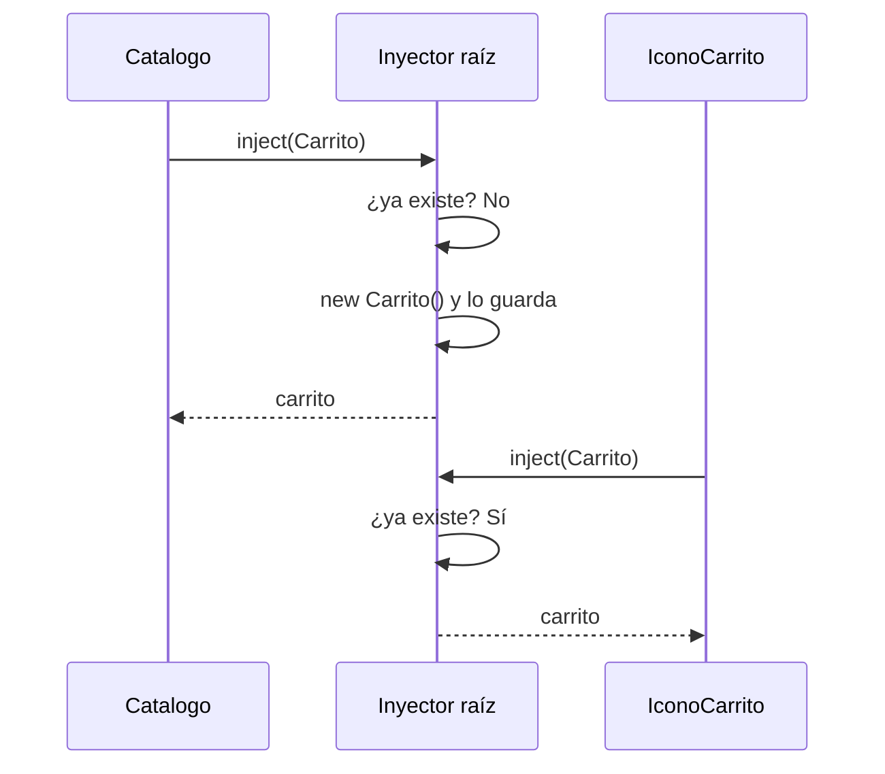

En la lección anterior escribiste `inject(Carrito)` y apareció un carrito listo para usar. Nadie hizo `new Carrito()`. ¿Quién lo creó? ¿Cuándo? ¿Por qué no lo creamos nosotros? Esta lección abre la caja: se llama **inyección de dependencias** (*dependency injection*, DI).

## El problema de hacer `new` tú mismo

Una **dependencia** es algo que tu clase necesita para trabajar: el catálogo depende del carrito; el carrito, quizá, de un servicio que guarda en `localStorage`. Si cada clase hiciera `new` de lo que necesita:

- cada componente tendría **su propio** carrito, y no se compartiría nada;
- si el carrito necesitara a su vez otras piezas, cada componente tendría que saber construirlas todas;
- en las pruebas no podrías cambiar el carrito real por uno falso (lección 5).

> [!analogia]
> Es la diferencia entre fabricarte tú la silla cada vez que te sientas y llegar a un hotel donde la recepción te da la llave de tu habitación. Tú solo dices qué necesitas («una habitación»); la recepción decide cuál, la prepara si hace falta y te da siempre la misma mientras dure tu estancia. En Angular, la recepción se llama **inyector**.

## El inyector

Un **inyector** es un objeto de Angular que:

1. tiene una lista de **proveedores**: recetas que dicen cómo crear cada cosa;
2. cuando alguien pide algo, mira si ya lo creó; si no, usa la receta, lo crea y **lo guarda**;
3. entrega siempre esa misma instancia.



El servicio se crea **la primera vez que alguien lo pide**, no al arrancar la app. Si ningún componente lo usa, nunca se crea, y el compilador puede incluso quitarlo del paquete final (*tree-shaking*).

## Dos formas de registrar un servicio en el inyector raíz

Angular tiene un **inyector raíz** para toda la aplicación. Registrar un servicio ahí lo convierte en un singleton global.

```typescript
// Angular 22: lo que genera la CLI
import { Service } from '@angular/core';

@Service()
export class Carrito {}
```

```typescript
// La forma clásica, válida en Angular 22 y en versiones anteriores
import { Injectable } from '@angular/core';

@Injectable({
  providedIn: 'root',
})
export class Carrito {}
```

- `@Service()`: el servicio se **autoprovee** (`autoProvided`, que por defecto es `true`) en el inyector raíz.
- `@Injectable({ providedIn: 'root' })`: «inyectable, y su proveedor está en la raíz». Es exactamente lo mismo para este caso.

Una diferencia práctica: dentro de una clase con `@Service()` **solo** puedes pedir dependencias con `inject()`. El compilador rechaza la inyección por constructor (`@Service class cannot use constructor dependency injection`).

## `inject()` y el contexto de inyección

`inject()` viene de `@angular/core` y solo funciona mientras Angular está **construyendo** algo: en la inicialización de un campo, en el constructor o en funciones que Angular ejecuta por ti, como los guards (módulo 11). A ese momento se le llama **contexto de inyección**.

```typescript
// src/app/pedido.ts
import { Component, inject } from '@angular/core';
import { Carrito } from './carrito';

@Component({
  selector: 'app-pedido',
  template: `<button (click)="pagar()">Pagar {{ carrito.total() }} €</button>`,
})
export class Pedido {
  protected readonly carrito = inject(Carrito);   // ✔ inicializando un campo

  pagar(): void {
    // const otro = inject(Carrito);               // ✘ esto falla: ya no estamos construyendo
    console.log('Pagando', this.carrito.total());
  }
}
```

> [!cuidado]
> Si llamas a `inject()` dentro de un método que se ejecuta después (un clic, un `setTimeout`), obtienes este error: `NG0203: The 'Carrito' token injection failed. 'inject()' function must be called from an injection context such as a constructor, a factory function, a field initializer…` Pide las dependencias siempre como campos de la clase y úsalas luego con `this`.

## En proyectos antiguos verás…

```typescript
export class Pedido {
  constructor(private carrito: Carrito) {}
}
```

Es la **inyección por constructor**: Angular lee el tipo de cada parámetro y pasa la instancia. Funciona en componentes y en clases con `@Injectable`, pero hoy se prefiere `inject()`: es más corta, funciona en funciones (guards, interceptores) y se lleva mejor con la herencia.

> [!prueba]
> En tu proyecto, mueve `inject(Carrito)` dentro del método `pagar()` y pulsa el botón. Abre la consola del navegador (F12) y lee el error NG0203. Vuelve a dejarlo como campo.

> [!resumen]
> - La inyección de dependencias significa pedir lo que necesitas en lugar de crearlo con `new`.
> - El inyector guarda las instancias que crea y entrega siempre la misma.
> - `@Service()` y `@Injectable({ providedIn: 'root' })` registran un servicio en el inyector raíz.
> - `inject()` solo funciona en un contexto de inyección: campos, constructor y funciones que Angular ejecuta.
