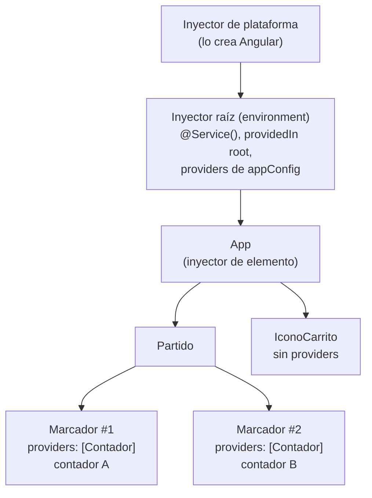
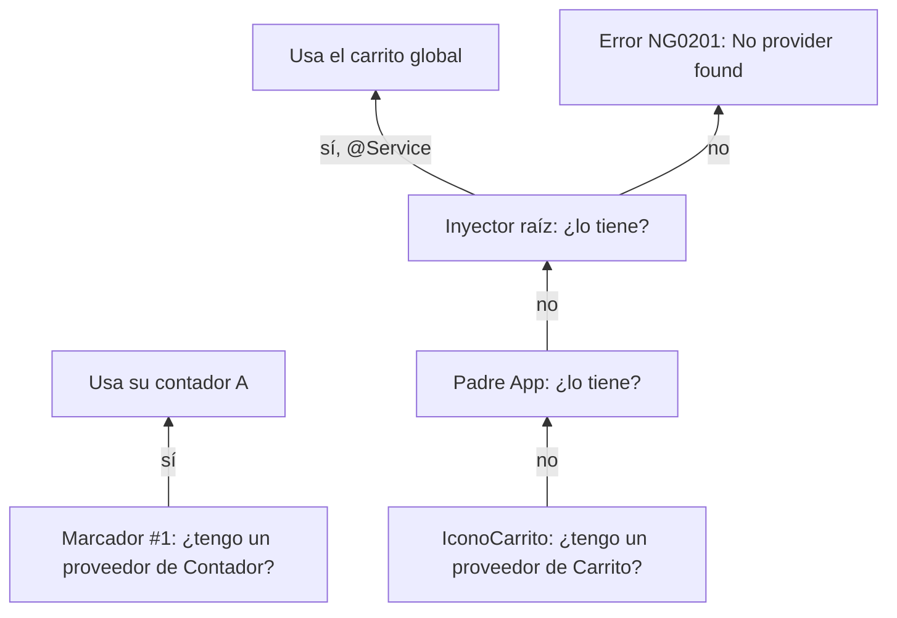

El carrito debe ser uno para toda la tienda. Pero imagina un marcador de partido con dos equipos: cada marcador necesita **su propio** contador. Si el contador fuera un singleton, al sumar un punto al equipo local también subiría el visitante. Angular resuelve los dos casos con una idea: **no hay un solo inyector, sino un árbol de inyectores**.

> [!analogia]
> Piensa en un edificio de oficinas. Cada despacho puede tener su propia grapadora. Si buscas una y no hay en tu despacho, vas a la de la planta; si tampoco, a recepción, que tiene de todo para todo el edificio. Lo que encuentres primero, subiendo, es lo que usas.

## Los inyectores de una aplicación



- **Inyector raíz** (de tipo *environment*): se crea con `bootstrapApplication(App, appConfig)`. Contiene los servicios con `@Service()` o `providedIn: 'root'` y todo lo que pongas en `providers` de `appConfig`.
- **Inyectores de elemento**: cada componente (y directiva) tiene uno. Si su decorador tiene `providers: [...]`, ese componente crea **sus propias** instancias, compartidas con todos sus descendientes.

## Cómo busca Angular

Cuando un componente hace `inject(X)`, Angular sube por el árbol:



1. Mira en el inyector del propio componente.
2. Si no, en el del padre, el abuelo… hasta `App`.
3. Si no, en el inyector raíz.
4. Si tampoco está, lanza `NG0201: No provider found for 'Contador'`.

## Un contador por marcador

```typescript
// src/app/marcador.ts
import { Component, Service, inject, signal } from '@angular/core';

@Service({ autoProvided: false })
export class Contador {
  readonly valor = signal(0);

  sumar(): void {
    this.valor.update((v) => v + 1);
  }
}

@Component({
  selector: 'app-marcador',
  providers: [Contador],
  template: `<button (click)="contador.sumar()">{{ nombre }}: {{ contador.valor() }}</button>`,
})
export class Marcador {
  protected readonly contador = inject(Contador);
  nombre = 'Equipo';
}

@Component({
  selector: 'app-partido',
  imports: [Marcador],
  template: `<app-marcador /><app-marcador />`,
})
export class Partido {}
```

Lo importante:

- `@Service({ autoProvided: false })`: este servicio **no** se registra solo en la raíz. Quien lo quiera tiene que proveerlo. (En código antiguo: `@Injectable()` sin `providedIn`).
- `providers: [Contador]` en `Marcador`: cada vez que Angular crea un `<app-marcador>`, su inyector de elemento crea un `Contador` nuevo. Cuando el marcador se destruye, su contador también.
- `inject(Contador)`: busca, lo encuentra en el propio componente y no sigue subiendo.

Tras pulsar dos veces el primer botón y una el segundo:

```pantalla
@url localhost:4200/partido
<button>Equipo: 2</button> <button>Equipo: 1</button>
```

Si quitas `providers: [Contador]` y vuelves a `@Service()` sin opciones, los dos botones comparten el contador del inyector raíz y ambos muestran `Equipo: 3`.

> [!idea]
> Dónde **provees** un servicio decide **cuántas instancias** hay y **cuánto viven**: en la raíz, una para toda la app y para siempre; en un componente, una por cada copia de ese componente, que muere con él.

> [!cuidado]
> Un servicio con `autoProvided: false` que nadie provee provoca `NG0201: No provider found for 'Contador'` en cuanto alguien hace `inject(Contador)`. El error dice exactamente qué falta: añade el servicio a `providers` del componente que lo necesita, de uno de sus padres o de `appConfig`.

## Para curiosos: modificadores de búsqueda

`inject()` acepta opciones que cambian la búsqueda: `inject(Contador, { optional: true })` devuelve `null` en vez de lanzar error; `{ self: true }` solo mira en el propio componente; `{ skipSelf: true }` empieza por el padre. Y `viewProviders` (en lugar de `providers`) hace que las instancias se vean en la plantilla del componente pero no en el contenido proyectado con `<ng-content>`. Los usarás poco; basta con saber que existen.

> [!prueba]
> En tu proyecto, crea `Partido` y `Marcador`. Pulsa los botones: van por separado. Luego mueve `providers: [Contador]` de `Marcador` a `Partido` y guarda: ahora los dos botones de ese partido suben juntos, porque comparten el contador de su padre.

> [!resumen]
> - Hay un árbol de inyectores: el raíz (environment) y uno por cada componente.
> - `inject()` busca desde el componente hacia arriba y usa el primer proveedor que encuentra.
> - `providers: [X]` en un componente crea una instancia por cada copia del componente.
> - `@Service({ autoProvided: false })` o `@Injectable()` sin `providedIn` obligan a proveer el servicio a mano.
