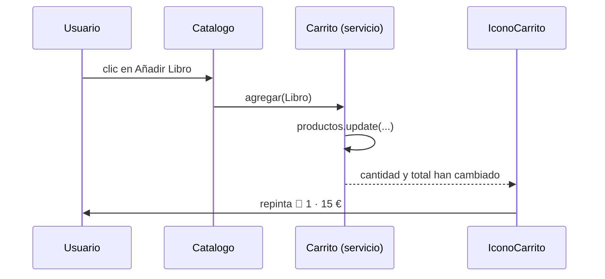

En tu tienda, el catálogo tiene botones de «Añadir al carrito» y la cabecera muestra un icono con el número de productos y el total. Son dos componentes distintos, lejos el uno del otro en el árbol. ¿Dónde vive el carrito? Si cada componente guarda su propia lista, el icono nunca se entera de lo que añade el catálogo. Y pasarlo con `input()` y `output()` a través de cinco niveles de componentes sería un infierno.

La solución es sacar el carrito de los componentes y meterlo en un **servicio**: una clase que guarda datos y lógica que **varios componentes comparten**.

> [!analogia]
> Un servicio es como la cocina de un restaurante. Los camareros (componentes) toman nota y sirven platos, pero no cocinan cada uno en su mesa. Todos piden a la misma cocina, que tiene los ingredientes y las recetas. Si mañana cambias de cocinero, los camareros ni se enteran.

## Qué va en un componente y qué en un servicio

| Componente | Servicio |
| --- | --- |
| Qué se ve y cómo se ve | Datos que comparten varias pantallas |
| Reaccionar a clics y teclas | Reglas de negocio (calcular un total, validar un descuento) |
| Pasar datos a su plantilla | Hablar con un servidor (módulo 13), guardar en `localStorage` |

> [!idea]
> Un componente debería ser «fino»: muestra cosas y delega el trabajo. Todo lo que no sea pintar va a un servicio.

## Crearlo con la CLI

```bash
ng generate service carrito
CREATE src/app/carrito.spec.ts (325 bytes)
CREATE src/app/carrito.ts (78 bytes)
```

```arbol
src/
  app/
    carrito.ts        # La clase del servicio, marcada con @Service()
    carrito.spec.ts   # Una prueba que pide el servicio a Angular y comprueba que existe
```

Y este es el archivo que genera Angular 22:

```typescript
// src/app/carrito.ts (tal como lo crea la CLI)
import { Service } from '@angular/core';

@Service()
export class Carrito {}
```

> [!cuidado]
> `@Service()` es **nuevo en Angular 22** y es estable (`@publicApi`). En casi todo el código que encuentres en internet, y en proyectos de antes de la v22, verás en su lugar `@Injectable({ providedIn: 'root' })`. Hacen lo mismo en este caso. La CLI genera el formato antiguo si escribes `ng generate service carrito --injectable`. En la lección siguiente verás los dos.

Fíjate también en el nombre: la clase se llama `Carrito`, sin el sufijo `Service`. Si prefieres `CarritoService`, genera `ng generate service carrito-service` y tendrás `carrito-service.ts` con `class CarritoService`.

## El carrito completo

```typescript
// src/app/carrito.ts
import { Service, computed, signal } from '@angular/core';

export interface Producto {
  nombre: string;
  precio: number;
}

@Service()
export class Carrito {
  private readonly productos = signal<Producto[]>([]);

  readonly cantidad = computed(() => this.productos().length);
  readonly total = computed(() => this.productos().reduce((suma, p) => suma + p.precio, 0));

  agregar(producto: Producto): void {
    this.productos.update((lista) => [...lista, producto]);
  }
}
```

- `import { Service, computed, signal } from '@angular/core'`: el decorador y las herramientas de signals del módulo 7.
- `@Service()`: marca la clase como servicio y le dice a Angular «crea **una sola** instancia para toda la aplicación y dásela a quien la pida».
- `private readonly productos`: la lista es **privada**. Nadie de fuera puede vaciarla ni cambiarla a escondidas.
- `cantidad` y `total`: signals calculadas de solo lectura que cualquiera puede consultar.
- `agregar(...)`: la **única puerta** para modificar el carrito. Crea un array nuevo para que las signals avisen del cambio.

## Usarlo desde dos componentes

```typescript
// src/app/catalogo.ts
import { Component, inject } from '@angular/core';
import { Carrito, Producto } from './carrito';

@Component({
  selector: 'app-catalogo',
  template: `
    @for (producto of productos; track producto.nombre) {
      <button (click)="carrito.agregar(producto)">Añadir {{ producto.nombre }}</button>
    }
  `,
})
export class Catalogo {
  protected readonly carrito = inject(Carrito);
  protected readonly productos: Producto[] = [
    { nombre: 'Libro', precio: 15 },
    { nombre: 'Taza', precio: 8 },
  ];
}
```

```typescript
// src/app/icono-carrito.ts
import { Component, inject } from '@angular/core';
import { Carrito } from './carrito';

@Component({
  selector: 'app-icono-carrito',
  template: `<span>🛒 {{ carrito.cantidad() }} · {{ carrito.total() }} €</span>`,
})
export class IconoCarrito {
  protected readonly carrito = inject(Carrito);
}
```

`inject(Carrito)` significa «Angular, dame el carrito». Los dos componentes reciben **el mismo objeto**. Tras pulsar los dos botones:

```pantalla
@url localhost:4200/
<span>🛒 2 · 23 €</span>
<p><button>Añadir Libro</button> <button>Añadir Taza</button></p>
```



A esa única instancia compartida se le llama **singleton** («el único»).

> [!prueba]
> En tu proyecto, genera el servicio, pega el código y pon `<app-icono-carrito />` y `<app-catalogo />` en `app.html` (importando ambos en `app.ts`). Pulsa los botones: el icono se actualiza aunque los componentes no se conocen entre sí.

> [!resumen]
> - Un servicio guarda datos y lógica que varios componentes comparten.
> - `ng generate service carrito` crea `carrito.ts` con `@Service()` (en código anterior a la v22: `@Injectable({ providedIn: 'root' })`).
> - `inject(Carrito)` pide el servicio; todos los que lo piden reciben la misma instancia (singleton).
> - Mantén el estado privado y ofrece métodos para cambiarlo.
