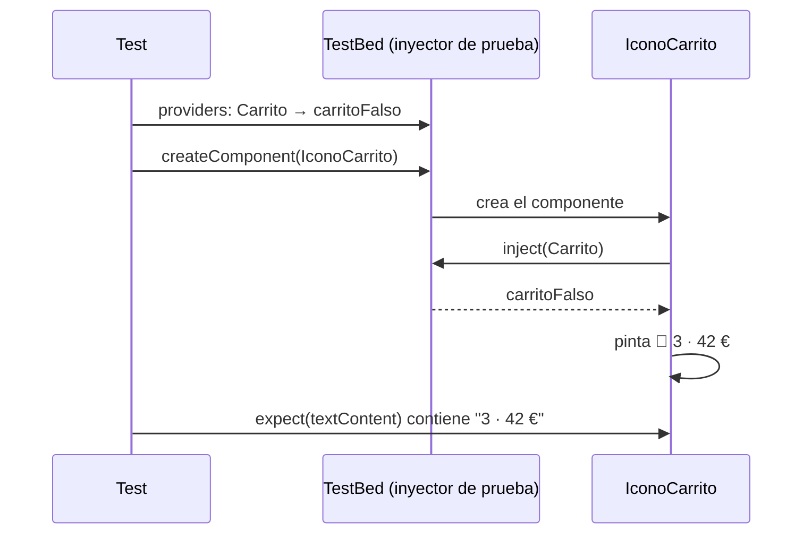

Quieres comprobar que el icono del carrito pinta bien «3 productos · 42 €». Para eso, con el carrito real, tendrías que añadir tres productos cuyos precios sumen 42. Y si el carrito hablara con un servidor, la prueba necesitaría internet. Con la inyección de dependencias hay un atajo precioso: **darle al componente un carrito falso** que diga exactamente lo que tú quieras.

> [!analogia]
> En el cine, para las escenas peligrosas se usa un **doble** que se parece al actor. La cámara (el componente) no nota la diferencia. En las pruebas, un *doble de prueba* es un objeto que se hace pasar por el servicio real.

Las pruebas de Angular las verás a fondo en el módulo 18. Aquí nos centramos en lo que la DI hace posible.

## Probar el servicio tal cual

Un servicio sin dependencias se prueba pidiéndoselo a Angular. Este es el archivo que la CLI generó junto a `carrito.ts`, ya completado:

```typescript
// src/app/carrito.spec.ts
import { TestBed } from '@angular/core/testing';
import { Carrito } from './carrito';

describe('Carrito', () => {
  it('suma los precios', () => {
    const carrito = TestBed.inject(Carrito);
    carrito.agregar({ nombre: 'Libro', precio: 15 });
    carrito.agregar({ nombre: 'Taza', precio: 8 });
    expect(carrito.cantidad()).toBe(2);
    expect(carrito.total()).toBe(23);
  });
});
```

- `import { TestBed } from '@angular/core/testing'`: `TestBed` («banco de pruebas») crea un inyector de prueba, como el de una aplicación de verdad pero solo para este test.
- `describe` / `it` / `expect`: vienen de **Vitest**, el programa de pruebas que trae el proyecto (sin `import`: son globales gracias a `tsconfig.spec.json`).
- `TestBed.inject(Carrito)`: lo mismo que `inject()`, pero desde fuera de un componente.
- `expect(...).toBe(...)`: comprueba que el valor es el esperado; si no, la prueba falla.

## Cambiar el servicio por un doble

```typescript
// src/app/icono-carrito.spec.ts
import { signal } from '@angular/core';
import { TestBed } from '@angular/core/testing';
import { Carrito } from './carrito';
import { IconoCarrito } from './icono-carrito';

describe('IconoCarrito', () => {
  it('muestra lo que dice el carrito', async () => {
    const carritoFalso = { cantidad: signal(3), total: signal(42) };

    TestBed.configureTestingModule({
      providers: [{ provide: Carrito, useValue: carritoFalso }],
    });

    const fixture = TestBed.createComponent(IconoCarrito);
    await fixture.whenStable();
    expect(fixture.nativeElement.textContent).toContain('3 · 42 €');
  });
});
```

Línea a línea:

- `carritoFalso`: un objeto con **solo** lo que el componente usa: dos signals con valores fijos. No hace falta copiar todo el carrito.
- `TestBed.configureTestingModule({ providers: [...] })`: configura el inyector de prueba. Igual que en `appConfig`, aquí puedes poner proveedores.
- `{ provide: Carrito, useValue: carritoFalso }`: «cuando alguien pida `Carrito`, dale este objeto». Es el `useValue` de la lección anterior.
- `TestBed.createComponent(IconoCarrito)`: crea el componente. Su `inject(Carrito)` sube hasta el inyector de prueba y recibe el doble.
- `await fixture.whenStable()`: espera a que Angular termine de pintar.
- `fixture.nativeElement.textContent`: el texto que se vería en pantalla.



Para ejecutar las pruebas:

```bash
ng test
 ✓ src/app/carrito.spec.ts (1 test)
 ✓ src/app/icono-carrito.spec.ts (1 test)

 Test Files  2 passed (2)
      Tests  2 passed (2)
```

> [!idea]
> El componente nunca supo que el carrito era falso. Eso solo es posible porque **pide** el carrito con `inject()` en lugar de crearlo con `new`. La inyección de dependencias hace tu código **fácil de probar**.

> [!cuidado]
> TypeScript no comprueba que el doble tenga la forma del servicio cuando usas `useValue`. Si el componente empieza a usar `carrito.vaciar()` y el doble no lo tiene, la prueba falla con `vaciar is not a function`. Puedes tiparlo para que el editor te avise: `const carritoFalso: Partial<Carrito> = { ... }`.

> [!prueba]
> En tu proyecto, crea `icono-carrito.spec.ts` con el código de arriba y ejecuta `ng test`. Después cambia `signal(42)` por `signal(40)` y mira cómo la prueba falla y te dice qué esperaba y qué recibió.

> [!resumen]
> - `TestBed.inject(Servicio)` te da el servicio para probarlo directamente.
> - `TestBed.configureTestingModule({ providers })` permite sustituir servicios por dobles.
> - `{ provide: Servicio, useValue: doble }` entrega el objeto falso a quien pida el real.
> - Gracias a la DI, el componente no nota la diferencia.
